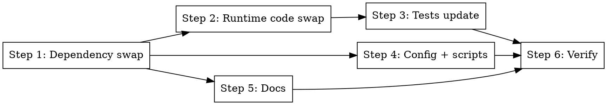

# Phase 1: Full Provider Swap — Gemini → Claude

> **Status:** pending

## Overview

A single coherent change that swaps `@ai-sdk/google` for `@ai-sdk/anthropic` across the pipeline package and updates every env-var, config, test, script, and doc reference so that after this phase the codebase contains zero mentions of Gemini as the active LLM provider. Default model is `claude-haiku-4-5-20251001` for both ranking and web extraction.

## Step Graph



Step 1 must land before any other step (code referring to the new import will not compile until the package is installed). Steps 2–5 are logically independent after Step 1 — they can be executed in any order or interleaved; the plan sequences them for reviewer clarity. Step 6 is the final verification gate.

---

### Step 1: Dependency swap

- **Files:** `packages/pipeline/package.json`
- **Change:**
  - Remove: `"@ai-sdk/google": "2.0.67"`
  - Add: `"@ai-sdk/anthropic": "2.0.74"` (exact, no `^`/`~`), inserted alphabetically in the `dependencies` block.
- **Then:** `pnpm install --frozen-lockfile=false` at repo root to update `pnpm-lock.yaml`.
- **Done:** `pnpm-lock.yaml` has `@ai-sdk/anthropic@2.0.74` resolved; `@ai-sdk/google` entries are gone; `pnpm install --frozen-lockfile` run again afterward succeeds.
- **Traces to:** REQ-001.

---

### Step 2: Runtime code swap

**Files:**
- Modify: `packages/pipeline/src/processors/rank.ts`
- Modify: `packages/pipeline/src/collectors/web.ts`
- Modify: `packages/pipeline/src/scripts/demo-web-collector.ts`
- Modify: `packages/pipeline/src/index.ts`

**Pattern to follow:** Current `rank.ts` uses `import { google } from "@ai-sdk/google"` and `google(modelId)` in `generateObject({ model: google(modelId), ... })`. The Anthropic provider exports `anthropic` from `@ai-sdk/anthropic` with the same call shape.

#### 2a. `packages/pipeline/src/processors/rank.ts`

```ts
// BEFORE
import { google } from "@ai-sdk/google";
// ...
const DEFAULT_MODEL = "gemini-2.5-flash";
// ...
result = (await generate({
  model: google(modelId),
  system: rankSystemPrompt,
  prompt: JSON.stringify({ candidates: userPayload }),
  schema: rankedResponseSchema,
})) as { object: z.infer<typeof rankedResponseSchema> };
```

```ts
// AFTER
import { anthropic } from "@ai-sdk/anthropic";
// ...
const DEFAULT_MODEL = "claude-haiku-4-5-20251001";
// ...
result = (await generate({
  model: anthropic(modelId),
  system: rankSystemPrompt,
  prompt: JSON.stringify({ candidates: userPayload }),
  schema: rankedResponseSchema,
})) as { object: z.infer<typeof rankedResponseSchema> };
```

No other change to this file. Logger events, error wrapping, schema, topN sort — all unchanged.

#### 2b. `packages/pipeline/src/collectors/web.ts`

Find the `getDefaultModel()` helper (lines ~336-337). Replace the dynamic import:

```ts
// BEFORE
const { google } = await import("@ai-sdk/google");
cachedDefaultModel = google("gemini-2.5-flash");
```

```ts
// AFTER
const { anthropic } = await import("@ai-sdk/anthropic");
cachedDefaultModel = anthropic("claude-haiku-4-5-20251001");
```

No other change to this file. The caching semantics and schemas stay as-is.

#### 2c. `packages/pipeline/src/scripts/demo-web-collector.ts`

Three touches:

1. Top-of-file env doc comment (line ~16): change `GOOGLE_GENERATIVE_AI_API_KEY  - Gemini API key` → `ANTHROPIC_API_KEY              - Anthropic API key`.
2. Import + model construction (lines ~21, 109):
   ```ts
   // BEFORE
   import { google } from "@ai-sdk/google";
   // ...
   const llmModel = google("gemini-2.5-flash");
   ```
   ```ts
   // AFTER
   import { anthropic } from "@ai-sdk/anthropic";
   // ...
   const llmModel = anthropic("claude-haiku-4-5-20251001");
   ```
3. Console banner (line ~112): change `"  model:     gemini-2.5-flash"` → `"  model:     claude-haiku-4-5-20251001"`.

#### 2d. `packages/pipeline/src/index.ts`

```ts
// BEFORE (lines ~23-26)
if (!process.env.GEMINI_API_KEY) {
  throw new Error("GEMINI_API_KEY is required for ranking");
}
process.env.GOOGLE_GENERATIVE_AI_API_KEY ??= process.env.GEMINI_API_KEY;
```

```ts
// AFTER
if (!process.env.ANTHROPIC_API_KEY) {
  throw new Error("ANTHROPIC_API_KEY is required for ranking");
}
```

The remap line is **deleted**, not replaced. The Anthropic provider reads `ANTHROPIC_API_KEY` directly — no indirection needed.

- **Done:** `pnpm typecheck` is clean. Grep for `@ai-sdk/google` and `GEMINI_API_KEY` in `packages/pipeline/src/` returns zero matches.
- **Traces to:** REQ-002, REQ-003, REQ-005, REQ-006, REQ-007, REQ-008, REQ-018; EDGE-001, EDGE-003, EDGE-004.

---

### Step 3: Tests update

**Files:**
- Modify: `packages/pipeline/tests/unit/processors/rank.test.ts`
- Modify: `packages/pipeline/tests/e2e/collectors/web.e2e.test.ts`

#### 3a. `packages/pipeline/tests/unit/processors/rank.test.ts`

Two concerns: env bookkeeping and REQ-065 model-override assertions.

**Env bookkeeping (lines 63-76):**

```ts
// BEFORE
const originalKey = process.env.GOOGLE_GENERATIVE_AI_API_KEY;

beforeEach(() => {
  delete process.env.RANKING_MODEL;
  process.env.GOOGLE_GENERATIVE_AI_API_KEY = "test-key";
  // ...
});

afterEach(() => {
  // ...
  if (originalKey === undefined) delete process.env.GOOGLE_GENERATIVE_AI_API_KEY;
  else process.env.GOOGLE_GENERATIVE_AI_API_KEY = originalKey;
});
```

```ts
// AFTER
const originalKey = process.env.ANTHROPIC_API_KEY;

beforeEach(() => {
  delete process.env.RANKING_MODEL;
  process.env.ANTHROPIC_API_KEY = "test-key";
  // ...
});

afterEach(() => {
  // ...
  if (originalKey === undefined) delete process.env.ANTHROPIC_API_KEY;
  else process.env.ANTHROPIC_API_KEY = originalKey;
});
```

**REQ-065 assertions (lines 201-217):** Per the `test-exact-spec-mandated-strings` rule, switch from `toContain(substring)` to `toBe(exact)`:

```ts
// BEFORE
it("uses RANKING_MODEL env var when set, default otherwise (REQ-065)", async () => {
  const generate = makeGenerate({
    ranked: [{ id: 1, score: 50, rationale: "ok" }],
  });

  process.env.RANKING_MODEL = "gemini-2.5-pro";
  await rankCandidates([makeCandidate(1)], { topN: 5 }, generate);
  const callA = generate.mock.calls[0]?.[0] as GenerateArgs;
  const modelA = callA.model as { modelId?: string };
  expect(modelA.modelId).toContain("gemini-2.5-pro");

  delete process.env.RANKING_MODEL;
  await rankCandidates([makeCandidate(1)], { topN: 5 }, generate);
  const callB = generate.mock.calls[1]?.[0] as GenerateArgs;
  const modelB = callB.model as { modelId?: string };
  expect(modelB.modelId).toContain("gemini-2.5-flash");
});
```

```ts
// AFTER
it("uses RANKING_MODEL env var when set, default otherwise (REQ-065)", async () => {
  const generate = makeGenerate({
    ranked: [{ id: 1, score: 50, rationale: "ok" }],
  });

  process.env.RANKING_MODEL = "claude-sonnet-4-5";
  await rankCandidates([makeCandidate(1)], { topN: 5 }, generate);
  const callA = generate.mock.calls[0]?.[0] as GenerateArgs;
  const modelA = callA.model as { modelId?: string };
  expect(modelA.modelId).toBe("claude-sonnet-4-5");

  delete process.env.RANKING_MODEL;
  await rankCandidates([makeCandidate(1)], { topN: 5 }, generate);
  const callB = generate.mock.calls[1]?.[0] as GenerateArgs;
  const modelB = callB.model as { modelId?: string };
  expect(modelB.modelId).toBe("claude-haiku-4-5-20251001");
});
```

Note: `anthropic(modelId)` returns a LanguageModel whose `.modelId` is the string passed in. The two assertions exercise REQ-003 (default) and REQ-004 (env override) with exact-string matching per the learning rule.

#### 3b. `packages/pipeline/tests/e2e/collectors/web.e2e.test.ts`

Three touches:

```ts
// BEFORE
import { google } from "@ai-sdk/google";
// ...
describe.skipIf(!process.env.GOOGLE_GENERATIVE_AI_API_KEY)("Web Collector E2E", () => {
  // ...
  const model = google("gemini-2.5-flash");
```

```ts
// AFTER
import { anthropic } from "@ai-sdk/anthropic";
// ...
describe.skipIf(!process.env.ANTHROPIC_API_KEY)("Web Collector E2E", () => {
  // ...
  const model = anthropic("claude-haiku-4-5-20251001");
```

- **Done:** `pnpm test:unit` exits 0 with 178 tests passing. The REQ-065 assertion uses `toBe` with exact strings. Grep for `@ai-sdk/google`, `GOOGLE_GENERATIVE_AI_API_KEY`, and `gemini-` in `packages/pipeline/tests/` returns zero matches.
- **Traces to:** REQ-003, REQ-004, REQ-016, REQ-017; EDGE-006.

---

### Step 4: Config + scripts

**Files:**
- Modify: `.env.example`
- Modify: `scripts/smoke-run.sh`

#### 4a. `.env.example`

```
# BEFORE
# Gemini (ranking LLM + web collector extraction)
GEMINI_API_KEY=
RANKING_MODEL=gemini-2.5-flash
```

```
# AFTER
# Anthropic Claude (ranking LLM + web collector extraction)
ANTHROPIC_API_KEY=
RANKING_MODEL=claude-haiku-4-5-20251001
```

#### 4b. `scripts/smoke-run.sh`

- Usage comment (line ~11): change `GEMINI_API_KEY exported in the calling shell` → `ANTHROPIC_API_KEY exported in the calling shell`.
- Usage example (line ~14): change `GEMINI_API_KEY=... ./scripts/smoke-run.sh` → `ANTHROPIC_API_KEY=... ./scripts/smoke-run.sh`.
- Hard check (line ~18): change `: "${GEMINI_API_KEY:?GEMINI_API_KEY is required (must be set in pipeline env)}"` → `: "${ANTHROPIC_API_KEY:?ANTHROPIC_API_KEY is required (must be set in pipeline env)}"`.

- **Done:** Grep for `GEMINI_API_KEY` and `GOOGLE_GENERATIVE_AI_API_KEY` in `.env.example` and `scripts/smoke-run.sh` returns zero matches.
- **Traces to:** REQ-011, REQ-012.

---

### Step 5: Docs

**Files:**
- Modify: `CLAUDE.md` (root)
- Modify: `packages/pipeline/CLAUDE.md`
- Modify: `docs/plans/run-ui/SPEC.md` (REQ-003 row only)

#### 5a. Root `CLAUDE.md`

Two edits:

**Tech-stack table row** (line ~46):
- Before: `| Ranking LLM | Vercel AI SDK (\`ai\`) + \`@ai-sdk/google\` (default \`gemini-2.5-flash\`) |`
- After: `| Ranking LLM | Vercel AI SDK (\`ai\`) + \`@ai-sdk/anthropic\` (default \`claude-haiku-4-5-20251001\`) |`

**Data-flow paragraph** (line ~29): change `ranks via Vercel AI SDK + Gemini` → `ranks via Vercel AI SDK + Claude`.

#### 5b. `packages/pipeline/CLAUDE.md`

Three edits:

1. Layout/processors description: change `ranking uses Vercel AI SDK \`generateObject\` with a Gemini model and inlines its system prompt as a TS const in \`rank.ts\`` → `ranking uses Vercel AI SDK \`generateObject\` with a Claude model and inlines its system prompt as a TS const in \`rank.ts\``.

2. Rules bullet: change `\`GEMINI_API_KEY\` is validated at worker startup (not per job) — ranking always needs it. \`RANKING_MODEL\` defaults to \`gemini-2.5-flash\`.` → `\`ANTHROPIC_API_KEY\` is validated at worker startup (not per job) — ranking always needs it. \`RANKING_MODEL\` defaults to \`claude-haiku-4-5-20251001\`.`.

#### 5c. `docs/plans/run-ui/SPEC.md`

REQ-003 row only. The current row (line ~20):

> `REQ-003 | Event-driven | When \`POST /api/runs\` receives a payload containing \`web\` config but \`GEMINI_API_KEY\` is not set in the server environment, the API shall return HTTP 400 with an error message mentioning the missing key. | Integration test: unset \`GEMINI_API_KEY\`, POST with \`web\` config, assert 400 and body contains \`"GEMINI_API_KEY"\`. POST without \`web\` config under same conditions returns 201. | Must`

Replace every `GEMINI_API_KEY` occurrence inside that single row with `ANTHROPIC_API_KEY`. Do not edit any other row or any historical `phase-*.md` / `*-design.md` file.

- **Done:** Grep for `GEMINI` and `gemini` in `CLAUDE.md`, `packages/pipeline/CLAUDE.md`, and `docs/plans/run-ui/SPEC.md` returns zero matches. The remaining historical docs under `docs/plans/run-ui/phase-*.md` and `docs/plans/*-design.md` are **not** touched.
- **Traces to:** REQ-013, REQ-014, REQ-015.

---

### Step 6: Verify

Run these in order; each must be clean before the phase is considered done.

1. `pnpm typecheck` — 0 errors.
2. `pnpm lint` — 0 errors, 0 warnings.
3. `pnpm test:unit` — ≥ 178 tests passing.
4. `grep -rn "@ai-sdk/google\|GEMINI_API_KEY\|GOOGLE_GENERATIVE_AI_API_KEY" packages/ scripts/ .env.example CLAUDE.md docs/plans/run-ui/SPEC.md` — zero matches.
5. `grep -rn "gemini-2\.5" packages/ scripts/ .env.example CLAUDE.md docs/plans/run-ui/SPEC.md` — zero matches.

Note: the grep commands deliberately exclude `docs/plans/run-ui/phase-*.md`, `docs/plans/*-design.md`, and `docs/plans/web-blog-collector/**` — those are historical audit artifacts per EDGE-008 and are expected to still mention Gemini.

- **Traces to:** REQ-001, REQ-008, REQ-009, REQ-016, REQ-018; EDGE-001, EDGE-008.

---

## Commit

Single commit at the end of the phase:

```
feat(VER): switch ranking + web extraction LLM from Gemini to Claude

- Replace @ai-sdk/google (gemini-2.5-flash) with @ai-sdk/anthropic
  (claude-haiku-4-5-20251001) as the sole LLM provider in the pipeline
  package.
- Pipeline boot now validates ANTHROPIC_API_KEY (was GEMINI_API_KEY);
  drops the GEMINI → GOOGLE_GENERATIVE_AI_API_KEY remap.
- Update .env.example, scripts/smoke-run.sh, and both CLAUDE.md files
  to reference ANTHROPIC_API_KEY and the new default model.
- Update docs/plans/run-ui/SPEC.md REQ-003 env var name.
- Rewrite rank.test.ts REQ-065 assertions to use exact Claude model IDs
  (toBe, not toContain), per the test-exact-spec-mandated-strings rule.
- Update web.e2e.test.ts to use anthropic() and ANTHROPIC_API_KEY guard.

BREAKING CHANGE: contributors must update their local .env:
  GEMINI_API_KEY=... → ANTHROPIC_API_KEY=...
  RANKING_MODEL=gemini-2.5-flash → RANKING_MODEL=claude-haiku-4-5-20251001
  (or unset RANKING_MODEL to use the new default)
```

## Done When

- [ ] All six steps completed with their individual Done criteria green.
- [ ] `pnpm typecheck && pnpm lint && pnpm test:unit` all exit 0.
- [ ] No grep match for Gemini/GEMINI_API_KEY/@ai-sdk/google outside the allow-listed historical docs.
- [ ] The single commit above is created with the exact BREAKING CHANGE footer.

## Smoke Test (optional, manual)

With a real `ANTHROPIC_API_KEY` exported:

```bash
ANTHROPIC_API_KEY=sk-ant-... ./scripts/smoke-run.sh
```

Should start the pipeline worker without the `ANTHROPIC_API_KEY is required for ranking` error and, if a test run is submitted, produce a ranked list from a Claude-backed generateObject call.
