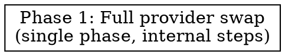

# Plan: Shift Ranking + Web Extraction LLM from Gemini to Claude

> **Source:** `docs/plans/2026-04-08-gemini-to-claude-switch-design.md`, `docs/spec/shift-gemini-to-claude-model/spec.md`
> **Created:** 2026-04-08
> **Status:** planning

## Goal

Replace `@ai-sdk/google` (Gemini) with `@ai-sdk/anthropic` (Claude Haiku 4.5) as the sole LLM provider in the pipeline package, across ranking, web extraction, env handling, tests, config, and docs — with no behavioral or contract changes to the code that wraps the model.

## Acceptance Criteria

- [ ] `packages/pipeline/package.json` has `@ai-sdk/anthropic@2.0.74` pinned exactly; `@ai-sdk/google` is removed.
- [ ] Grep for `@ai-sdk/google`, `GEMINI_API_KEY`, `GOOGLE_GENERATIVE_AI_API_KEY`, and `gemini-2.5` in `packages/`, `scripts/`, `.env.example`, and both `CLAUDE.md` files returns zero matches.
- [ ] `rank.ts` default is `claude-haiku-4-5-20251001`; `web.ts` and `demo-web-collector.ts` use the same model via `anthropic(...)`.
- [ ] `packages/pipeline/src/index.ts` validates `ANTHROPIC_API_KEY` at boot with the exact error string `"ANTHROPIC_API_KEY is required for ranking"`.
- [ ] `.env.example`, `scripts/smoke-run.sh`, root `CLAUDE.md`, `packages/pipeline/CLAUDE.md`, and `docs/plans/run-ui/SPEC.md` REQ-003 all reference `ANTHROPIC_API_KEY`.
- [ ] `pnpm typecheck` and `pnpm lint` exit 0.
- [ ] `pnpm test:unit` reports at least 178 tests passing (same as baseline).
- [ ] `rank.test.ts` REQ-065 test uses exact Claude model IDs (no substring match on "gemini").

## Codebase Context

### Call sites and files that change

**Pipeline runtime:**
- `packages/pipeline/package.json` — remove `@ai-sdk/google`, add `@ai-sdk/anthropic@2.0.74`.
- `packages/pipeline/src/processors/rank.ts` (lines 1-20, 90) — provider import + `DEFAULT_MODEL` constant + `generateObject` `model` arg.
- `packages/pipeline/src/collectors/web.ts` (lines 336-337) — lazy dynamic import inside `getDefaultModel()`.
- `packages/pipeline/src/scripts/demo-web-collector.ts` (lines ~16, 21, 109, 112) — import + model assignment + console output + header comment.
- `packages/pipeline/src/index.ts` (lines 23-26) — env var validation + delete the `GOOGLE_GENERATIVE_AI_API_KEY ??= GEMINI_API_KEY` remap line.

**Tests:**
- `packages/pipeline/tests/unit/processors/rank.test.ts` (lines 63-76, 201-217) — env bookkeeping switches from `GOOGLE_GENERATIVE_AI_API_KEY` → `ANTHROPIC_API_KEY`; REQ-065 uses exact Claude model IDs (`toBe`, not `toContain`, per the `test-exact-spec-mandated-strings` learning).
- `packages/pipeline/tests/e2e/collectors/web.e2e.test.ts` (lines 4, 37, 88) — `google` → `anthropic`, `describe.skipIf` guard, model call.

**Config / scripts:**
- `.env.example` — rename var, update default.
- `scripts/smoke-run.sh` — rename env guard and usage comment.

**Docs:**
- `CLAUDE.md` (root) — tech-stack row + data-flow sentence.
- `packages/pipeline/CLAUDE.md` — three lines mentioning Gemini/GEMINI_API_KEY/RANKING_MODEL default.
- `docs/plans/run-ui/SPEC.md` REQ-003 row only — rename env var references.

### Existing Patterns to Follow

- **AI SDK provider usage**: `rank.ts` uses `generateObject({ model: google(modelId), system, prompt, schema })`. Claude provider is a drop-in via the unified API — pass `anthropic(modelId)` instead. Confirmed via context7 `/vercel/ai` docs.
- **Version pinning rule**: per `.claude/rules/learnings/lock-ai-sdk-versions-explicitly.md`, `@ai-sdk/anthropic@2.0.74` must be installed as an exact version (no `^`/`~`), and its major must match the installed `ai@5.x` + retired `@ai-sdk/google@2.x` pair.
- **Exact-string test assertions**: per `.claude/rules/learnings/test-exact-spec-mandated-strings.md`, when the spec mandates a user-visible string (error messages here), tests must use `toBe` with the exact string, not `toContain(substring)`.
- **Lazy dynamic import**: `web.ts` uses `await import("@ai-sdk/google")` inside `getDefaultModel()` so the module loads without a provider. Preserve this pattern with `@ai-sdk/anthropic`.
- **DI for ranker tests**: `rankCandidates(candidates, options, generate)` takes `generate` as a DI arg in unit tests. Unit tests don't call the real provider — they just inspect the `model` object's `modelId` that was passed to the mock. This is why REQ-065 can use substring assertions today and why we can swap providers without touching the other 178 assertions.

### Test Infrastructure

- Test runner: Vitest 3, unit project in `packages/pipeline/vitest.config.ts`.
- Run command: `pnpm test:unit` (monorepo-wide via turbo).
- Baseline: 178 tests passing (12 files in pipeline).
- E2E tests live under `tests/e2e/` and are gated on env vars via `describe.skipIf(...)`.

### Library Docs Verified

`@ai-sdk/anthropic@2.0.74` peerDependencies: `zod: ^3.25.76 || ^4.1.8` — compatible with currently-pinned `zod@4.x` in the monorepo. Confirmed with `pnpm view`. Default provider instance reads `ANTHROPIC_API_KEY` from env. Model instantiation is `anthropic(modelId: string)` returning a `LanguageModelV1` that `generateObject` accepts. Confirmed via context7 `/vercel/ai` docs.

## Phase Graph

One phase. The whole change is mechanical, strongly coupled (all edits need to land together to keep typecheck clean), and small enough that splitting it would only add coordination overhead. Steps inside the phase are sequenced for a clean typecheck/test at each boundary.

## REQ Coverage Map

All SPEC requirements are covered by the single phase below:

| Phase | REQs Covered |
|-------|-------------|
| Phase 1 | REQ-001, REQ-002, REQ-003, REQ-004, REQ-005, REQ-006, REQ-007, REQ-008, REQ-009, REQ-011, REQ-012, REQ-013, REQ-014, REQ-015, REQ-016, REQ-017, REQ-018; EDGE-001, EDGE-002, EDGE-003, EDGE-004, EDGE-005, EDGE-006, EDGE-007, EDGE-008, EDGE-009, EDGE-010 |
