# Implementation Plan: split-slack-notifications

**Spec:** `docs/spec/split-slack-notifications/spec.md`
**Design:** `docs/spec/split-slack-notifications/design.md`

## Phase graph (DOT)

```dot
digraph phases {
  rankdir=LR
  node [shape=box]
  P1 [label="Phase 1: shared/slack foundation\n(types, keys, 4 builders, 4 notifier methods, unit tests)"]
  P2 [label="Phase 2: pipeline wire-up\n(run-process, email-send, linkedin-post, twitter-post)"]
  P3 [label="Phase 3: integration polish\n(update existing tests, deprecate annotation, README sync)"]
  P1 -> P2 -> P3
}
```



Phases are serial: P2 imports the new types/methods added in P1, P3 cleans up
remaining references and updates docs. No internal parallelism within phases —
each phase touches a small, tightly-coupled set of files.

## Phase 1: shared/slack foundation

**Files:**
- `packages/shared/src/types/notifications.ts` — extend `NotificationKey` union with `sourceDistribution | emailDelivery | linkedinPosted | twitterPosted`.
- `packages/shared/src/slack/types.ts` — add `SourceDistributionInput`, `EmailDeliveryInput`, `LinkedinPostedInput`, `TwitterPostedInput`. Extend `SlackNotifier` interface with the four new method signatures. Mark `notifyNewsletterSent` `@deprecated`.
- `packages/shared/src/slack/builders/_helpers.ts` — new file. Export `headerBlock`, `sectionMarkdown`, `contextMarkdown`, `statusSuffix`, `truncate`, `renderPermalink`, `archiveContextLine`. Lift from `message-builder.ts` (which keeps its own copies for backwards compat — minor duplication is acceptable here since the legacy combined-message path must keep working unchanged).
- `packages/shared/src/slack/builders/source-distribution.ts` — new. `buildSourceDistributionMessage({ runId, headline, sourceTelemetry, publicArchiveBaseUrl })` returns `{ blocks }`.
- `packages/shared/src/slack/builders/email-delivery.ts` — new. `buildEmailDeliveryMessage({ runId, headline, delivery, publicArchiveBaseUrl })`.
- `packages/shared/src/slack/builders/linkedin-posted.ts` — new. `buildLinkedinPostedMessage({ runId, headline, permalink, publicArchiveBaseUrl })`.
- `packages/shared/src/slack/builders/twitter-posted.ts` — new. `buildTwitterPostedMessage({ runId, headline, permalink, publicArchiveBaseUrl })`.
- `packages/shared/src/slack/notifier.ts` — implement four new methods using existing `notifyWithMarker` helper. For `notifySourceDistribution`, branch inside the `blocks` factory: if `archive.sourceTelemetry === null`, return early before posting (call a thin wrapper that bypasses `notifyWithMarker` to control logging). Add `@deprecated` JSDoc to `notifyNewsletterSent`. Pull `headline` from `archive.digestHeadline` for all four (no `topRankedTitle` fallback — design §3 EC-2 says "include only the data block; omit headline if null").
- `packages/shared/src/index.ts` — re-export builders if not already covered.

**Unit tests (mandatory, RED → GREEN per TDD):**
- `packages/shared/src/slack/builders/source-distribution.test.ts` — covers VS-1 (rendered blocks), VS-2 (skip-on-null-telemetry should NOT be in the builder — that's a notifier-level decision; builder just renders what it's given).
- `packages/shared/src/slack/builders/email-delivery.test.ts` — VS-4 builder slice.
- `packages/shared/src/slack/builders/linkedin-posted.test.ts` — VS-6 builder slice.
- `packages/shared/src/slack/builders/twitter-posted.test.ts` — VS-8 builder slice.
- `packages/shared/src/slack/notifier.test.ts` — extend with cases for VS-2 (skip on null telemetry), VS-10 (idempotency for all 4 new keys), VS-11 (failure-no-mark for all 4), VS-12 (dry-run skip), VS-13 (webhook unset).

**Gates:** `pnpm --filter @newsletter/shared typecheck` + `pnpm --filter @newsletter/shared lint` + `pnpm --filter @newsletter/shared test:unit` all green.

## Phase 2: pipeline wire-up

**Depends on:** Phase 1 complete (new methods callable on `SlackNotifier`).

**Files:**
- `packages/pipeline/src/workers/run-process.ts` — insert after the `archiveWritten` block (line ~774), before the `notifyReviewPending` call (line ~779):
  ```
  if (archiveWritten && sourceTelemetry !== null) {
    await deps.slackNotifier?.notifySourceDistribution({ runId });
  }
  ```
  Wrap in try/catch matching the existing pattern (warn log + continue).
- `packages/pipeline/src/workers/email-send.ts` — replace the `notifyNewsletterSent` invocation (around line 363) with `notifyEmailDelivery({ runId, delivery: { attempted, sent, failed, failureReasons } })`. Remove the `socialResults` plumbing from THIS worker only (LinkedIn/Twitter still get their own messages from their own workers). Remove `linkedinNotifier`/`twitterNotifier` deps from email-send if they were only there to drive the now-removed `socialResults` argument — verify by inspection; if email-send doesn't actually invoke the social notifiers itself (only collects their results for the combined Slack call), they go.
- `packages/pipeline/src/workers/linkedin-post.ts` — capture the `SocialResult` from `notifyArchiveReady`; on `status === "posted" && permalink !== null`, call `slackNotifier?.notifyLinkedinPosted({ runId: archive.id, permalink })`. Wrap in try/catch.
- `packages/pipeline/src/workers/twitter-post.ts` — symmetric.

**Tests (mandatory, RED → GREEN):**
- `packages/pipeline/tests/unit/workers/run-process.test.ts` — add cases for VS-1 (call placement), VS-3 (fires for both autoReview branches), VS-2 (does NOT call when sourceTelemetry null — though this is hard to reach since run-process always builds telemetry; cover with a sourceTelemetry=null injection).
- `packages/pipeline/tests/unit/workers/email-send.test.ts` — update to assert `notifyEmailDelivery` is called (VS-4) and `notifyNewsletterSent` is NOT (VS-5).
- `packages/pipeline/tests/unit/workers/publish-workers.test.ts` (or split files if they exist) — add cases for VS-6, VS-7 (linkedin posted + 4 skip cases), VS-8, VS-9 (twitter posted + 4 skip cases).

**Gates:** `pnpm --filter @newsletter/pipeline typecheck` + `pnpm --filter @newsletter/pipeline lint` + `pnpm --filter @newsletter/pipeline test:unit` all green.

## Phase 3: integration polish

**Depends on:** Phase 2 complete.

**Files:**
- `packages/pipeline/src/workers/newsletter-send.ts` — no code change but verify it still compiles against the deprecated `notifyNewsletterSent`. Confirm no warnings beyond the `@deprecated` JSDoc one (which may surface as an eslint warning depending on the rule set — if so, add a single inline disable comment with the reason "legacy worker, see split-slack-notifications spec").
- `CLAUDE.md` — update the "Service communication" / "After the newsletter-send worker finishes" paragraph to reflect the new four-message split. Replace the line "After the newsletter-send worker finishes (subscriber email delivery + Slack send-summary)..." with the per-channel description.
- Run the **full repo gates**: `pnpm typecheck`, `pnpm lint`, `pnpm build`, `pnpm test:unit` across all packages. Any cross-package fallout (e.g. `@newsletter/api` referencing `SlackNotifier` types) gets fixed here.

**Gates:** `pnpm typecheck && pnpm lint && pnpm build && pnpm test:unit` all green from repo root.

## Risks (carried from design)

- **Risk:** `SocialResult.permalink` may be `null` on `posted` (platform-reported duplicate). **Mitigation:** REQ-007/REQ-009 explicitly skip the Slack message in that case.
- **Risk:** Builder `_helpers.ts` divergence from `message-builder.ts`. **Mitigation:** Keep `message-builder.ts` untouched in this PR; the legacy combined path stays bit-identical. Helpers live in two places temporarily; a follow-up PR can consolidate when the legacy worker is removed.
- **Risk:** New notifier methods missing from the test-double `SlackNotifier` used by worker tests. **Mitigation:** Each worker test file's stub `slackNotifier` factory gets the four new no-op methods added.

## Approval

Plan is concrete, all phases scoped, each phase has explicit files + tests + gates. Ready for coder dispatch.
