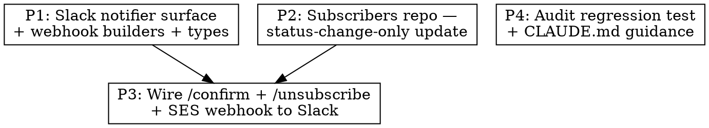

# Plan — Subscribe/Unsubscribe Audit + Slack Notifications

## Phase graph



Two independent leaves (P1 + P2) feed P3. P4 is independent and can run any time. Recommended wave order: **{P1, P2, P4} parallel → P3**.

---

## Phase 1 — Slack notifier surface

**Files**
- `packages/shared/src/slack/types.ts` — extend `SlackNotifier` with two new methods.
- `packages/shared/src/slack/builders/subscriber-confirmed.ts` (new) — single-line text block builder.
- `packages/shared/src/slack/builders/subscriber-removed.ts` (new) — single-line text block builder, covers `unsubscribe`/`bounce`/`complaint`.
- `packages/shared/src/slack/notifier.ts` — implement both methods + add no-op stubs in the disabled branch.
- `packages/shared/tests/unit/slack/notifier.test.ts` — extend with cases for new methods (disabled-mode no-op + happy path + webhook failure).

**API additions to `SlackNotifier`**
```ts
notifySubscriberConfirmed(input: {
  readonly email: string;
  readonly totalConfirmed: number;
}): Promise<void>;

notifySubscriberRemoved(input: {
  readonly email: string;
  readonly via: "unsubscribe-link" | "one-click" | "bounce" | "complaint";
  readonly totalConfirmed: number;
}): Promise<void>;
```

(Single `notifySubscriberRemoved` covers unsubscribe AND SES bounce/complaint — the operator's mental model is "the list shrank by one"; the `via` enum gives provenance.)

**Message shape**
- Confirmed: `:green_circle: New subscriber confirmed: alice@example.com  (#42 total)`
- Removed: `:red_circle: Subscriber removed: alice@example.com  (via one-click)  (#41 total)`

These do NOT go through `notifyWithMarker` (which is run-archive scoped). They are direct `postToWebhook` calls with no archive context.

**Acceptance**
- Disabled-mode (`SLACK_WEBHOOK_URL` unset): both methods are no-ops returning resolved promises, no fetch attempted.
- Happy path: webhook receives a single POST with the formatted text.
- Webhook 5xx / network error: method warn-logs `slack.subscriber_confirmed.failed` (or `.removed.failed`) and does NOT throw.

---

## Phase 2 — Subscribers repo: status-change-only update

**Files**
- `packages/api/src/repositories/subscribers.ts` — refactor `updateStatus` to return `{ changed: boolean; prev: SubscriberStatus | null; next: SubscriberStatus; row: SubscriberSelect }`.
- `packages/api/tests/unit/repositories/subscribers.test.ts` (extend or create) — assert no-op transitions return `changed: false`.

**Implementation sketch**
```ts
async updateStatus(id, status, extra?) {
  // First read prev status, then atomic conditional UPDATE.
  const [row] = await db.update(subscribers)
    .set({ status, updatedAt: new Date(), ...(extra ?? {}) })
    .where(and(eq(subscribers.id, id), ne(subscribers.status, status)))
    .returning();
  if (row !== undefined) {
    // changed — `row.status` is `next`; we don't get prev cheaply, so do a fast follow-up only if a caller needs it.
    // For our use case the boolean is enough. Return the new row.
    return { changed: true, next: status, row };
  }
  // No-op: row already had this status (or row doesn't exist). Read once to surface current row + prev.
  const [current] = await db.select().from(subscribers).where(eq(subscribers.id, id)).limit(1);
  if (current === undefined) throw new Error(`subscriber ${id} not found`);
  return { changed: false, next: current.status, row: current };
}
```

**Call sites to update** (`grep -n updateStatus packages/api/src`):
- `packages/api/src/routes/subscribe.ts` — three call sites (`/confirm`, GET `/unsubscribe`, POST `/unsubscribe`)
- `packages/api/src/routes/webhooks.ts` — two call sites (bounce, complaint)

Each call site needs to destructure the new return shape; existing callers used the void-return form (`await deps.subscribersRepo.updateStatus(...)`) — they continue to compile if they ignore the return, but they need the boolean to gate Slack. We update them explicitly in P3.

**Acceptance**
- `updateStatus(id, "confirmed")` twice in a row: first call `changed:true`, second `changed:false`.
- `updateStatus` for a non-existent id throws.
- Existing pipeline/api tests still pass (the void-form callers compile because returning a value is a superset; we audit one-by-one).

---

## Phase 3 — Wire routes to Slack notifier

**Files**
- `packages/api/src/routes/subscribe.ts` — extend `SubscribeRouterDeps` with `slackNotifier: SlackNotifier`; in `/confirm`, GET `/unsubscribe`, POST `/unsubscribe`, fire the appropriate notifier ONLY when `changed && next === <expected>`. Wrap each call in try/catch + warn-log.
- `packages/api/src/routes/webhooks.ts` — extend its deps with `slackNotifier`; in the bounce + complaint branches, gate on `changed` and call `notifySubscriberRemoved({ via: "bounce" | "complaint", ... })`.
- `packages/api/src/index.ts` — instantiate `createSlackNotifier({ webhookUrl: process.env.SLACK_WEBHOOK_URL, logger, archives })` at bootstrap (or pull a stub minus `archives` since the new methods don't need archives — split deps or pass `archives` from the api side). Wire into both routers.
- `packages/api/tests/unit/routes/subscribe.test.ts` — extend with VS-1..VS-7 from the design.
- `packages/api/tests/unit/routes/webhooks.test.ts` — extend with VS-8.

**Subtle wiring point — `SlackNotifierDeps.archives`**
The existing `createSlackNotifier` requires an `archives` dependency for `notifyWithMarker`. The new subscriber methods do NOT need it. We do NOT split the constructor — we pass the same archives repo the pipeline uses. The API package already constructs `RunArchivesRepo` for `getMostRecentReviewedArchiveId` in subscribe-router wiring, so we reuse that same instance. If passing it feels heavy, an alternative is to pass `archives: undefined as unknown as Archives` — REJECTED, violates strict-types rule. We pass the real repo.

**Total counter**
After every status mutation that fires Slack, call `subscribersRepo.countConfirmed()` and include the result in the message. This is one extra small SELECT per event — acceptable.

**Order of operations in `/confirm`**
1. Verify token
2. `updateStatus(..., "confirmed", ...)` — returns `{changed, next, row}`
3. PostHog capture (unchanged, `void`)
4. If `changed && next === "confirmed"`:
   - `countConfirmed()`
   - `void notifier.notifySubscriberConfirmed({email, totalConfirmed}).catch(log)`
5. Welcome-back-issue enqueue (unchanged)
6. Redirect

Steps 4 + 5 are independent; the welcome enqueue keeps its existing warn-on-failure behaviour. Slack is `void` so even if `countConfirmed` or `notify` takes time, the redirect isn't blocked beyond the await — actually we `void` to fire-and-forget, identical to PostHog.

**Acceptance** — all VS-1..VS-8 scenarios pass; VS-9 (regression guard for Part 1) lives in P4.

---

## Phase 4 — Part-1 regression guard + CLAUDE.md update

**Files**
- `packages/pipeline/tests/unit/workers/email-send.test.ts` — add a new test case "targeted welcome send does NOT fire notifyEmailDelivery" that wires the existing `slackNotifier` mock and asserts `notifyEmailDelivery` was never called when `subscriberIds: [<uuid>]`. This is the explicit VS-9 assertion.
- `packages/pipeline/CLAUDE.md` — append a one-paragraph convention note about archive-level idempotency markers:

  > **Archive-level idempotency markers (`email_sent_at`, `linkedin_posted_at`, `twitter_posted_at`, and the `notification_state.*` JSONB keys) are written ONLY from the canonical scheduled/broadcast path.** Any worker that supports a targeted/per-recipient/manual variant (e.g. the welcome back-issue send via `subscriberIds: [...]`) MUST short-circuit before stamping these markers. Per-recipient dedup belongs on a per-recipient table (e.g. `email_sends`). This convention prevents the class of bug where a targeted send silently poisons the next broadcast.

**Acceptance**
- New test passes against current code (it should — the fix is already in).
- `pnpm --filter @newsletter/pipeline test:unit` exit 0.
- The doc note is in `packages/pipeline/CLAUDE.md`.

No code change in `email-send.ts` itself — Part 1 is a documentation + regression-test add only.

---

## Test strategy summary

- **Unit-only** for everything; no e2e infra spin-up required for this work. (Phases 1-4 are pure wiring + small repo refactor + Slack message format.)
- All Slack assertions use a mock `SlackNotifier` injected via deps (matches existing pattern in `email-send.test.ts`).
- Webhook-failure tests use a stub that throws to assert isolation.

## Rollback

If Slack subscriber notifications spam too much, set `SLACK_WEBHOOK_URL` empty in env — the no-op stub kicks in. No DB migration. No schema change. Pure additive surface.

## Out of scope (confirmed)

- Slack channel splitting (one channel for digests, another for subs)
- Per-subscriber dedup window for sub/unsub flapping
- Admin manual unsubscribe route
- Re-activation of `unsubscribed` rows via re-subscribe
- Email PII masking in Slack (operator team only)
- Custom ESLint rule for marker writers (too small a surface)
