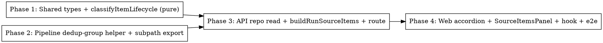

# Plan: Per-Item Source Telemetry

> **Source:** [`design.md`](./design.md) · [`spec.md`](./spec.md)
> **Visual reference:** [`mock.html`](./mock.html) (rendered `verification/screenshots/mock-render-v2.png`) — authoritative for the expanded-source UI. Implementers MUST open it and match the layout, lifecycle-trail vocabulary, outcome pills, per-source log strip, and Ledger aesthetic.
> **Created:** 2026-05-27
> **Status:** planning

## Goal

Let an operator click a Source Telemetry row on `/admin/runs/:runId` to see that source's extracted items as a flat list with each item's lifecycle (fetched → enriched → deduped → shortlisted → ranked) plus an inline drop reason, alongside a per-source verbose log strip — to debug why any item did or didn't make the digest.

## Acceptance Criteria

- [ ] Clicking a source row expands it inline; clicking again collapses it (REQ-001, REQ-002).
- [ ] Expanded panel shows outcome pills, a flat item list (title→original, meta, lifecycle trail, inline drop reason), and a per-source log strip (REQ-004–REQ-007, REQ-010).
- [ ] Items ordered by lifecycle outcome (REQ-006); dedup drops recomputed at read-time with winner attribution (REQ-009, EDGE-009).
- [ ] Failed/empty source shows only the log strip (REQ-011); item list & log strip scroll with hidden scrollbars (REQ-012).
- [ ] Legacy runs (null `shortlisted_item_ids`, no `run_id`) degrade gracefully (EDGE-001, EDGE-002).
- [ ] Admin-gated; lean payload (no markdown/recap/cost) (REQ-003, REQ-014); web uses subpath imports (REQ-015); `pnpm typecheck`/`lint`/`build` green.

## Codebase Context

### Existing Patterns to Follow
- **API route + deps injection**: `packages/api/src/routes/admin-runs.ts` — the `/:runId/sources` and `/:runId/observability` routes (zod `runIdSchema`, `NotFoundError` → 404, deps factory). Add the new route here.
- **API composition service**: `packages/api/src/services/run-observability.ts::buildRunObservability` — live/historical split; mirror for `buildRunSourceItems`.
- **Repos**: `packages/api/src/repositories/raw-items.ts` (`listForRun`, `aggregateBySourceAndIdentifier`), `run-archives.ts` (`rankedItems`, `shortlistedItemIds` already selected), `run-logs.ts`. Repo factories `create*Repo(db)`.
- **Read-time dedup (prior art)**: `packages/pipeline/src/repositories/eval-exports.ts::loadDedupedPool` — loads `raw_items WHERE run_id`, `collectedAt` fallback, applies `dedupCandidates`. Mirror its load + dedup approach.
- **Dedup primitive**: `packages/pipeline/src/processors/dedup.ts::dedupCandidates` + `canonicalizeUrl`. NOT yet on a public subpath — Phase 2 adds one.
- **Shared types**: `packages/shared/src/types/observability.ts` (`RunLogEntry` already has `source`/`level`/`event`/`context` — reuse for the log strip), `types/run.ts` (`EnrichedLinkContent`, `EnrichmentSkipReason`, `RankedItemRef`), `types/index.ts` (`RawItemMetadata`).
- **`deriveRawItemIdentifier`**: `packages/shared/src/services/source-identifier.ts` — source-unit identity; matches `RunObservabilitySource.identifier`.
- **Web page/table/hook**: `packages/web/src/pages/RunObservabilityPage.tsx`, `components/observability/SourceTelemetryTable.tsx`, `hooks/useRunObservability.ts`, `api/runs.ts`. Expand idiom: `components/review/PoolCard.tsx` / `observability/FailuresList.tsx` (local `expanded` state). Hidden scroll: `scrollbar-none` utility in `packages/web/src/index.css`. Status badge: `components/observability/StatusBadge`.

### Key data facts
- `RawItemSummary` (current `listForRun` output) is lean and **lacks** `metadata.enrichedLink`. Phase 3 needs a repo read returning items **with** enrichment status/reason + `url` + `engagement` + `id` + `sourceType`.
- `run_archives.shortlisted_item_ids` (mig 0033) is `number[] | null`; `rankedItems` is `RankedItemRef[]` (carries `rawItemId`, `score`).
- `@newsletter/api` may import `@newsletter/pipeline/<subpath>` (eval/add-post already do); reverse is eslint-blocked.

### Test Infrastructure
- Vitest 3, per-package `test:unit` / `test:e2e` (turbo). API e2e under `packages/api/tests/e2e/` (real DB+Redis via `pnpm infra:up`). Web component tests under `packages/web/tests/unit`. Playwright MCP for UI proof. Cross-impl parity precedent: `packages/api/tests/e2e/sources.e2e.test.ts`.

## Phase Graph

Phases 1 and 2 are independent (no edge between them) → dispatch in parallel. Phase 3 depends on both. Phase 4 depends on Phase 3.
