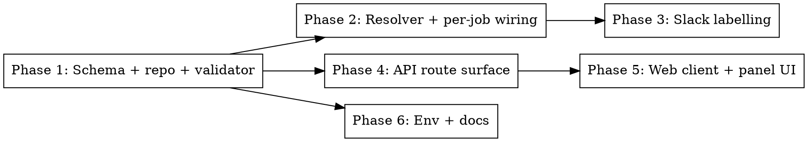

# Plan — Twitter collector cookies in admin settings

**Spec:** `docs/spec/twitter-cookies-admin-settings/spec.md`
**Branch:** `feat/admin-twitter-cookies`

## Phase graph

Phase 1 is the blocker. Phases 2 + 4 can run in parallel after Phase 1. Phase 3 needs Phase 2 (so it can read the failure shape). Phase 5 needs Phase 4 (api route). Phase 6 is doc-only.

## Phase 1 — Schema + repo + validator (shared, api, pipeline)

**Goal:** widen the `social_credentials` schema to include `twitter_collector`, add repo methods on both api and pipeline sides, and add the zod validator.

**Files to touch:**
- `packages/shared/src/db/schema.ts` — widen platform union, add `TwitterCollectorEncryptedFields`, re-export
- `packages/shared/src/db/index.ts` — re-export the new interface if not auto-included
- `packages/shared/drizzle/` — `pnpm --filter @newsletter/shared db:generate` (snapshot only; SQL no-op expected)
- `packages/api/src/repositories/social-credentials.ts` — add `upsertTwitterCollector`, extend `getStatus`, extend `delete` union
- `packages/pipeline/src/repositories/social-credentials.ts` — add `getTwitterCollector`, `upsertTwitterCollector`, extend `delete` union
- `packages/api/src/lib/validate-social-credentials.ts` — add `twitterCollectorUpsertSchema`

**Tests (TDD-first):**
- `packages/api/src/repositories/__tests__/social-credentials.test.ts` — upsert + getStatus paths for twitter_collector
- `packages/pipeline/tests/unit/repositories/social-credentials.test.ts` (find existing or add) — `getTwitterCollector` round-trip with cipher

**Acceptance:** `pnpm typecheck` PASS; `pnpm --filter @newsletter/shared db:generate` produces a migration whose `*.sql` is empty (or trivial) but whose snapshot updates; the new repo methods round-trip values via the test cipher.

## Phase 2 — Resolver + per-job wiring (pipeline)

**Goal:** add `resolveTwitterCollectorCookie` and move the `Rettiwt` client construction into per-job code paths.

**Files to touch:**
- `packages/pipeline/src/services/credential-resolver.ts` — add the new resolver
- `packages/pipeline/src/workers/processing.ts` — remove worker-startup `new Rettiwt({...})`; build the client inside the job handler using the resolved value
- `packages/pipeline/src/workers/run-process.ts` — same change in the fallback path; inject the resolver from the deps or build the client at the job-entry boundary

**Tests (TDD-first):**
- `packages/pipeline/tests/unit/services/credential-resolver.test.ts` — add VS-2 cases (env-only, db-only, db-then-delete, both-empty) and VS-6 (decrypt-failed → null + log; env NOT consulted)
- `packages/pipeline/tests/unit/workers/processing.test.ts` (or run-process.test.ts) — add a freshness assertion: stub the resolver to return value A on first call and value B on second, drive two jobs through, assert the Rettiwt constructor is called with both A and B in order. This is VS-3.

**Acceptance:** resolver tests pass; freshness test fails before the wiring change and passes after; `pnpm typecheck` PASS.

## Phase 3 — Slack labelling (shared)

**Goal:** review-pending Slack message labels collector `auth` failures as `<source>: skipped (<message>)`.

**Files to touch:**
- `packages/shared/src/slack/builders/review-pending.ts` — extend the per-source rendering for `auth`-class failures
- `packages/shared/tests/unit/slack/message-builder.test.ts` (or builders/review-pending.test.ts) — add the VS-5 case

**Acceptance:** new unit test passes; existing slack-builder tests still pass; `pnpm typecheck` PASS.

## Phase 4 — API route surface (api)

**Goal:** new `PUT/DELETE` routes for `twitter-collector` and the extended `GET` status include the new field.

**Files to touch:**
- `packages/api/src/routes/admin-social-credentials.ts` — add PUT + DELETE for twitter-collector; extend GET-status response via the repo's `getStatus`
- `packages/api/src/routes/__tests__/admin-social-credentials.test.ts` — add VS-1 round-trip via the route, the 400-on-empty-body case, the DELETE case, and verify the GET response shape

**Acceptance:** route tests pass; existing tests for linkedin + twitter routes still pass; `pnpm typecheck` PASS.

## Phase 5 — Web client + panel UI (web)

**Goal:** third card on `/admin/settings` for the Twitter collector cookie blob.

**Files to touch:**
- `packages/web/src/api/socialCredentials.ts` — add types, `putTwitterCollectorCookie`, hook; extend `deleteSocialCredentials` to accept the third platform
- `packages/web/src/components/SocialCredentialsPanel.tsx` — render the third card with status pill, textarea, save/delete buttons, `data-testid="twitter-collector-card"`
- (optional) `packages/web/src/components/__tests__/SocialCredentialsPanel.test.tsx` if such tests exist; otherwise the Playwright e2e is the proof

**Verification:** Playwright MCP scenario VS-7 — load the page, see Not configured, save a value, see Configured, reload, still Configured, delete, back to Not configured.

**Acceptance:** `pnpm --filter @newsletter/web build` succeeds; e2e VS-7 passes.

## Phase 6 — Env + docs

**Goal:** `.env.example` notes deprecation; `CLAUDE.md` updated.

**Files to touch:**
- `.env.example` — comment next to `RETTIWT_API_KEY` saying "deprecated — prefer setting via /admin/settings"
- `CLAUDE.md` — add `RETTIWT_API_KEY` to the optional env-var list with an "or managed via /admin/settings" note in the same sentence used for LinkedIn/Twitter posting creds

**Acceptance:** `grep -n RETTIWT_API_KEY .env.example` shows the deprecation note; `grep -n RETTIWT_API_KEY CLAUDE.md` shows the env var documented.

## Open questions

None. The user already disambiguated:
1. Storage → extend `social_credentials` (new `twitter_collector` platform key).
2. Scope → base64 cookies only.
3. Failure mode → collector fails individually + Slack notice (also generalised across collectors).

## Sequencing

Phases 1 → (2, 4) parallel → (3, 5) → 6 (independent doc-only, can run anywhere).
