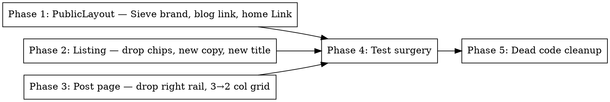

# Plan — VER-94 UI/UX polish

**Spec:** `docs/spec/ver-94-uiux-archive-fixes/spec.md`
**Design:** `docs/spec/ver-94-uiux-archive-fixes/design.md`

This plan is a **retrospective** of what was actually done in PR #92.

## Phase graph

Phases 1-3 are independent (different files, no shared state). Phase 4 (tests) waits for the source changes to know what to assert. Phase 5 deletes the now-orphaned `FilterChip.tsx` + `buildMonthChips`.

In a forward-running pipeline, Phases 1-3 would dispatch in parallel as a single wave. The actual implementation did them sequentially in the main conversation; the parallelism was unnecessary for a 9-file change.

## Phase 1 — PublicLayout

**File:** `packages/web/src/layouts/PublicLayout.tsx`

Steps:
1. Import `Link` from `react-router-dom`.
2. Replace the `AI Newsletter` brand with `<Link to="/">Sieve</Link>`.
3. Add a `Blog` `<a>` link with `href="https://blog.vertexcover.io"`, `target="_blank"`, `rel="noopener noreferrer"` to the right-side nav cluster, before Subscribe.
4. Update footer to read `Sieve · Made by Vertexcover · blog.vertexcover.io` with the URL as a real `<a>` link.

Acceptance: REQ-2, REQ-5, REQ-6, REQ-7.

## Phase 2 — Listing page (`/`)

**File:** `packages/web/src/pages/ArchiveListingPage.tsx`

Steps:
1. Drop imports: `FilterChip`, `buildMonthChips`, `runDateToMonthKey` (the listing page no longer uses them; `groupVisible` retains its own internal `runDateToMonthKey` use).
2. Replace TAGLINE constant with `"AI news worth your morning."`.
3. Hero: change h1 text from "The Archive" to "The Daily Read".
4. State: collapse `(activeMonth, visibleState)` → single `visibleCount` integer; `setVisibleCount((c) => Math.min(c+10, n))` on Load more.
5. Remove the chip row JSX (`
`).
6. Document title: `"Sieve — The Daily Read"`.

Acceptance: REQ-1, REQ-3, REQ-4.

## Phase 3 — Post page (`/archive/:runId`)

**Files:**
- `packages/web/src/components/ArchiveStoryCard.tsx`
- `packages/web/src/pages/ArchivePage.tsx` (caller update)

Steps:
1. `ArchiveStoryCard`: drop `totalCount` from `ArchiveStoryCardProps`.
2. Drop `truncateHost` helper (only callsite was the right rail).
3. Change article grid template from `md:grid-cols-[120px_minmax(0,1fr)_120px]` to `md:grid-cols-[120px_minmax(0,1fr)]`.
4. Delete the `
…
` block at the end.
5. `ArchivePage`: drop `totalCount={items.length}` from the `<ArchiveStoryCard>` callsite.

Acceptance: REQ-8, REQ-9, REQ-10, REQ-11.

## Phase 4 — Test surgery

**Files:**
- `packages/web/tests/unit/ArchiveStoryCard.test.tsx`
- `packages/web/tests/unit/ArchivePage.test.tsx`
- `packages/web/tests/unit/pages/ArchiveListingPage.test.tsx`

Steps:
1. `ArchiveStoryCard.test.tsx`: bulk-strip ` totalCount={N}` from all `render()` calls. Replace tests 22 and 23 (right-rail content assertions) with a single "no right rail" guard. Update test 24's grid-template assertion to the 2-col version.
2. `ArchivePage.test.tsx`: replace `screen.getByText("01 / 02")` and `screen.getByText("02 / 02")` (right-rail rank-of-total) with left-rail textContent regex assertions (`/N°.*01/`, `/N°.*02/`).
3. `ArchiveListingPage.test.tsx`:
   - Update brand assertion: `"AI Newsletter"` → `"Sieve"`.
   - Update title assertion: `"Newsletter archive"` → `"Sieve — The Daily Read"`.
   - Update headline assertion: heading-by-name `"The Daily Read"`.
   - Replace `getFilterChipByText("All")` truthy with `getFilterChips().length === 0`.
   - Replace `Made by Vertexcover` regex with `blog\.vertexcover\.io`.
   - Delete REQ-022 through REQ-026 (chip filtering behavior).
   - Delete EDGE-008 (single-month chip count) and EDGE-009 (filter resets visible count) — replace with one VER-94 assertion.
   - Drop `getFilterChipByText` and `requireFilterChipByText` helpers (now unused).

Acceptance: 237/237 unit tests pass (29 test files).

## Phase 5 — Dead code cleanup

Steps:
1. Delete `packages/web/src/components/archive-listing/FilterChip.tsx`.
2. Drop `MonthChip` interface and `buildMonthChips` function from `packages/web/src/components/archive-listing/format.ts`. Keep `runDateToMonthKey` (still used by `groupVisible`).

Acceptance: `pnpm typecheck` passes; no broken imports.

## Out of plan

- No new dependencies.
- No DB / API / pipeline changes.
- No `/admin/*` changes.
- No new env vars.
