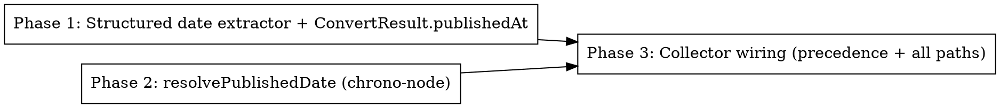

# Plan: Web Collector Date Extraction & Relative-Date Resolution

> **Source:** docs/spec/web-collector-date-fix/design.md, docs/spec/web-collector-date-fix/spec.md
> **Created:** 2026-05-26
> **Status:** planning

## Goal

Capture publish dates from web pages that expose them only in structured signals
(JSON-LD / meta / `<time>`) and resolve relative dates ("4 hrs ago") to absolute
timestamps — fixing both reported test URLs.

## Acceptance Criteria

- [ ] `extractPublishedAt(doc)` returns the JSON-LD `datePublished` for the therundown.ai fixture (`2026-05-25`), not the body-text date `2026-05-21`. (REQ-001, REQ-002, REQ-003)
- [ ] `ConvertResult.publishedAt` is populated and threaded through `fetchStatic`/`fetchBrowser`/`fetchAdaptive`. (REQ-004, REQ-005)
- [ ] `resolvePublishedDate("4 hours ago", ref)` = ref−4h; ISO round-trips; garbage → `null`. (REQ-006)
- [ ] `extractPostFields` / `fetchWebPost` prefer the structured date; listing pass + sort/filter route LLM strings through the resolver. (REQ-007..011)
- [ ] All new behavior unit-tested; existing pipeline + web tests still pass.

## Codebase Context

### Existing Patterns to Follow
- **DOM extraction before Readability**: `packages/pipeline/src/services/web-fetch/convert.ts::extractImageUrl(doc, baseUrl)` — runs on the original DOM before Readability mutates it. `extractPublishedAt` slots in next to it (called from both `article` and `listing` branches, against the pre-strip DOM).
- **ConvertResult passthrough**: `fetch-static.ts` / `fetch-browser.ts` build `ConvertResult` via `convert(...)`; `fetch-adaptive.ts` returns whichever result — so a new `ConvertResult` field threads through automatically.
- **Date parse helper**: `collectors/web.ts::parseDateOrNull` (bare `Date.parse`) is the function being superseded by `resolvePublishedDate`.
- **buildRawItem**: `collectors/web.ts::buildRawItem(postUrl, markdown, fields)` sets `publishedAt: parseDateOrNull(fields.published_at)` — this is where the structured date must win.
- **Collector return shape**: every collector maps source response → `RawItemInsert[]` (enforced by `newsletter/collector-return-shape`). `publishedAt` is `Date | null` on `RawItemInsert`.

### Test Infrastructure
- Vitest 3; unit tests under `packages/pipeline/tests/unit/`. Run: `pnpm --filter @newsletter/pipeline test:unit`.
- HTML fixtures: `packages/pipeline/tests/unit/fixtures/web/` (loaded by `convert.test.ts` via `fixture(name)`).
- Existing date tests in `tests/unit/collectors/web.test.ts` (parseDateOrNull, applySinceDays, buildRawItem).
- Probe HTML/JSON evidence: `.harness/web-collector-date-fix/probes/`.

### Dependency to add
- `chrono-node@2.9.1` (exact version, no `^`) → `packages/pipeline/package.json` dependencies. MIT, zero runtime deps, bundled types. Verified by library-probe.

## Phase Graph

Phase 1 and Phase 2 are independent (different files, no shared symbols) and can run in
parallel. Phase 3 depends on both (it consumes `ConvertResult.publishedAt` and calls
`resolvePublishedDate`).
