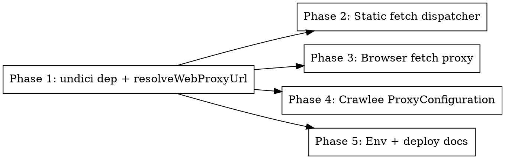

# Plan: Proxy Support for the Web Collector

> **Source:** docs/spec/web-collector-proxy-support/design.md + spec.md
> **Created:** 2026-06-01
> **Status:** planning

## Goal

Route the web collector's three outbound-HTTP seams (static fetch, browser fetch, Crawlee crawl)
through an optional `WEB_HTTP_PROXY`, following the `REDDIT_HTTP_PROXY` convention; unset = direct
egress, secret never logged.

## Acceptance Criteria

- [ ] `resolveWebProxyUrl(env)` resolves valid / empty / malformed `WEB_HTTP_PROXY` correctly (REQ-001, EDGE-001/002).
- [ ] Static fetch attaches an undici `ProxyAgent` dispatcher only on the default `fetch` path when set (REQ-002, REQ-006, REQ-010).
- [ ] Browser fetch launches chromium with the parsed `proxy` when set (REQ-003, EDGE-006).
- [ ] `runWebCrawl` passes `ProxyConfiguration` when set; covers static + browser sub-paths (REQ-004, EDGE-004).
- [ ] All seams omit proxy wiring when unset; existing 1108 pipeline tests still pass (REQ-005, EDGE-005).
- [ ] `undici@7.24.7` is an explicit pinned dep of pipeline (REQ-008).
- [ ] Proxy URL never appears in any log/error (REQ-007).
- [ ] `WEB_HTTP_PROXY` documented in `.env`, `deployment/.env.prod.example`, `deploy.yml` (REQ-009).
- [ ] Live VS-0 probes still pass (functional-verify).

## Codebase Context

### Existing Patterns to Follow
- **Per-source proxy env convention**: `.env:45-47` (`REDDIT_HTTP_PROXY`), `deploy.yml` optional list + env block, `deployment/.env.prod.example:41`.
- **Empty-string-to-undefined env helper**: `fetch-browser.ts::resolveChromiumExecutablePath` — mirror its trim/empty handling in `resolveWebProxyUrl`.
- **Injected `fetchFn` seam**: `fetch-static.ts` `FetchStaticOptions.fetchFn` (default `globalThis.fetch`) — proxy only wraps the default path (REQ-006).
- **Crawler option capture in tests**: `tests/unit/services/web-crawler.test.ts` already stubs `AdaptivePlaywrightCrawler` and captures `CapturedCrawlerOptions` — extend it to assert `proxyConfiguration`.
- **Env reads in tests**: `web-crawler.test.ts` / `web.test.ts` use `vi.stubEnv`.

### Test Infrastructure
- Vitest 3, unit project. Run: `pnpm --filter @newsletter/pipeline test:unit`.
- Existing: `fetch-static.test.ts` (injected `fetchFn` mock), `web-crawler.test.ts` (crawler stub).
- No `fetch-browser.test.ts` — Phase 3 extracts a pure `parseProxyForPlaywright(url)` helper so REQ-003 is unit-testable without launching chromium.

### Key constraint (from library-probe)
- `undici` is a **phantom transitive** dep — pipeline can't `import "undici"` until it's declared. Phase 1 adds `"undici":"7.24.7"` and runs `pnpm install`.

## Phase Graph

Phase 1 is the foundation (dep + shared resolver). Phases 2, 3, 4, 5 are independent of each
other and may run in parallel after Phase 1 (each touches a distinct file/seam).
