# Plan: Web Collector — Surface Structured Data (JSON-LD + Next.js) to Discovery LLM

> **Source:** docs/spec/web-collector-structured-data/spec.md
> **Created:** 2026-05-26
> **Status:** planning

## Goal

Make the web collector capture listing items whose links/metadata live only in embedded
JSON (JSON-LD + Next.js `__next_f`/`__NEXT_DATA__`) — e.g. the llm-stats `/ai-news`
"Today" section — by extracting those raw blobs in `convert.ts` and handing them to the
discovery LLM, dropping the markdown-substring URL gate, and skipping the Pass-2 detail
fetch for self-referential `#item-` URLs.

## Acceptance Criteria

- [ ] `convert()` listing mode returns `ConvertResult.structuredData` (`string | null`) holding raw JSON-LD + Next.js script text, extracted before `<script>` stripping. (REQ-001–004)
- [ ] `discoverPostUrls` appends structured data after the markdown in a delimited section and caps the combined body at `COMBINED_DISCOVERY_CAP = 120_000` chars. (REQ-005–007)
- [ ] `validateDiscoveredUrls` no longer requires the URL to be a markdown substring; keeps URL-parse + `http(s)` + empty/`#` checks. (REQ-008–009)
- [ ] When a discovered URL minus `#fragment` resolves to the listing URL, Pass-2 detail fetch is skipped and the item is built from discovery fields with the full verbatim URL as `url`/`externalId`. (REQ-010–011)
- [ ] No-structured-data path is byte-for-byte unchanged; existing 106 unit tests stay green. (REQ-007, EDGE-004)
- [ ] New unit tests cover REQ-001–011 and EDGE-001–008.

## Codebase Context

### Existing Patterns to Follow
- **HTML parsing lives in `convert.ts`**: `packages/pipeline/src/services/web-fetch/convert.ts` — JSDOM parse, extract signals (`extractImageUrl`, `extractPublishedAt`) on the original `doc` BEFORE the `stripTags`/Readability step, then build markdown. New `structuredData` extraction follows this exact "extract before strip" pattern (the `<script>` strip is the listing-mode `stripTags` loop at convert.ts:148-153).
- **`ConvertResult` flows transparently to the collector**: `web-crawler.ts:143` calls `convert(...)` and sets `result: convertResult` on the `CrawlResult` (`web-crawler.ts:160`). `CrawlResult.result` IS the `ConvertResult` — adding a field to `ConvertResult` automatically reaches `web.ts` via `dr.result.structuredData` with no crawler change.
- **Discovery prompt**: `discoverPostUrls(listingUrl, listingMarkdown, model, reportUsage?)` in `web.ts:54` builds one `generateObject` prompt. Today it interpolates `listingMarkdown` raw. New: build a combined body, cap it, embed it.
- **URL validation**: `validateDiscoveredUrls(posts, listingMarkdown, listingUrl)` in `web.ts:103`. The substring gate is the single line `if (!listingMarkdown.includes(p.url)) continue;` (web.ts:114).
- **Pass-2 dispatch**: `web.ts:328-336` builds `detailJobs` from `postBySource`. The skip decision belongs here — items flagged self-referential get no `detailJob` and are built directly.
- **Item build**: `buildRawItem(postUrl, markdownBody, fields, structuredPublishedAt)` in `web.ts:486`. The skipped-Pass-2 path needs an item built from discovery `title`/`published_at` with empty/blurb content — either reuse `buildRawItem` with discovery-derived `ExtractedFields` or a small dedicated builder.

### Test Infrastructure
- **Runner:** Vitest 3. Run: `pnpm --filter @newsletter/pipeline exec vitest run <paths>`.
- **convert tests:** `tests/unit/services/web-fetch/convert.test.ts` — loads fixture HTML from `tests/unit/fixtures/web/` via `fixture(name)`, asserts on `ConvertResult` fields. New fixtures (llm-stats-style JSON-LD, `__next_f`, `__NEXT_DATA__`, metadata-only, plain) go here.
- **web collector tests:** `tests/unit/collectors/web.test.ts` — `MockLanguageModelV2` from `ai/test` (`makeDiscoveryMockModel(jsonObject)`); `collectWeb` tested by mocking the `runWebCrawl` boundary + an in-memory repo (`makeRepo({existing})` with `upsertItems`/`findExistingExternalIds` spies, ~line 521-660). Discovery-prompt assertions read `getCallOrThrow(model.doGenerateCalls, 0).prompt`.
- **Baseline:** typecheck (pipeline + shared) green; 106 unit tests green across web/convert/web-date.
- **E2E (network, gated on ANTHROPIC_API_KEY):** `tests/e2e/network/collectors/web.e2e.test.ts` hits live sources. Manual llm-stats verification belongs here (or a dry-run).

### Potential Conflicts / Notes
- `shared` must be built before pipeline typecheck (`pnpm --filter @newsletter/shared build`).
- Removing the substring gate changes the `validateDiscoveredUrls` signature contract: `listingMarkdown` param becomes unused for the gate. Keep the param for signature stability (callers at web.ts:288 pass it) but stop using it for the gate — or drop it. Phase 2 decides; prefer dropping the unused arg to keep the code honest, updating the one caller + tests.
- Two existing tests assert the OLD gate behavior (`validateDiscoveredUrls` "drops URLs not present in the listing markdown", web.test.ts:166). These MUST be updated in Phase 2 — they encode the behavior we are intentionally removing.

## Phase Graph

```dot
digraph phases {
  rankdir=LR
  node [shape=box]

  phase_1 [label="Phase 1: Extract structured data in convert.ts\n(ConvertResult.structuredData)"]
  phase_2 [label="Phase 2: Feed blobs to discovery + drop substring gate\n(discoverPostUrls cap, validateDiscoveredUrls)"]
  phase_3 [label="Phase 3: Pass-2 skip for self-referential #item URLs\n(collectWeb build-from-discovery)"]

  phase_1 -> phase_2 -> phase_3
}
```

Sequential: Phase 2 consumes `ConvertResult.structuredData` from Phase 1; Phase 3 builds on Phase 2's relaxed validation and the discovery output. Each phase is one TDD cycle → one commit.

## Decisions (locked)

- `COMBINED_DISCOVERY_CAP = 120_000` chars; combined body = `markdown + "\n--- STRUCTURED DATA ---\n" + structuredData`, then `.slice(0, cap)` (markdown first so it survives truncation).
- Script selection in convert.ts: `<script type="application/ld+json">` (by type), `<script id="__NEXT_DATA__">` (by id), and any `<script>` whose text contains `self.__next_f.push` or `__NEXT_DATA__`. Skip webpack/analytics noise.
- No manual JSON parsing / no `#item-` URL unwrapping anywhere — raw blobs only; the LLM extracts.
- Self-referential detection: strip the `#fragment` from the discovered URL, resolve against the listing URL, compare to the listing URL (origin + path). Match → skip Pass-2.
