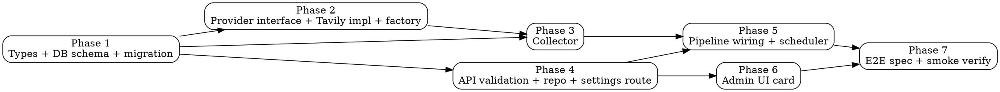

# Web-Search Collector — Implementation Plan

**Spec:** [spec.md](./spec.md)
**Design:** [design.md](./design.md)
**Library probe:** [library-probe.md](./library-probe.md)

## Naming convention (resolved)

The project already has a `web` source (RSS/blog crawler, `sourceKey: "blog"`). To avoid collisions:

| Concept | Name |
|---------|------|
| DB columns | `web_search_enabled`, `web_search_config` |
| Drizzle fields | `webSearchEnabled`, `webSearchConfig` |
| `RunCollectorsPayload` key | `webSearch` |
| `RunSubmitConfig` shape | `RunSubmitWebSearchConfig` |
| `UserSettings` fields | `webSearchEnabled`, `webSearchConfig` |
| `sourceKey` (telemetry) | `"web_search"` |
| `SourceType` union value | `"web_search"` (added to schema.ts:18 union) |
| Settings UI card | "Web Search" |

The existing `web` / `webConfig` / `blog` source is untouched.

## Phase graph



Parallel waves:
- **Wave 1:** Phase 1 (alone — everything else depends on types)
- **Wave 2:** Phase 2 + Phase 4 (independent: Phase 2 is pipeline-side, Phase 4 is API-side)
- **Wave 3:** Phase 3 + Phase 6 (Phase 3 needs the Tavily provider; Phase 6 needs the API types and zod schema)
- **Wave 4:** Phase 5 (wiring needs both collector + scheduler/API knowing about it)
- **Wave 5:** Phase 7 (e2e — last)

## Phases

### Phase 1 — Shared types, DB schema, migration

**Files:**
- `packages/shared/src/db/schema.ts` — at the `user_settings` block (lines 108–139), add after the `webConfig` column:
  ```ts
  webSearchEnabled: boolean("web_search_enabled").notNull().default(false),
  webSearchConfig: jsonb("web_search_config").$type<RunSubmitWebSearchConfig | null>(),
  ```
  At line 18, widen `SourceType`:
  ```ts
  export type SourceType = "hn" | "reddit" | "twitter" | "rss" | "github" | "blog" | "newsletter" | "web_search";
  ```
- `packages/shared/src/types/run.ts` — add after `RunSubmitWebConfig` (around line 110):
  ```ts
  export type WebSearchProviderName = "tavily";

  export interface WebSearchQueryConfig {
    query: string;       // 1..400 chars, trimmed
    sinceDays: number;   // 1..30 integer
    maxItems: number;    // 1..20 integer
  }

  export interface RunSubmitWebSearchConfig {
    provider: WebSearchProviderName;
    queries: WebSearchQueryConfig[];  // 0..25
  }
  ```
  Add `webSearch?: RunSubmitWebSearchConfig` to `RunCollectorsPayload`.
- `packages/shared/src/types/settings.ts` — add to `UserSettings`:
  ```ts
  webSearchEnabled: boolean;
  webSearchConfig: RunSubmitWebSearchConfig | null;
  ```
- Run `pnpm --filter @newsletter/shared db:generate` to produce a migration file under `packages/shared/src/db/migrations/`.

**Tests:** none yet (types only). Verify with `pnpm --filter @newsletter/shared build` + `pnpm typecheck` (will surface every place that destructures `UserSettings`).

**Unblocks:** Phase 2, Phase 3, Phase 4.

### Phase 2 — Provider interface + Tavily impl + factory

**Files:**
- `packages/pipeline/package.json` — add dep `"@tavily/core": "0.7.3"` (exact pin per project rule).
- `packages/pipeline/src/collectors/web-search/providers/types.ts` — `WebSearchProvider` interface + `WebSearchResult` type.
- `packages/pipeline/src/collectors/web-search/providers/tavily.ts` — `TavilyProvider` class.
- `packages/pipeline/src/collectors/web-search/providers/index.ts` — `createWebSearchProvider(name, env)` factory.

**Tests:**
- `packages/pipeline/tests/unit/collectors/web-search/tavily-provider.test.ts` — mock `tavily()` (vi.mock the SDK), verify mapping of result fields (probe-derived: `publishedDate` camelCase, `score`, `content` → `snippet`, no per-result image).
- `packages/pipeline/tests/unit/collectors/web-search/providers-factory.test.ts` — `createWebSearchProvider("tavily", {})` throws on missing key; with key returns instance.

**TDD order:** write the provider tests first (red), then the implementation (green).

### Phase 3 — Collector

**Files:**
- `packages/pipeline/src/collectors/web-search/index.ts` — `collectWebSearch(deps, config)`.

**Algorithm:** per spec REQ-004.

**Tests:**
- `packages/pipeline/tests/unit/collectors/web-search.test.ts` — covers:
  - Happy path: 2 queries, 3 results each, all upserted.
  - Per-query failure isolation: one query throws, the other still produces items.
  - URL dedup across queries (keeps higher-score duplicate).
  - `enrichment` is called when provided.
  - `signal` cancellation is honored (aborts on signal trigger).
  - `metadata.provider`, `metadata.query`, `metadata.rawScore` set.
  - `externalId` is `tavily:<sha256(url)>`.

### Phase 4 — API: validation, repository, route

**Files:**
- `packages/api/src/lib/validate.ts` — extend `userSettingsCommonShape` + `userSettingsUpsertSchema` with:
  ```ts
  webSearchEnabled: z.boolean().optional(),
  webSearchConfig: z.object({
    provider: z.literal("tavily"),
    queries: z.array(z.object({
      query: z.string().trim().min(1).max(400),
      sinceDays: z.number().int().min(1).max(30),
      maxItems: z.number().int().min(1).max(20),
    })).max(25),
  }).nullable().optional(),
  ```
  Add `webSearchEnabled: payload.webSearchEnabled ?? payload.webSearchConfig != null` to the transform.
  Extend `addEnabledConfigIssues` to require non-empty `queries` when `webSearchEnabled: true`.
  Extend `sourcesEnabledRefinement` to count `webSearchEnabled` toward "at least one source enabled".
- `packages/api/src/repositories/user-settings.ts` — extend `toDomain()` and `upsert()` with the two new fields (mirror `webEnabled` / `webConfig`).

**Tests:**
- `packages/api/tests/unit/lib/validate.test.ts` — add cases for valid/invalid `webSearchConfig` (empty query, out-of-range `sinceDays`/`maxItems`, too-many queries).
- `packages/api/tests/unit/repositories/user-settings.test.ts` — upsert + get round-trip with `webSearchConfig` set.

### Phase 5 — Pipeline wiring + scheduler

**Files:**
- `packages/pipeline/src/workers/run-process.ts` — in `runCollecting()` (after the `if (collectors.twitter)` branch), add:
  ```ts
  if (collectors.webSearch) {
    const config = collectors.webSearch;
    tasks.push({
      sourceKey: "web_search",
      run: () => deps.collectFns.webSearch(
        { rawItemsRepo: deps.rawItemsRepo, provider: deps.webSearchProvider!, logger, signal, enrichment: enrichmentCtx },
        config,
      ),
    });
  }
  ```
  Extend `RunProcessDeps.collectFns` with `webSearch: typeof collectWebSearch` and `deps.webSearchProvider: WebSearchProvider | undefined`. Wire `createWebSearchProvider` at the pipeline bootstrap (where the worker is constructed) using `process.env.TAVILY_API_KEY`.
- `packages/api/src/services/scheduler.ts` — find the function that builds `RunCollectorsPayload` from `UserSettings`. Add:
  ```ts
  if (settings.webSearchEnabled && settings.webSearchConfig) {
    payload.webSearch = settings.webSearchConfig;
  }
  ```
  (Exact location pinned by the Explore output: scheduler reads `UserSettings` → builds payload → enqueues `run-process`.)
- `packages/pipeline/.env.example` (if separate) + root `.env.example` — add `TAVILY_API_KEY=`.

**Tests:**
- `packages/pipeline/tests/unit/workers/run-process.test.ts` — extend to assert that a payload with `webSearch` pushes a `web_search` task.
- `packages/api/tests/unit/services/scheduler.test.ts` (or wherever the payload-builder is tested) — assert `webSearchConfig` is included when enabled.

### Phase 6 — Admin UI

**Files:**
- `packages/web/src/components/settings/SourcesSection.tsx` — add `summarizeWebSearch(c: RunSubmitWebSearchConfig | null): string` and a new card after the Twitter card. Card contents:
  - Header: switch (`webSearchEnabled`) + title "Web Search" + greyed badge "Tavily".
  - When enabled: an array editor for `queries[]`. Each row: `query` text input, `sinceDays` (number, min 1 max 30), `maxItems` (number, min 1 max 20), Remove (×). "Add query" button below.
- Whatever form-schema helper the page uses (if it has a client-side zod mirror) — extend with the same shape as Phase 4.
- Whatever client API types file exposes `UserSettings` — should auto-pick from `@newsletter/shared/types` (subpath import per the project learning rule).

**Tests:**
- Component unit test (if Settings has any) for the summarize function — happy path + empty queries case.

### Phase 7 — E2E + smoke

**Files:**
- `packages/web/tests/e2e/web-search-settings.spec.ts` — Playwright spec covering VS-0.5:
  1. Log into `/admin` (use the test login fixture).
  2. Open Settings.
  3. Enable Web Search, add a query, save.
  4. Reload, assert query is still there.

**Run:** functional-verify runs this in Stage 5. Authoring the spec is not enough — the run must produce `e2e-report.json` with `executed > 0`.

**Smoke (manual via functional-verify):**
- VS-0.7 end-to-end pipeline run (queues a run via API, asserts items land with `source_type='web_search'`).

## Risks & mitigations

| Risk | Mitigation |
|------|------------|
| Tavily's `topic: "news"` returns 0 results for very obscure queries | Collector treats empty result set as success (not error) — admin sees it in the per-query telemetry, can adjust query |
| `publishedDate` malformed | Parse with `new Date(...)`; on `isNaN`, fall back to `collectedAt` (same pattern as Reddit) |
| URL collision with an existing raw_items row from a different source | `externalId` is `tavily:<sha256(url)>` — distinct from blog/web's `externalId`. `url` may match across sources but `externalId` won't, so `onConflictDoUpdate(target: externalId)` keeps them separate. Downstream dedup runs on `url` and handles the cross-source merge. |
| `SourceType` union widening breaks downstream code (`switch` statements with `never` checks) | Phase 1 typecheck will surface every such site. Address them in the same phase. |
| Scheduler payload-builder not found by Explore | Phase 5 starts by re-grepping for the function; if missing, surface as a blocker before coding |

## What this PR does NOT do

- Add Brave / Exa / Serper providers (interface is ready; we just don't wire them).
- Expose `includeDomains` / `excludeDomains` / `searchDepth` controls in the UI.
- Add per-source telemetry to the Run Archive page.
- Tweak ranking weights for `web_search` items (stage-2 rerank handles them with no special-casing).
