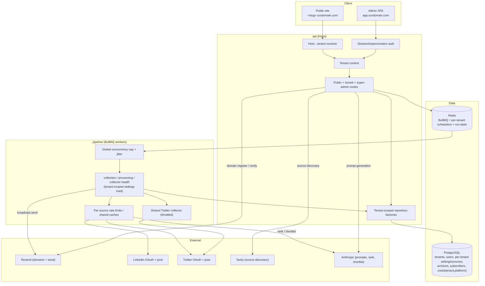
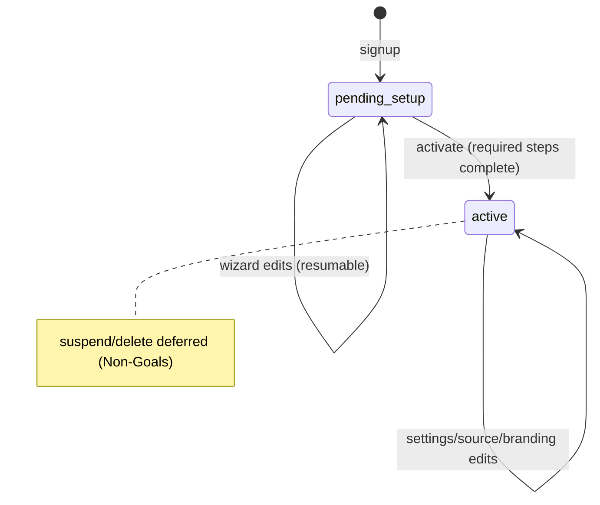

# Multi-Tenancy (VER-110) — Design

> Single, comprehensive design + spec for the whole epic. Source requirements: `multi-tenant-req.md`.
> Sub-systems §6.1–6.7 of the req are all covered here; build order is a sequencing concern, not a reason to split the design.

## Problem Statement

Convert a single-admin internal tool (one shared password, one singleton settings row, platform-keyed credentials, one hardcoded brand) into a **multi-tenant product**: external customers sign up, configure, and run their own AI newsletters on shared infrastructure, fully isolated from one another. Vertexcover's own newsletter (AGENTLOOP) is migrated in as the first tenant with **zero data loss** and keeps running throughout.

## Context

What exists today (verified against code this session):

- **Auth:** one `ADMIN_PASSWORD`; a stateless HMAC cookie `admin|<ts>` signed with `SESSION_SECRET` (D-008). No users/accounts/roles. `requireAdmin` gates `/api/admin/*`.
- **Settings:** a single `user_settings` row (`singleton=true` unique index) holds *everything* — source configs (JSONB per source), ranking/shortlist prompts, schedule times, feature flags.
- **Credentials:** `social_credentials` / `social_tokens` keyed by **platform alone** (one LinkedIn, one Twitter, one collector globally), encrypted via `CredentialCipher` (HKDF from `SESSION_SECRET`, D-012/D-104). LinkedIn OAuth exists; Twitter posting is **manual API keys**; collection uses a Rettiwt cookie/key.
- **Sources:** not a table — JSONB inside `user_settings`. "34 sources" is doc only.
- **Pipeline:** 3 BullMQ workers (collection / processing / collector-health, D-110); shared queues; web-crawler concurrency is a process-wide env var; run-state keyed `run:<runId>`; cancel via Redis pub/sub `run:cancel:<runId>` (D-014). Prompts load per-job from settings.
- **Scheduling:** `reconcilePipelineSchedule()` upserts BullMQ schedulers under **fixed global keys** (scheduler keys keep `:`, D-112); publish day anchored on completion instant (D-108).
- **Email:** `EMAIL_PROVIDER` selects Resend vs SES at **startup** globally (D-010). `subscribers` / `email_sends` / `ses_events` tables exist; subscribe + double-opt-in confirm flow exists; broadcast keyed by `email_sent_at` (D-050).
- **Web:** hardcoded "AGENTLOOP" Masthead/Footer; routes `/`, `/archive/:runId`, `/sources`, `/must-read`, `/built` (public) + `/admin/*`; password-gate login; cookie auth via `apiFetchAdmin`. No signup, no wizard, no file upload, no tenant/super-admin views.

Trigger: VER-110 epic — productize the engine for external customers.

---

## Product Requirements (PRD)

### Personas

- **Super admin (Vertexcover ops).** Knows the system deeply. Seeded, never self-signs-up. Needs to list tenants, open any tenant's dashboard for support, and own shared app-level secrets.
- **Tenant admin (external customer).** Non-technical-to-technical operator who wants a curated AI newsletter without running infrastructure. Signs up, completes a guided wizard, then reviews/publishes daily. One human per tenant.
- **End subscriber (a tenant's reader).** Visits a tenant's public site, subscribes, receives the digest, gives feedback, unsubscribes. Scoped to one tenant.

### Goals & Non-Goals

**Goals**
- Any external user can sign up and stand up an isolated, running newsletter with no Vertexcover involvement.
- Complete cross-tenant data isolation — a tenant never sees or affects another's data.
- AGENTLOOP migrated in with zero data loss and no behavior change.
- Each tenant's pipeline, branding, subscribers, and delivery are independent.
- The platform stays robust when many tenants share a schedule.

**Non-Goals (deliberately excluded from v1)**
- Vanity custom domains for arbitrary tenants (CNAME + per-domain TLS/ACME). *Exception:* AGENTLOOP's existing domain via a hardcoded tenant-0 mapping.
- Billing, plans, usage metering, or usage caps (open signup, uncapped).
- Multiple users / teams / invites per tenant (one user per tenant).
- Tenant self-serve suspend/delete, GDPR erasure, data-retention automation.
- Per-tenant LLM model selection (ranking/shortlist model stays a global env var).
- Per-tenant arbitrary custom/static pages (AGENTLOOP's `/built` is hard-scoped to tenant 0).
- Email **verification** at signup (login is immediate); 2FA.

### User Stories

| Story | Persona | Fulfilled by |
|-------|---------|--------------|
| Sign up with name/email/password and start immediately | Tenant admin | F1, F2, F3 |
| Reset a forgotten password | Tenant admin | F4 |
| Be guided through setup with a live preview, and resume later | Tenant admin | F20–F29 |
| Pick a Substack-style subdomain | Tenant admin | F22, F23 |
| Get tailored ranking/shortlist prompts from a short blurb | Tenant admin | F26 |
| Get suggested sources and add my own | Tenant admin | F27, F50–F53 |
| Run my newsletter daily, isolated from others | Tenant admin | F40–F44, F10 |
| Be notified when a run is ready or fails | Tenant admin | F70–F73 |
| Connect LinkedIn/Twitter without seeing app secrets | Tenant admin | F60–F63 |
| Send from my own verified domain | Tenant admin | F64–F66 |
| Brand my public site (name/logo/headline) | Tenant admin | F30–F34 |
| Subscribe to a tenant's newsletter and receive it | End subscriber | F35, F36, F38 |
| See all tenants and open one's dashboard | Super admin | F80–F83 |
| Manage shared app-level secrets | Super admin | F62 |
| Keep AGENTLOOP running through the migration | Super admin | F90–F95 |

### User Flows

**Flow: Sign up → onboard → activate** — mock: `mocks/signup.html`, `mocks/onboarding.html`
1. Visitor on `app.ourdomain.com` opens **Sign up** and fills name, email, password, confirm password.
2. On valid, unused input they are signed in and land in the wizard; invalid input (password mismatch, already-registered email) keeps them on the form with guidance.
3. They work through the carousel; the right pane shows the live public-home preview with their name/logo/headline and lorem-ipsum elsewhere.
4. They pick a subdomain slug and see live availability feedback.
5. They leave mid-wizard and return later, resuming where they left off.
6. With the required steps done they **Activate**; the site goes live at `<slug>.ourdomain.com` and scheduled runs begin. Activate stays unavailable while any required step is incomplete.

**Flow: Daily review & publish** — mock: `mocks/impersonation.html` (tenant dashboard shell)
1. Scheduled run completes → tenant notified via configured channels (email and/or Slack).
2. Opens dashboard (tenant-scoped) → reviews ranked items, reorders, edits digest copy, adds pool posts.
3. Publishes → digest emails go only to that tenant's confirmed subscribers from the tenant's verified domain; connected LinkedIn/Twitter posts go out.
4. A collector fails or a run crashes → tenant gets an error alert on configured channels.

**Flow: End subscriber** — mock: `mocks/public-home.html`
1. Visits `<slug>.ourdomain.com` → branded homepage (existing layout): today's issue + list of older archives.
2. Enters email → double opt-in confirmation email from the shared platform sender.
3. Confirms → becomes a confirmed subscriber of that tenant only.
4. Receives the digest; can one-tap feedback and unsubscribe.

**Flow: Super-admin impersonation** — mock: `mocks/super-admin.html`, `mocks/impersonation.html`
1. Super admin logs in on `app.ourdomain.com` → sees the tenant list (not a tenant dashboard).
2. Clicks a tenant → enters impersonation; the tenant's dashboard renders as-is with a persistent "Viewing as <tenant> — Exit" banner.
3. Clicks Exit → returns to the tenant list; impersonation token cleared.

**Flow: Connect a sending domain** — mock: `mocks/settings.html` (Sending domain panel)
1. Tenant enters a sending domain → system registers it with Resend and shows the DNS records to add.
2. Tenant adds DNS records, clicks Verify → status moves pending → verified (or failed with reasons shown).
3. Meanwhile the tenant can still publish to web/social and send transactional email; the subscriber broadcast becomes available once the domain verifies.

### Mockups

Static HTML mockups of every new surface live in `docs/multi-tenant/mocks/` (open `index.html`), built on the existing "Daily Read" theme tokens. They are the visual contract for the build.

| Mock | Surface | Requirements |
|------|---------|--------------|
| `signup.html` | Tenant signup (name/email/password + confirm) | F1–F3 |
| `forgot-password.html`, `reset-password.html` | Password reset | F4 |
| `onboarding.html` | 8-step resumable wizard + live homepage preview | F20–F29 |
| `settings.html` | Tenant settings — branding, **sources**, social OAuth, sending-domain, notifications, feature flags (one page) | F30, F33, F50–F53, F60–F65, F70–F74 |
| `super-admin.html` | Super-admin tenant list + app-credential ownership | F80, F62 |
| `impersonation.html` | Impersonation banner over a tenant dashboard | F81–F83 |
| `public-home.html` | Public homepage — **existing AGENTLOOP layout**, only configured slots differ | F30–F34 |

Sources management is a panel **inside Settings** (plus the onboarding sources step), not a standalone page; the only separate sources surface is the pre-existing public `/sources` page.

---

## Requirements

### Functional Requirements

> F# numbering uses reserved blocks per sub-system (auth 1–16, onboarding 20–29, branding 30–34, subscribers/delivery 35–38, pipeline 40–48, sources 50–53, credentials/email 60–66, notifications 70–74, super-admin 80–83, migration 90–95); gaps are intentional reservations.

**Accounts & auth**
- F1: When a visitor submits the signup form with name, email, password, and a matching confirm password for an email not already registered, the system shall create a `tenant_admin` user, create its tenant in `pending_setup`, establish a session, and start the onboarding wizard.
- F2: When the confirm password does not match the password, the system shall reject the submission with a field error and create nothing.
- F3: When the email is already registered, the system shall reject signup with an "email already in use" error.
- F4: When a user requests a password reset for a known email, the system shall send a reset link (shared platform sender) that, when followed, lets them set a new password; unknown emails shall receive no enumeration signal.
- F5: The system shall authenticate requests via a stateless signed cookie whose payload encodes user id, tenant id, and role, signed with `SESSION_SECRET`.
- F6: The system shall **not** allow `super_admin` accounts to be created through public signup.
- F7: When a session cookie is absent/invalid/expired, the system shall return 401 for tenant/admin API routes and redirect the SPA to login.

**Tenancy & isolation**
- F8: The system shall associate every tenant-owned row with a `tenant_id`.
- F9: The system shall resolve the active tenant for each request from session context (admin app) or from the request Host (public site), and scope all data access to that tenant.
- F10: Every repository read/write of tenant-owned data shall be filtered by the resolved `tenant_id` (the enforced isolation mechanism; F11 specifies the observable cross-tenant-access behavior).
- F11: The system shall reject (404/not-found semantics) any request for a resource id that exists but belongs to another tenant.
- F12: A lint rule shall fail the build when a repository touches a tenant-owned table without a tenant scope.

**Host → tenant routing**
- F13: When a request arrives on `app.ourdomain.com`, the system shall treat it as the admin/signup surface (tenant derived from session, not Host).
- F14: When a request arrives on `<slug>.ourdomain.com`, the system shall resolve the tenant by slug and serve that tenant's public site; an unknown slug shall serve a not-found page.
- F15: When a request arrives on AGENTLOOP's configured custom domain, the system shall resolve it to tenant 0 via a hardcoded domain→tenant mapping.
- F16: When a tenant's slug changes, the system shall 301-redirect the old `<old-slug>.ourdomain.com` to the new slug.

**Onboarding wizard**
- F20: The system shall persist wizard progress per tenant so a tenant can leave and resume at the furthest reached step.
- F21: While a tenant is in `pending_setup`, the system shall keep the public newsletter inactive and run no scheduled pipeline.
- F22: The wizard shall accept a newsletter name, a subdomain slug, a headline, a topic strip, an optional subtagline, an optional logo, prompt-generation input, optional social/email connections, ≥1 source, and a schedule.
- F23: When a tenant types a slug, the system shall validate it live (lowercase alphanumeric + hyphens, globally unique, not in the reserved blocklist) and report available/taken/invalid.
- F24: The wizard shall render a live preview of the public home page (existing layout) applying the tenant's name, logo, headline, topic strip, and subtagline, with all other content as lorem-ipsum placeholders.
- F25: When the required steps (name, slug, headline, prompts, ≥1 source, schedule) are complete, the system shall allow **Activate**, transition the tenant to `active`, and begin scheduled runs.
- F26: When a tenant submits a free-text newsletter description, the system shall generate editable ranking and shortlist prompts derived from that description plus the default prompts as reference.
- F27: The wizard shall present LLM+Tavily-suggested sources as click-to-add pills and allow manual source addition and removal.
- F28: When required steps are incomplete, the system shall block activation and indicate which steps remain.
- F29: Logo upload shall accept only an image content-type allowlist (PNG, JPEG, SVG, WebP) up to a max byte size (default 512 KB), rejecting oversized/invalid files with a clear error and leaving any existing logo unchanged.

**Branding & public site**
- F30: The public site shall render the tenant's name, logo, headline, topic strip, and subtagline from tenant branding (no hardcoded brand).
- F31: The public homepage shall reuse the existing AGENTLOOP homepage layout unchanged (hero → today's issue → inline subscribe → recent issues → Elsewhere → footer), substituting only the tenant's configured branding slots; it shall not be a bespoke per-tenant redesign.
- F32: The public nav shall be derived per tenant: `Sources` always; `Must Read` only when the tenant's **Canon** feature is on; `How it's Built` only for tenant 0.
- F33: The system shall serve a tenant's logo from Postgres-stored bytes with the correct content-type and long-lived HTTP cache headers (etag/version) so repeat requests are cache hits.
- F34: Public archive and item pages shall be tenant-scoped and reachable only on that tenant's host.

**Subscribers & delivery**
- F35: When a visitor subscribes on a tenant's public site, the system shall create a `pending` subscriber for that tenant and send a double-opt-in confirmation from the shared platform sender.
- F36: When a subscriber confirms, the system shall mark them `confirmed` for that tenant only.
- F37: When a tenant publishes a digest, the system shall send only to that tenant's `confirmed` subscribers.
- F38: While a tenant has no verified sending domain, the system shall block the digest broadcast for that tenant while still allowing transactional email (confirmation, reset, notifications) from the shared platform sender.

**Per-tenant pipeline & scheduling**
- F40: The system shall thread `tenant_id` through every pipeline job payload.
- F41: Pipeline workers shall load the originating tenant's settings, sources, and prompts (not the legacy singleton).
- F42: The system shall maintain per-tenant schedule entries so each tenant runs on its own configured times.
- F43: When settings change, the system shall reconcile that tenant's schedulers only.
- F44: A run, its raw items, logs, review edits, archives, and publishes shall all be attributed to the originating tenant.
- F45: The system shall cap globally-concurrent pipeline runs; runs above the cap shall queue and wait rather than overrun resources.
- F46: The system shall apply start-time jitter so tenants sharing a nominal schedule do not all start simultaneously.
- F47: The system shall apply global per-external-source rate limiting so concurrent tenant runs do not exceed an upstream source's tolerance.
- F48: The shared Twitter collector shall be globally throttled across all tenants.

**Sources**
- F50: The system shall store sources in a normalized per-tenant table (type, config, enabled, health).
- F51: The system shall support source discovery via LLM + Tavily, returned as add-candidates the tenant explicitly chooses to add.
- F52: The system shall support manual add and removal of sources of each supported type.
- F53: The pipeline shall collect from a tenant's enabled sources rows.
- F54: Source management (discovery, add/remove, enable/disable, health) shall be presented within the tenant Settings page and the onboarding sources step — not as a standalone admin page.

**Credentials, social, email domain**
- F60: When a tenant connects LinkedIn, the system shall run OAuth using the shared app-level LinkedIn client and store only that tenant's tokens.
- F61: When a tenant connects Twitter for posting, the system shall run Twitter OAuth and store only that tenant's tokens (no manual API-key entry for tenants).
- F62: App-level secrets (LinkedIn client id/secret, Twitter collector cookies) shall be managed only by super admins and never exposed to tenant admins.
- F63: Social credentials/tokens shall be keyed by `(tenant_id, platform)` and encrypted at rest.
- F64: When a tenant adds a sending domain, the system shall register it with Resend and surface the DNS records required for verification.
- F65: When a tenant requests verification, the system shall check Resend and update the domain status (pending/verified/failed with reasons).
- F66: The Twitter shared collector shall be used for collection across tenants while never exposing its cookies to tenant admins.

**Notifications & feature flags**
- F70: When a run becomes ready for review, the system shall notify the tenant via its configured channels (email and/or Slack).
- F71: When a collector fails or a run crashes, the system shall send an error alert to the tenant's configured channels.
- F72: The system shall let a tenant configure a notification email and an encrypted Slack incoming-webhook URL.
- F73: The system shall provide independent per-tenant toggles for **Deliverability** (analytics dashboard), **Canon** (gates the Must Read page + nav per F32), and **Eval**, each defaulting to off. (AGENTLOOP's Canon-on state is set by the migration, F93.)
- F74: The **shortlist size** control shall be hidden from the tenant dashboard and use an internal default the tenant cannot see or edit.

**Super admin**
- F80: A super admin shall see a list of all tenants on login (not a tenant dashboard).
- F81: When a super admin opens a tenant, the system shall issue an impersonation context and render that tenant's dashboard as-is.
- F82: While impersonating, the system shall display a persistent banner and provide a one-click exit that clears impersonation.
- F83: The system shall record an audit trail of impersonation start/stop with the acting super-admin and target tenant.

**AGENTLOOP migration (zero data loss)**
- F90: The migration shall create the AGENTLOOP tenant (slug, branding, custom-domain mapping) and its tenant-admin account, and seed super-admin account(s) separately.
- F91: The migration shall re-point every existing tenant-owned row to the AGENTLOOP tenant across all listed tables (`raw_items`, `run_archives`, `run_logs`, `review_edits`, `email_sends`, `subscribers`, `feedback_events`, `ses_events`, `eval_runs`, `must_read_entries`, the singleton settings, sources, and `social_credentials`/`social_tokens`).
- F92: The migration shall move singleton `user_settings` (sources→rows, prompts, schedule, flags) and connected social tokens/credentials into AGENTLOOP's per-tenant config so its pipeline/publishing keep working unchanged.
- F93: The migration shall enable AGENTLOOP-only features (Canon/Must Read, `/built`).
- F94: The migration shall be idempotent and re-runnable on a copy, and guarded/reversible.
- F95: Post-migration verification shall assert row counts match pre-migration, no NULL `tenant_id` remains on tenant-owned tables, AGENTLOOP archives/subscribers/runs resolve under the tenant, and a dry-run pipeline succeeds.

### Non-Functional Requirements

- NF1 (Isolation/Security): No request path returns another tenant's data. The lint guard + repository tenant-scoping is the enforced mechanism (app-level, per locked decision); a missed scope must fail CI, not ship.
- NF2 (Security): Open signup is abuse-exposed — auth endpoints (signup, login, reset) shall be rate-limited per IP; passwords stored with a memory-hard hash (argon2id or bcrypt cost ≥12); reset tokens single-use and short-lived.
- NF3 (Backwards compatibility): Existing AGENTLOOP archives/runs/settings degrade gracefully; new columns are nullable with fallbacks (project convention); legacy rows resolve to tenant 0.
- NF4 (Reliability under load): With N tenants on the same nominal schedule, total concurrent runs stay ≤ the global cap; upstream sources are not exceeded; one tenant's heavy run cannot starve others indefinitely.
- NF5 (Observability): Per-tenant run telemetry, costs, and failures remain attributable to a tenant; impersonation is auditable.
- NF6 (Secret hygiene): App-level secrets never serialize into any tenant-facing API response or client bundle.
- NF7 (Maintainability): `tenant_id` plumbing flows through the existing repository-factory pattern (single seam), not ad-hoc per query.
- NF8 (Migration safety): The migration runs inside a transaction (or idempotent batches), verifiable on a DB copy before production.

### Edge Cases and Boundary Conditions

- EC1: Two tenants race for the same slug → uniqueness enforced at the DB; the loser gets "taken" and must repick.
- EC2: Slug change while old links/emails are in flight → old slug 301-redirects; emails embedding the old slug still resolve.
- EC3: Reserved/profane slug (`app`, `www`, `admin`, `api`, `mail`, …) → rejected at validation.
- EC4: Tenant abandons onboarding → stays `pending_setup`, never runs, never serves a public site; not counted as active. (Cleanup of stale accounts is deferred — Open Questions.)
- EC5: Subscriber confirmation/password-reset before the tenant verifies a domain → sent from the shared platform sender (F38).
- EC6: Tenant publishes with no verified domain → broadcast blocked with a clear message; social/web publish still allowed.
- EC7: Logo too large / wrong type → rejected; existing logo unchanged.
- EC8: Super admin acts destructively while impersonating → audited; same guardrails as the tenant admin (no elevated destructive powers via impersonation in v1).
- EC9: Global concurrency cap reached at a popular schedule time → excess runs queue; jitter spreads starts; runs eventually complete (publish day anchored on completion instant, D-108).
- EC10: Rotating `SESSION_SECRET` invalidates all encrypted credentials (D-104) — unchanged risk, now multiplied across tenants; documented recovery is re-connect per tenant. Migration must not rotate the secret.
- EC11: Shared Twitter collector hits a rate limit/ban → throttle backs off globally; affected tenants' Twitter collection degrades without failing the whole run (collector failures are per-source, D-110 sibling behavior).
- EC12: Legacy AGENTLOOP rows with NULL `tenant_id` during the migration window → must be fully backfilled before isolation enforcement turns on (ordering requirement, see migration sequencing).
- EC13: Unknown Host (typo subdomain, bare apex) → not-found page, no tenant leak.
- EC14: A tenant disables Canon after having Must Read entries → page/nav hidden; data retained, not deleted.

---

## Key Insights

- **The singleton is the spine of single-tenancy.** `user_settings.singleton=true` is where "one of everything" is enforced; multi-tenancy is fundamentally "replace the singleton with a per-tenant row + make every reader take a tenant." Most work radiates from that one change plus the credential re-key.
- **Two trust tiers, not one.** "App-level shared secrets" (LinkedIn client, collector cookies, our Tavily/Anthropic keys) vs "tenant-owned tokens/domains." Conflating them is the security trap; the design keeps them in separate stores with separate access rules.
- **Domain verification is asynchronous and optional-to-activate.** Decoupling "go live" from "can broadcast email" (shared transactional sender + per-tenant broadcast domain) removes the DNS step from the signup critical path — the single biggest UX unlock.
- **Open signup turns latent single-tenant assumptions into abuse/load surfaces.** Process-wide crawler concurrency, one shared collector, and uncapped LLM spend were fine for one trusted operator; under open multi-tenancy they become the primary risk axis (NF2/NF4), which is why the global cap + jitter + per-source limits are first-class.

---

## Architectural Challenges

- **Tenant context propagation.** A single resolved `tenant_id` must flow request → repository → enqueued job → worker → repository again, across two processes (api, pipeline) via the BullMQ payload. Seam: repository factories take a tenant context; jobs carry `tenantId`; workers build tenant-scoped repos. Public requests resolve tenant from Host; admin requests from session.
- **Isolation enforcement without RLS.** Locked decision is app-level filtering. The guard is the extended `enforce-repository-access` lint rule (tenant-owned table touched ⇒ must be scoped) + a tenant-scoped repository base. Risk lives in any code that bypasses repos (the rule already forbids raw `drizzle-orm` outside `repositories/**`).
- **Credential re-key + two tiers.** `social_credentials`/`social_tokens` PK moves platform → `(tenant_id, platform)`. App-level secrets move to a separate store (env/super-admin table) resolved independently of tenant. Twitter posting gains an OAuth flow (new) while collection stays on the shared collector.
- **Scheduling many tenants.** Per-tenant scheduler keys (namespaced, `:`-delimited per D-112) replace fixed global keys; reconcile is per-tenant. A global concurrency limiter + jitter + per-source token buckets prevent thundering-herd at common times.
- **Sources: JSONB → table.** Promoting sources to rows changes how the pipeline loads sources and how the UI renders pills/search; the migration must lift AGENTLOOP's JSONB config into rows without changing collection behavior.
- **Migration ordering.** `tenant_id` columns must be added nullable, backfilled to tenant 0, *then* made the enforced scope — isolation enforcement cannot precede backfill (EC12). The whole thing must be idempotent and rehearsed on a copy.
- **Host-based serving in dev & prod.** Wildcard `*.ourdomain.com` + the app domain + AGENTLOOP's custom domain must all route correctly; local dev needs a subdomain story (e.g. `*.lvh.me` or a dev Host/`X-Tenant-Slug` override).
- **Logo storage in Postgres, not object storage.** Locked decision: logos are tiny and size-constrained (≤512 KB, F29), so a `bytea` column avoids adding an object-store/CDN dependency for v1. The load concern (many tenants × many public requests reading bytes from PG) is mitigated by long-lived HTTP cache headers + etag/version (F33), collapsing repeat reads to cache hits; object storage is the future move if asset size/volume grows.

## Approaches Considered

### Approach A — Shared schema, `tenant_id` column, app-level filtering (chosen)
Add `tenant_id` to tenant-owned tables; resolve tenant per request; scope every repository; enforce via lint. Per-tenant settings/sources rows replace the singleton. Single DB, single connection pool, minimal infra change.

### Approach B — Postgres Row-Level Security (RLS)
Same columns, but the DB enforces isolation via policies and a per-transaction `SET app.tenant_id`. Stronger defense-in-depth, but the current single-connection repository pattern (D-008-era) would need per-request session variables and reworked pooling.

### Approach C — Schema-per-tenant or DB-per-tenant
Hard isolation by physical separation. Strongest boundary, but migrations, the shared pipeline workers, connection management, and cross-tenant super-admin/migration tooling all multiply in complexity; incompatible with "one shared infra, open signup."

## Chosen Approach

**Approach A.** It matches the locked decision (app-level filtering + lint guard), fits the existing repository-factory + single-connection architecture, and keeps the migration tractable. We accept that isolation correctness rests on discipline + the lint rule rather than the database; mitigations are the repo seam (no raw DB access outside `repositories/**`, already enforced), the extended lint rule, and tenant-scoping tests. RLS (B) is the natural future hardening if/when scale or compliance demands it; the column model chosen here is forward-compatible with adding RLS later without reshaping data.

## High-Level Design

### Component / architecture



### Tenant context plumbing

```
TenantContext = { tenantId: Uuid; userId?: Uuid; role: 'super_admin' | 'tenant_admin'; impersonating?: boolean }
createXRepo(db, tenantCtx)   // every tenant-owned repo factory gains tenantCtx; queries auto-scope
JobPayload<T> = T & { tenantId: Uuid }   // every enqueue carries tenantId; workers rebuild scoped repos
```

### Transitional: legacy settings ↔ sources table (until the Settings panel phase)

The `sources` table is the runtime source of truth: runs collect from
`listEnabled()` rows and the public sources summary derives its configured
sections from them. The legacy `user_settings.*_config`/`*_enabled` columns
remain the write surface of the existing Settings UI, so `PUT /api/settings`
write-through-syncs them into the table (`settingsToSourceRows` →
`SourcesRepo.replaceAll`, the TS mirror of the 0041 lift). Consequences,
accepted for the transition window only: a settings save wholesale-replaces
the tenant's rows (superseding interim `/api/admin/sources` edits and
resetting row ids/health), and collector tuning knobs without per-row slots
(`web.maxItems`/`sinceDays`, `twitter.maxTweetsPerSource`/`sinceHours`,
`webSearch.provider`) still live only in the legacy columns. The sync is
removed when the Settings page consumes `/api/admin/sources` directly
(REQ-074); only then may the legacy source-list columns be dropped.

### Transitional: per-source rate limiting (REQ-067 v1)

The v1 per-external-source limit is the existing process-wide
`WEB_CRAWLER_CONCURRENCY` crawler cap: with the global run cap of 1 plus
start jitter (`PIPELINE_START_JITTER_MS`), concurrent tenant runs cannot
multiply crawler pressure beyond it. The run cap currently rests on BullMQ's
default worker concurrency of 1: `PIPELINE_RUN_CONCURRENCY` is read only by
the dedicated run-process worker, which production does not boot (it deploys
the multi-job-type dispatcher, which must not set an explicit concurrency) —
the knob is inert in the deployed topology until that worker ships. The shared Twitter collector additionally has a dedicated
cross-tenant Redis token bucket (`throttle:twitter-collector`, tunable via
`TWITTER_COLLECTOR_RATE_PER_SECOND`, REQ-068). Dedicated per-source token
buckets for the remaining collectors are deferred until the cap is raised
above 1.

### Signup → onboarding → activation

```mermaid
sequenceDiagram
  actor U as Visitor
  participant API
  participant DB
  U->>API: POST /signup (name,email,pw,confirm)
  API->>API: validate (match, unused email)
  API->>DB: insert user + tenant(pending_setup)
  API-->>U: Set-Cookie session; redirect wizard
  loop wizard steps (resumable)
    U->>API: PATCH /onboarding/<step>
    API->>DB: persist step + progress
    API-->>U: live preview data
  end
  U->>API: POST /onboarding/activate
  API->>API: assert required steps complete
  API->>DB: tenant.status = active
  API->>API: reconcile per-tenant schedulers
  API-->>U: redirect dashboard; site live
```

### Tenant lifecycle (v1)



### Sending-domain verification

```mermaid
stateDiagram-v2
  [*] --> none
  none --> pending: add domain (registered w/ Resend, DNS records shown)
  pending --> verified: Resend reports verified
  pending --> failed: Resend reports failure
  failed --> pending: retry verify
  verified --> [*]
  note right of pending: broadcast blocked; transactional via shared sender
```



### Migration (cutover) sequence

```mermaid
sequenceDiagram
  participant M as Migration
  participant DB
  M->>DB: add tenant_id (nullable) to all tenant-owned tables
  M->>DB: create tenants, users; insert AGENTLOOP tenant + admin; seed super-admins
  M->>DB: backfill tenant_id = AGENTLOOP on all existing rows
  M->>DB: lift singleton settings → AGENTLOOP per-tenant settings + sources rows
  M->>DB: move social creds/tokens to (tenant_id, platform)
  M->>DB: enable AGENTLOOP features (Canon, /built); set custom-domain map
  M->>DB: verify (counts, no NULL tenant_id, dry-run pipeline)
  Note over M,DB: only after verify → enable isolation enforcement (NOT NULL / guard)
```

## External Dependencies & Fallback Chain

> Probed 2026-06-10 (see `library-probe.md`): all 5 libs are pinned + in production use. Tavily search **VERIFIED live**; Resend Domains API **VERIFIED live** with a full-access key (`domains.list` OK; `create` reaches the API, blocked only by plan quota = 1 domain → **scaling risk**); Twitter OAuth2 posting **confirmed via docs** (`twitter-api-v2`: `generateOAuth2AuthLink` → `loginWithOAuth2` → `refreshOAuth2Token` → `v2.tweet`).

### Primary: Resend (per-tenant sending-domain verification + broadcast)
- **Purpose:** Register and verify per-tenant sending domains; send broadcast digests from verified domains; send transactional email from the shared platform sender.
- **Use cases to probe:** (1) create domain, (2) fetch domain verification status, (3) send from a shared-domain sender, (4) send from a tenant verified-domain sender.
- **Auth:** api-key. **Constraint (probe finding):** the Domains API needs a **full-access** key with domain-management permission; the send-only delivery key returns `401 restricted_api_key`. Use a separate management key for `domains.*`.
- **Required env keys:** `RESEND_API_KEY` (full-access for domains).
- **Fallbacks:** 1) Amazon SES domain identities + DKIM (already integrated behind the provider interface, D-010) → 2) build-our-own SMTP relay with manual DNS instructions (no managed verification).

### Primary: Tavily (source discovery search)
- **Purpose:** Find candidate sources (sites/feeds) from a tenant's newsletter description.
- **Use cases to probe:** (1) topic→candidate-URLs search.
- **Auth:** api-key
- **Required env keys:** `TAVILY_API_KEY`
- **Fallbacks:** 1) LLM-only suggestion from the blurb (no live search) → 2) curated static seed catalog.

### Primary: Anthropic (prompt generation; existing rank/shortlist)
- **Purpose:** Generate tailored ranking/shortlist prompts from the tenant blurb (new); existing rank/shortlist steps unchanged.
- **Use cases to probe:** (1) blurb→ranking-prompt, (2) blurb→shortlist-prompt.
- **Auth:** api-key
- **Required env keys:** `ANTHROPIC_API_KEY`
- **Fallbacks:** 1) template-fill the default prompts with the blurb (no LLM) → 2) plain default prompts.

### Primary: LinkedIn OAuth + Twitter OAuth (per-tenant posting)
- **Purpose:** Per-tenant connect + post. LinkedIn OAuth exists; **Twitter OAuth posting is new** (replaces manual keys for tenants).
- **Use cases to probe:** (1) LinkedIn auth+post, (2) Twitter OAuth handshake, (3) Twitter post.
- **Auth:** oauth (shared app-level client; per-tenant tokens)
- **Required env keys:** `LINKEDIN_CLIENT_ID/SECRET/API_VERSION`, Twitter OAuth app keys, `RETTIWT_API_KEY` (shared collector).
- **Fallbacks:** 1) skip the unconnected channel (web + email still publish) → 2) manual copy/paste (deferred).

## Open Questions

- **Production apex/app domain** — `ourdomain.com` is a placeholder; real apex, the `app.` host, wildcard DNS + wildcard TLS provisioning, and AGENTLOOP's exact existing domain (for the tenant-0 mapping) need to be supplied before deploy.
- **Local-dev subdomain story** — `*.lvh.me`/`nip.io` vs an `X-Tenant-Slug` dev header override (default: `*.lvh.me` + header fallback, decide during planning).
- **Resend domain quota vs one-domain-per-tenant** — per-tenant verified domains consume one Resend domain identity each; the current plan caps at 1 (probe-confirmed). Resolve before launch: upgrade to a Resend plan with sufficient domain quota, switch the domain path to SES (higher identity limits), or adopt a shared-domain/per-tenant-subaddress model. Blocks at-scale broadcast, not v1 functionality.
- **Stale `pending_setup` cleanup** — open signup will accrue abandoned accounts; reaping policy is deferred (no caps in v1, but unbounded growth needs a later answer).
- **Super-admin seeding mechanism** — env list (`SUPER_ADMIN_EMAILS`) + seed script vs a manual one-off (default: seed script reading an env allowlist, set during migration).
- **Global concurrency cap / jitter window / per-source limits / collector throttle** — exact values are empirical (defaults: cap = current single-box safe max, jitter ≤ a few minutes, per-source buckets per upstream's published limits; tune in staging).
- **LLM cost exposure** — uncapped open signup means Vertexcover funds all tenant LLM/crawl spend; billing/caps are explicit Non-Goals but the exposure should be tracked.

## Risks and Mitigations

- **Cross-tenant data leak via a missed scope (highest).** Mitigation: tenant-scoped repository base + extended lint guard (F12/NF1) + tenant-isolation tests; no raw DB access outside `repositories/**` (already enforced).
- **Thundering herd at popular schedule times (NF4).** Mitigation: global concurrency cap + jitter + per-source rate limits + shared collection caches (F45–F47); collector failures stay per-source (D-110).
- **Shared Twitter collector ban/rate-limit affecting all tenants.** Mitigation: global throttle + graceful per-source degradation (F48/EC11); collection failure never fails the whole run.
- **Migration data loss / orphaned rows.** Mitigation: idempotent, transaction-guarded, rehearsed on a copy, with a hard verification gate before enabling enforcement (F94/F95/EC12/NF8).
- **Open-signup abuse (spam tenants, auth brute force).** Mitigation: rate-limited auth endpoints, memory-hard password hashing, single-use short-lived reset tokens (NF2); no caps otherwise per decision.
- **Secret leakage of app-level credentials.** Mitigation: separate store + super-admin-only routes; never serialized to tenant responses or client bundle (F62/NF6).
- **`SESSION_SECRET` rotation wipes all tenants' encrypted credentials (D-104).** Mitigation: document the constraint; migration must not rotate it; re-connect path per tenant (EC10).
- **Resend domain quota caps active senders (probe-confirmed: plan limit 1).** Each tenant's verified domain = one Resend identity; the broadcast can't scale past the plan's domain limit. Mitigation: provision a Resend plan sized to tenant count, fall back to SES domain identities (D-010, higher limits), or a shared-domain model; track domain count vs quota. Does not block v1 build/verification, only at-scale broadcast.

## Assumptions

- AGENTLOOP is a live newsletter on its own domain with real subscribers/SEO worth preserving (drives the tenant-0 custom-domain mapping); if it has no live custom domain, F15 collapses to a normal subdomain.
- Production sends via Resend (chosen verification target); if prod is SES, the verification flow targets SES via the provider interface instead.
- Wildcard DNS + wildcard TLS for `*.ourdomain.com` can be provisioned in the deploy environment.
- The existing repository-access lint rule can be extended to assert tenant-scoping (it already governs DB-access boundaries).
