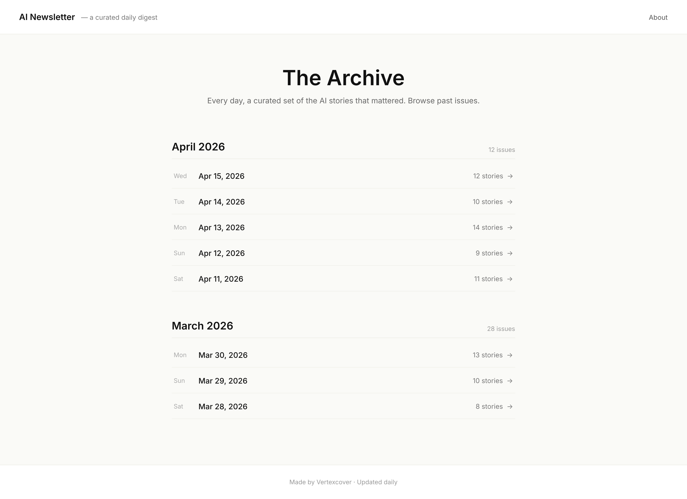
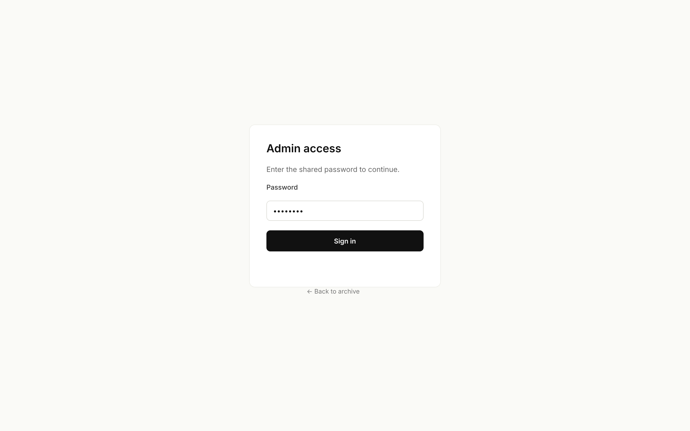

# Public Archive Listing — Design

**Date:** 2026-04-17
**Status:** Design complete, ready for planning
**Author:** Aman

## Problem Statement

The AI Newsletter currently exposes no public surface: every route in the web app is operator-facing (dashboard, run, review, archive-by-id). There is no index page where a reader can discover past curated issues, and the admin dashboard sits at `/`, so any visitor lands directly inside the operator console. We want a single public entry point where anyone can browse past reviewed issues, while keeping operator tooling behind a minimal auth gate.

## Context

- The pipeline already produces reviewed archives: `run_archives.reviewed: boolean` exists in `packages/shared/src/db/schema.ts` and is set to `true` by the review flow (`PATCH /api/archives/:runId`).
- `ArchivePage` at `/archive/:runId` already renders a single reviewed run as a recap-style read-only view — no change needed; this design only adds the *index* that links into it.
- The operator surface today: `/` (Dashboard), `/run` (manual run), `/review/:runId`, `/archive/:runId`, `/settings`.
- Deployment is internal-tool scale (Vertexcover team). Traffic is low. No CDN, no auth provider wired up.

## Mockups

### Public listing (root `/`)



Key elements:
- Top nav with product name on the left and an "About" link on the right (no RSS, no contact).
- Hero strip with one-line positioning ("A hand-curated daily digest of what's actually moving in AI.").
- Main column (720px) grouped by month. Each group has a sticky-feeling header ("April 2026") and stacked rows. Row format: `Apr 15, 2026 — 12 stories` with a subtle chevron on hover. Entire row is the link target.
- Centered footer with a single "Made by Vertexcover" line.

### Admin login (`/admin` when unauthenticated)



Minimal centered card: title, password field, "Sign in" button, and a "← Back to archive" link that returns to `/`.

## Requirements

### Functional

1. **Root route is public.** `GET /` renders a listing of reviewed archives. No auth prompt, no redirect.
2. **Listing content.** Each row shows the run date (e.g. `Apr 15, 2026`) and the story count (e.g. `12 stories`) as a single clickable link to `/archive/:runId`.
3. **Only reviewed archives appear.** Filter on `run_archives.reviewed = true`.
4. **Newest first, grouped by month.** Rows within a month are descending by run date; months descend too.
5. **Admin routes move to `/admin/*`.** Existing operator pages relocate: Dashboard → `/admin`, Run → `/admin/run`, Review → `/admin/review/:runId`, Settings → `/admin/settings`. Archive-by-id stays at `/archive/:runId` (public).
6. **Admin gate.** Any `/admin/*` route and the corresponding `/api/admin/*` endpoints require a shared password. Unauthenticated visitors see the login card, submit the password, receive a session cookie, and are redirected to the intended admin page.
7. **New listing API.** `GET /api/archives` returns the reviewed archives list (id, run date, story count), newest first. No auth required.
8. **Sign-out.** An admin user can clear their session from the admin UI.

### Non-functional

- **Security.** The admin password lives in `.env` as `ADMIN_PASSWORD` (plaintext is acceptable for an internal tool). Compare with constant-time equality. Session cookie must be `HttpOnly`, `SameSite=Lax`, `Secure` in production. No password is ever sent to the public bundle.
- **Performance.** Listing renders under 200ms for up to ~400 archives (≈1 year of daily runs). Single DB query, no N+1.
- **SEO basics.** Public pages (`/` and `/archive/:runId`) get meaningful `<title>` and `<meta name="description">`. No indexing blocker.
- **Responsive.** Listing and admin login work at 375px width. Rows stack vertically; month headers stay readable.
- **Accessibility.** Rows are real anchor tags, focusable with keyboard; month headings use `<h2>`; login form is a real `<form>` with `<label>`.
- **Observability.** Failed login attempts log a warning with the source IP and timestamp. No lockout/throttling for MVP (internal tool, low traffic).

### Edge cases

- **No reviewed archives yet.** Empty state copy: "No issues yet. Check back soon." Centered under the hero.
- **A run marked reviewed but with zero items.** Still listed; story count shows `0 stories`. (Shouldn't happen in practice, but don't crash.)
- **Clicking a row for an archive that was later unreviewed.** `ArchivePage` currently renders any archive; we keep that — the row simply wouldn't appear on the listing anymore if unreviewed.
- **Admin session expires while editing.** The admin SPA gets a 401 on its next API call and redirects to `/admin/login?next=<current-path>`.
- **Wrong password.** Inline error under the field ("Incorrect password"). Form stays on the login page.
- **Direct navigation to `/admin/run` when logged out.** Redirect to `/admin/login?next=/admin/run`, then back after success.
- **Bookmark of the old `/` dashboard URL.** The root is now public — operators must update their bookmark. Acceptable (2 internal users).
- **Shared password rotation.** Changing `ADMIN_PASSWORD` invalidates all existing sessions on next request (sessions are HMACed with the password as part of the secret — see design below).

## Key Insights

1. **The existing `run_archives` table already has everything we need.** No schema change, no migration. The work is route restructuring, a thin listing endpoint, and an auth middleware.
2. **"Minimal gate" means session cookie, not basic auth.** HTTP Basic Auth would force the browser's native dialog on every admin page and leaks the password into browser history/proxy logs. A single password posted to `/api/admin/login` that sets an `HttpOnly` cookie is barely more code and dramatically better UX/security.
3. **Public and admin share the same React app, not two bundles.** Splitting bundles would force duplication of the API client, router setup, and styling. One SPA with a route split (`/admin/*` gated client-side + server-side) is simpler and still meets the security bar because the server is the real gate.
4. **Client-side "auth" is UX, not security.** The public bundle cannot hide admin-only code at runtime — anyone can view source. Security is enforced by the API middleware on `/api/admin/*`. The client router just avoids flashing the admin UI before the 401 lands.

## Architectural Challenges

- **Route taxonomy split.** Today all routes live under `/`. We need three classes: public (`/`, `/archive/:runId`), admin-gated (`/admin/*`), and the login page itself (`/admin/login`, no gate). The router and the API middleware both need to agree on this split.
- **Where the auth boundary lives.** Option A: middleware on `app.route("/api/admin/*")`. Option B: per-route guard. Middleware at the mount point is simpler, leaks less, and is harder to forget on a new admin route.
- **Session storage.** Stateful (DB/Redis-backed session table) vs. stateless (signed cookie). For a single shared password with ≤5 concurrent operators, a stateless HMAC-signed cookie is simpler — no new table, no Redis key churn, trivially revocable by rotating the secret.
- **What the listing API returns.** The review flow already stores `rankedItems` in `run_archives`. Story count = `rankedItems.length`. No join into `raw_items` needed for the listing — one query on `run_archives` is enough.

## Approaches Considered

### A. Basic Auth on `/admin/*` (rejected)

Server sends `WWW-Authenticate: Basic` on any unauthenticated `/admin/*` request; browser prompts natively.

- Pros: ~10 lines of code, zero frontend work.
- Cons: Password sits in browser memory for the tab lifetime, shows up in proxy logs as `Authorization: Basic ...`, can't sign out without closing the browser, the native dialog is ugly, and the "Back to archive" UX from the mockup is impossible.

### B. Signed-cookie session + login page (chosen)

`POST /api/admin/login { password }` validates against `ADMIN_PASSWORD` and sets an `HttpOnly` cookie containing `HMAC(secret, "admin|<issuedAt>")`. Middleware on `/api/admin/*` verifies the cookie. React has a `/admin/login` route and a `<RequireAdmin>` wrapper that probes `GET /api/admin/me` and redirects on 401.

- Pros: Matches the mockup exactly; clean sign-out (clear cookie); rotatable by changing the secret; cookie never leaks to the public bundle.
- Cons: ~40 lines more than Basic Auth (middleware + login route + one hook). Still tiny.

### C. Full auth provider (rejected)

Lucia / Auth.js with email-password or OAuth.

- Pros: Real multi-user story later.
- Cons: Massive overkill for an internal tool with 2 users and no user model. Adds a dependency, a table, and a migration for zero current value. Revisit if we ever need per-user audit trails.

**Recommendation: B.** It's the smallest thing that isn't actively bad.

## Chosen Approach

### Routing

| Route | Audience | Gate |
|---|---|---|
| `/` | Public | none |
| `/archive/:runId` | Public | none |
| `/admin/login` | Anyone | none |
| `/admin` | Operator | cookie |
| `/admin/run` | Operator | cookie |
| `/admin/review/:runId` | Operator | cookie |
| `/admin/settings` | Operator | cookie |

React Router has two layout components: `<PublicLayout>` (used by `/`, `/archive/:runId`) and `<AdminLayout>` (wraps `<RequireAdmin>`, used by `/admin/*` except `/admin/login`).

### API

- `GET /api/archives` — public. Returns `{ archives: Array<{ runId, runDate, storyCount }> }`, newest first.
- `POST /api/admin/login` — public. Body `{ password }`. On success: set cookie, return `{ ok: true }`. On failure: 401, log warning with IP.
- `POST /api/admin/logout` — clears cookie.
- `GET /api/admin/me` — returns 200 when the cookie is valid, 401 otherwise. Used by the frontend guard.
- Everything currently under `/api/runs/*`, `/api/settings`, `/api/archives/:runId` (PATCH/add-post) moves under the admin gate. `GET /api/archives/:runId` (read-only) stays public so `ArchivePage` works unauthenticated.

### Auth middleware

A Hono middleware mounted at `/api/admin/*` reads the `admin_session` cookie, verifies the HMAC against `SESSION_SECRET`, and on failure returns 401. The secret is `process.env.SESSION_SECRET` (new env var) — not `ADMIN_PASSWORD` — so rotating the password doesn't invalidate sessions unless we also rotate the secret. Cookie payload is just `issuedAt`; validity window is 30 days.

### Frontend gate

`<RequireAdmin>` calls `GET /api/admin/me` on mount via react-query. While pending, render nothing (no flash). On 401, navigate to `/admin/login?next=<currentPath>`. On 200, render children. The login page posts to `/api/admin/login`, invalidates the `me` query, and navigates to `next` (default `/admin`).

### Listing query

Single Drizzle query on `run_archives`:
```
select runId, runDate, jsonb_array_length(rankedItems) as storyCount
  where reviewed = true
  order by runDate desc
```
Grouping by month is done client-side from the sorted array — it's ≤400 rows and the client already has date-fns-style helpers.

### Environment

New env vars in `.env.example` and `.env`:
- `ADMIN_PASSWORD` — plaintext shared password.
- `SESSION_SECRET` — 32-byte random string for HMAC.

## High-Level Design

```
Browser ──► /               ──► PublicLayout ──► ArchiveListing ──► GET /api/archives (no auth)
Browser ──► /archive/:id    ──► PublicLayout ──► ArchivePage     ──► GET /api/archives/:id (no auth)
Browser ──► /admin/*        ──► RequireAdmin ──► GET /api/admin/me
                                    │
                                    ├─ 200 ──► AdminLayout renders existing pages ──► /api/admin/*
                                    └─ 401 ──► redirect /admin/login?next=...

POST /api/admin/login { password }
    ├─ password === ADMIN_PASSWORD ──► set admin_session cookie (HMAC), 200
    └─ mismatch ──► 401, log warning with IP
```

## Open Questions

1. **About page content.** The mockup has an "About" link. Does it point to a `/about` route we need to build, or the marketing site / GitHub? Deferring — design assumes it links to `https://vertexcover.io` for now; revisit during planning.
2. **RSS feed later.** Explicitly out of scope now, but the listing endpoint's shape (`runId`, `runDate`, `storyCount`) is already close to what an RSS generator would need. No decision required; just noting.

## Risks and Mitigations

| Risk | Impact | Mitigation |
|---|---|---|
| `ADMIN_PASSWORD` leaked via frontend bundle | Critical | Password is only read server-side in the login route; never imported from `@newsletter/shared` or referenced in web code. Verify via grep in CI. |
| Operators bookmark `/` and lose access to the dashboard | Low | Ship a one-time note; 2 internal users. |
| Session cookie over HTTP in local dev feels broken | Low | Mark `Secure` only when `NODE_ENV === "production"`. |
| Listing query grows slow if archives balloon | Low (400 rows/yr) | Add index on `(reviewed, runDate)` if it ever matters. Not needed for MVP. |
| Clicking "Sign in" with empty field | UX | Client-side `required` on the input + server returns 400. |

## Assumptions

- The single shared password is acceptable to both current operators.
- Public traffic is low enough that we do not need rate-limiting on `/api/admin/login` beyond the warning log. If this ever ships outside Vertexcover infra, add IP-based throttling.
- `run_archives.rankedItems` is always a JSON array (current schema says `notNull`). Story count can therefore use `jsonb_array_length` without a null check.
- `ArchivePage` already handles the public case — no auth token is embedded in its API calls today. (Verified before starting implementation.)
