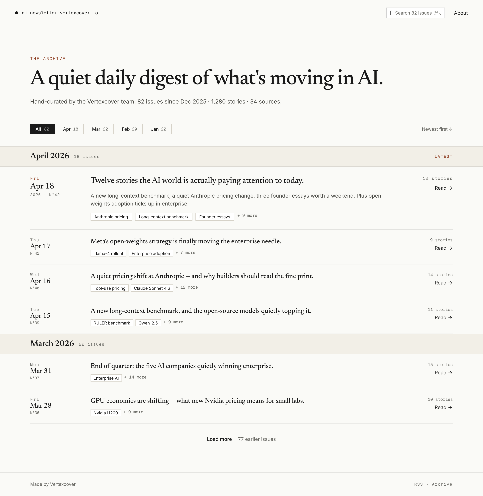

# Ledger Archive Listing — Design Doc

**Date:** 2026-04-19
**Status:** Approved for implementation
**Visual reference:** `./2026-04-19-ledger-archive-listing-mockup.png`

## Context

The public archive listing at `/` currently renders three fields per issue (`runId`, `runDate`, `storyCount`) as a minimal row with just `"Apr 18, 2026 — 12 stories"` + a chevron. The owner rejected the current UI as generic. After exploring four distinct directions (Ledger, Bento Magazine, Timeline Rail, Typographic Index) in Pencil, the **Ledger** direction was selected.

The Ledger is a dense editorial single-column list, grouped by month, that gives each issue enough visual substance to decide whether to open it — without becoming a magazine grid.

## What the design shows

Top-to-bottom:

1. **Nav bar** — brand mark + domain (`ai-newsletter.vertexcover.io`), search pill (`Search 82 issues` with `⌘K`), "About" link. Search is visual-only for now (no functionality wired).
2. **Hero** — small eyebrow `THE ARCHIVE` in warm accent, serif H1 `"A quiet daily digest of what's moving in AI."`, one-line stats sub `Hand-curated by the Vertexcover team. 82 issues since Dec 2025 · 1,280 stories · 34 sources.`
3. **Filter row** — dark pill `All 82`, outline pills `Apr 18`, `Mar 22`, `Feb 20`, `Jan 22` (per-month chips), right-aligned `Newest first ↓`. Filter is visual-only for MVP.
4. **Sticky month header** — `April 2026 · 18 issues ············ LATEST` (light cream band, editorial serif month name, mono meta).
5. **Rows** (dense, separated by thin dividers):
   - **Left: date block** (fixed 120px). Mono day-of-week eyebrow, serif `Apr 18` date, mono `2026 · N°42` sub. The featured (most recent) row uses a warm accent on the day-of-week and a larger date size.
   - **Middle: main column** (fills). Serif headline (22pt for featured, 18pt for rest) taken from the top-ranked story's title. On the featured row only, a 2-line Inter 14pt dek taken from the top item's `recap.summary`. Below the title, a chip row of up to 3 top-story titles (`Anthropic pricing`, `Long-context benchmark`, `Founder essays`) + muted `+ N more`.
   - **Right: meta column** (fixed 120px). Mono `12 stories`, `Read →` link.
6. **Second month header** — `March 2026 · 22 issues`.
7. **More rows** (same structure).
8. **Load more** — centered link `Load more · 77 earlier issues`.
9. **Footer** — thin rule, left `Made by Vertexcover`, right `RSS · Archive`.

## Data it depends on

Today the listing endpoint returns only `{ runId, runDate, storyCount }`. The Ledger needs one small extension:

| Field | Source | Notes |
|---|---|---|
| `topItems: { id, title, sourceType }[]` | First 3 from `run_archives.rankedItems`, joined against `raw_items` for `title` / `sourceType` | In rank order |
| `leadSummary: string \| null` | Top item's `recap.summary` with per-item override precedence (matches `hydrateRankedItems`) | Used only on the featured row |

Issue number `N°X` is derived **client-side** as `total - index` — not persisted.

No new LLM calls. No cover images. No tags. The chips are literal top-story titles truncated to ~28 chars.

## What NOT to add

- **No** issue-level synthesized headlines ("Twelve stories the AI world is paying attention to today.") — that would require a new LLM call in the pipeline. Deferred to a later PR. The featured row's headline is the actual top story's title.
- **No** tag / category / source filter chips — we don't categorize issues at that grain.
- **No** cover images per issue — the `raw_items.imageUrl` is per-story, not per-issue.
- **No** functional search in this PR. The `⌘K` pill is visual only. (Wiring it to a client-side title filter is a <1 hr follow-on.)
- **No** pagination beyond a "Load more" stub. Current scale (≤100 reviewed issues) doesn't require it.

## Acceptance signals

A user landing on `/` should:
- Immediately see the most recent issue dominate the visual hierarchy.
- Be able to read the top 3 story titles for every issue without clicking.
- Scan 20+ issues on a single desktop viewport with no ambiguity about dates or counts.
- Never see fabricated data (e.g. a row with missing `topItems` must degrade gracefully, not render placeholder text).

## Decisions resolved during brainstorm (2026-04-19)

1. **Featured treatment** — applied only when `index === 0` **AND** `leadSummary !== null`. If the most recent issue has no summary, the row collapses to normal styling. No placeholder text.
2. **Chip truncation** — client-side, ~28 chars + ellipsis; `title` attribute carries the full title so hover shows the original. API returns full titles.
3. **Month filter chips** — wired to a client-side filter over the already-loaded list. No network call. The chip for the active month toggles on click.
4. **"Load more" behavior** — client-side progressive reveal of 10 issues at a time. Initial render shows 10; clicking Load more appends 10 more from the already-loaded list. Link hides when the list is exhausted.
5. **Empty / error states** — keep the current copy (`"No issues yet. Check back soon."`, `"Couldn't load issues"`) but restyle to match Ledger typography (serif headline + mono eyebrow).
6. **Typography** — Newsreader (serif) and Geist Mono loaded via Google Fonts `<link>` in `packages/web/index.html`; Tailwind `fontFamily` config extended with `serif` and `mono` tokens pointing at the two families.
7. **Repo hydration** — `RunArchivesRepo.listReviewed()` composes `RawItemsRepo.findByIds()` internally. After the `run_archives` read, the repo collects the top-3 ranked ids across all rows, calls `findByIds` once, and stitches titles + summaries in memory using the same override precedence rule as `hydrateRankedItems` (per-item override on `run_archives.rankedItems[i].summary` wins over `raw_items.metadata.recap.summary`). No schema change required; no raw SQL join.

## Edge cases to handle in implementation

- `storyCount === 0` → `topItems === []`, no chip row, no `+ N more`. Row renders as date block + muted `"No stories"` label + right meta. No `Read →` link.
- `topItems.length < 3` → render only the chips we have; no `+ N more`.
- `topItems.length === 3` and `storyCount > 3` → show the three chips plus `+ (storyCount - 3) more`.
- `leadSummary === null` on index 0 → featured treatment does NOT apply; row renders as a normal row.
- Single-month archive (no March group) → only one month header, no empty groups.
- Empty archives list → `EmptyState` renders, filter chips and Load more are hidden.
- Error from `GET /api/archives` → error component renders, filter chips and Load more are hidden.
- User clicks an already-active month chip → filter clears (toggle semantics), list returns to "all issues".
