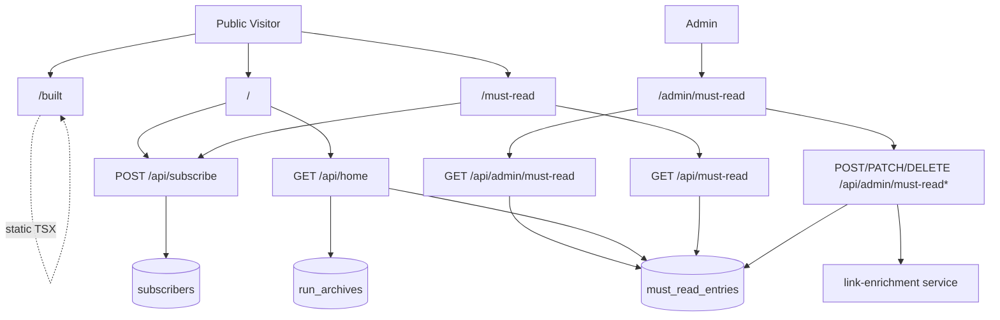
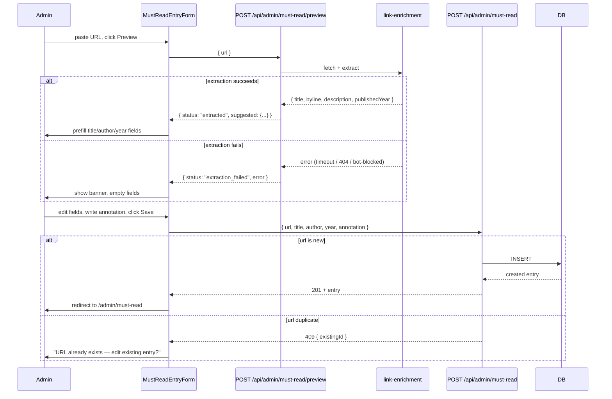
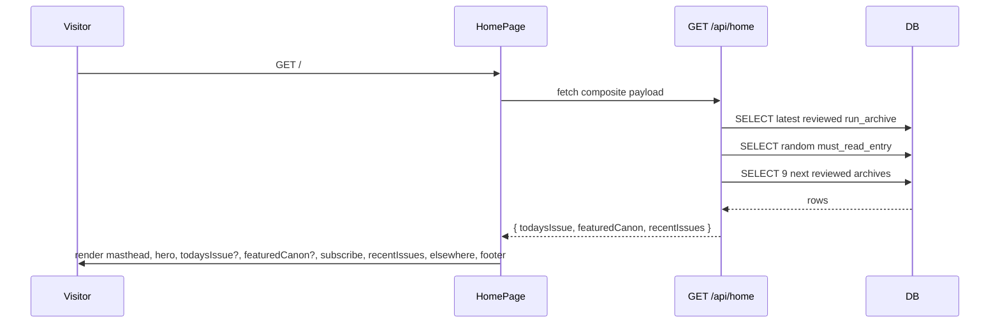

# AgentLoop Rebrand — Home / Must Read / Built

**Date:** 2026-05-23
**Author:** Ritesh + Claude
**Status:** Draft for review
**Scope:** Medium

## Problem

The current public surface is `The Daily Read` — a single archive listing at `/` with no positioning, no canon, no "behind the curtain". It reads as one of many AI newsletter aggregators rather than something a builder would subscribe to and revisit. The product has narrowed editorially (agentic coding, harness engineering, context engineering, software factory) but the brand has not followed.

This redesign:

1. Rebrands `/` from *The Daily Read* to **AgentLoop**, a Vertexcover Labs publication, with a front-page treatment that positions the newsletter against the noise.
2. Adds **`/must-read`** — a curated, annotated list of seminal external essays/talks/papers, surfaced on the home page and editable via admin UI.
3. Adds **`/built`** — a static page describing how AgentLoop itself is built using harness engineering practices (manifesto + technical breakdown).
4. Updates **`/sources`** to a flat reading list (already designed; out of scope for this doc beyond routing/nav inclusion).

## Context

- Current home (`ArchiveListingPage`) is the Ledger-style archive listing. It will become a section *within* the new home, not the whole page.
- All public routes are wrapped in `PublicLayout`. Admin routes sit under `/admin/*` with `requireAdmin` cookie middleware.
- The existing link-enrichment service (`services/link-enrichment`) already extracts `{ title, byline, description, ogImage, readabilityMarkdown }` from arbitrary URLs. Reused for Must Read entry creation.
- The existing `/api/subscribe` endpoint handles double-opt-in subscription. All new subscribe surfaces wire to it unchanged.
- Migrations are at `0026`. This adds `0027_create_must_read_entries.sql`.

## Requirements

### Functional

- **F1** — `GET /` MUST render the new home page with: masthead (`AGENTLOOP` + Vertexcover Labs attribution + top-right `MUST READ · BUILT · SUBSCRIBE →`), hero, pillars, exclusion line, today's issue block, From-the-canon callout (random Must Read entry), inline subscribe card, recent issues list (existing archive rows), Elsewhere three-up strip (Must Read / Sources / Tools), colophon, footer.
- **F2** — `GET /api/home` MUST return a single composite payload: `{ todaysIssue: ArchiveListItem | null, featuredCanon: MustReadEntry | null, recentIssues: ArchiveListItem[] }`. The `todaysIssue` is the most recent reviewed `run_archives` row whose `completed_at` is within the last 48 hours; otherwise `null`. The `featuredCanon` is a single uniform-random `must_read_entries` row (re-rolled on every request — same visitor refreshing twice may see different entries; this is intentional). The `recentIssues` is the next 9 reviewed archives (newest first, excluding the `todaysIssue` row if non-null), so the home page can render the first 10 issues without a second call. When `todaysIssue` is null, `recentIssues` returns the 10 newest reviewed archives.
- **F3** — `GET /must-read` MUST render a public flat list of all `must_read_entries`, reverse-chronological by `added_at`, with two inline subscribe cards (after header, before footer). Per-entry: serif title, mono `Author · Year` byline, mono `ADDED: <date>` eyebrow, italic annotation, rust `→ source` link. No themes, no categories.
- **F4** — `GET /api/must-read` (public) MUST return `MustReadEntry[]` ordered by `added_at DESC`.
- **F5** — `POST /api/admin/must-read/preview` (admin-gated) MUST accept `{ url: string }`, fetch the URL via the existing link-enrichment service, and respond with `{ status: "extracted", suggested: { title, author, year } } | { status: "extraction_failed", error: string }`. This is a *preview* call only; it MUST NOT persist anything. Server holds no state between preview and save — an abandoned preview is a no-op.
- **F6** — `POST /api/admin/must-read` (admin-gated) MUST accept `{ url, title, author, year, annotation }` and persist a new entry with `addedAt = now()`. `author` and `year` MAY be null. On success returns `201 Created` with the new `MustReadEntry`. On duplicate URL returns `409 Conflict` with `{ error: "duplicate_url", existingId: string }`.
- **F7** — `PATCH /api/admin/must-read/:id` (admin-gated) MUST accept partial updates `{ title?, author?, year?, annotation?, url? }`. `addedAt` MUST NOT change on PATCH; `updatedAt` MUST update.
- **F8** — `DELETE /api/admin/must-read/:id` (admin-gated) MUST remove the entry.
- **F9** — `GET /admin/must-read` MUST render an admin list view with: row per entry (title, author, year, added date, annotation excerpt), per-row Edit/Delete actions, top-of-page "Add new" CTA that opens a paste-URL form.
- **F10** — The admin add-new flow MUST be a two-step UX: (1) paste URL → submit to F5 preview endpoint → backend extracts via link-enrichment (5–15s, blocking) → form prefills with suggested title/author/year and an empty annotation field; (2) admin reviews/edits prefilled fields + types annotation + clicks Save → submit to F6. The form MUST disable the Save button during preview and show a "Extracting…" indicator. On extraction failure, the form opens with empty fields and a `Extraction failed: <reason>. Enter manually.` banner. If the admin abandons the page mid-preview (tab close, refresh, navigate away), no server state is created (per F5).
- **F11** — `GET /built` MUST render a static React page with the locked manifesto + pipeline diagram + skills/agents/artifacts tables + closing CTA. Copy lives in TSX in the repo; edits require a code change + deploy.
- **F12a** — All three new pages (`/`, `/must-read`, `/built`) MUST include the masthead nav `MUST READ · BUILT · SUBSCRIBE →`.
- **F12b** — The home page (`/`) MUST NOT show a full directory nav row. `/must-read` and `/built` MUST show the full directory nav row (`TODAY · ARCHIVE · MUST READ · SOURCES · TOOLS · BUILT`).
- **F13** — All subscribe surfaces (top-right link, inline cards, footer) MUST POST to the existing `/api/subscribe` endpoint and surface the existing double-opt-in confirmation flow.

### Non-functional

- **NF1** — Home page first-byte latency MUST remain within 100ms of the current `/` (measure with `pnpm --filter @newsletter/api dev` + `curl -w` against `/api/archives` to capture baseline p50; new `/api/home` p50 MUST be within 100ms of that baseline). Requires verification during implementation that `run_archives (reviewed, completed_at DESC)` is indexed.
- **NF2** — Must Read admin URL preview MUST timeout at 15s (matches existing link-enrichment timeout).
- **NF3** — Random featured-canon selection MUST be uniform across all entries on each request. No caching layer. Two consecutive requests by the same visitor MAY return different entries (intentional).
- **NF4** — Home page MUST render gracefully when any of the three composite slots is null (no reviewed archives yet → hide today's issue and recent issues; no Must Read entries → hide From-the-canon section).
- **NF5** — Public list endpoint `GET /api/must-read` MUST NOT expose `updatedAt`. Admin endpoints MAY expose all fields. (Current schema has no other admin-only fields, but this rule applies if any are added later.)
- **NF6** — All external links to source URLs (Must Read entries, archive items) MUST use `rel="noopener noreferrer" target="_blank"` to prevent reverse-tab-nabbing.
- **NF7** — Admin endpoints MUST be CSRF-safe. The existing `admin_session` cookie MUST be `SameSite=Lax` or stricter; mutating endpoints (POST/PATCH/DELETE) MUST verify this via existing `requireAdmin` middleware. No new CSRF tokens required if cookie is already SameSite-safe; verify during implementation.
- **NF8** — The URL-extraction endpoint (F5) MUST reject private/loopback/link-local addresses (SSRF protection). The existing `link-enrichment/url-classifier.ts::isPrivateOrLoopbackHost` already blocks `localhost`, `127.0.0.0/8`, `192.168.0.0/16`, `169.254.0.0/16`. Implementation MUST also add `10.0.0.0/8` and `172.16.0.0/12` to that helper before exposing the F5 endpoint, since the admin endpoint is reachable over the public internet (current callers only run inside the pipeline, where the omission was not exploitable).

### Edge cases

- **E1** — Cold start: zero reviewed archives. Home hides "Today's Issue" and "Recent Issues" sections; subscribe card and Elsewhere strip remain. Hero, pillars, exclusion, footer always render.
- **E2** — Cold start: zero Must Read entries. Home hides the From-the-canon section. `/must-read` renders headline + sub-deck + meta line (`0 entries`) + both subscribe cards + footer. No "no entries yet" placeholder shown to the public.
- **E3** — URL extraction returns partial data (title only, no author, no year). Admin form prefills what was extracted; missing fields stay empty for manual entry.
- **E4** — URL extraction fails entirely (timeout, 404, bot-blocked, paywall). Admin form opens with all fields empty + a banner `Extraction failed: <reason>. Enter manually.` Save still requires title at minimum.
- **E5** — Admin deletes the only Must Read entry while a public visitor is on the home page. Next page load hides the From-the-canon section. No real-time invalidation needed.
- **E6** — Duplicate URL submitted twice. The admin save endpoint returns `409 Conflict` with a pointer to the existing entry. No silent dedup.
- **E7** — Featured canon selects an entry whose URL is now dead. Editorial responsibility (not validated by the system). Links open with `rel="noopener noreferrer" target="_blank"` per NF6, so a dead link is a graceful 404 in a new tab — never a hijack risk.
- **E8** — Admin abandons the URL-preview step mid-extraction (closes tab, refreshes, navigates away). The 15s extraction continues server-side until completion or timeout, but no state is persisted (F5 is read-only). Next preview attempt is a fresh call.
- **E9** — Admin edits a 6-month-old entry. `addedAt` MUST NOT change (per F7); `updatedAt` MUST update. The entry stays in its reverse-chron position based on `addedAt`.

## Architectural Decisions

- **AD1 — One composite `/api/home` endpoint over multiple calls.** Reason: atomic snapshot, one round-trip, one `useQuery` in the React page. Cleaner contract.
- **AD2 — Server-side random for featured canon (`ORDER BY random() LIMIT 1`).** Reason: uniform random across all entries on each visit, no cache layer needed at this scale (<50 rows, <10ms). Same visitor refreshing twice sees different entries — desired behavior.
- **AD3 — Sync URL extraction in admin POST.** Reason: 1–2 entries/week, 5–15s extraction time is fine in a blocking call. A job queue would be overengineering. Existing link-enrichment service is reused as-is.
- **AD4 — `/built` page copy lives in TSX, not markdown or DB.** Reason: page changes 2x/year max, layout is custom (pipeline diagram, tables), and code-edited copy is consistent with how every other static page in the app works. YAGNI on admin UI for /built. Maintainer hint: a `LAST_REVIEWED` constant at the top of `BuiltPage.tsx` (e.g. `const LAST_REVIEWED = "2026-05-23";`) makes staleness visible during code review.
- **AD5 — New table `must_read_entries`, not JSON file or settings row.** Reason: native CRUD via admin UI requires a real table; existing patterns (`requireAdmin` middleware, Drizzle repo, route handler) apply unchanged.
- **AD6 — Public read endpoint returns all entries unpaginated; no sort/search/RSS controls.** Reason: at 20–50 entries, the full payload is <20KB. Pagination, search, sort controls, view counters, and RSS for Must Read are all YAGNI until the list exceeds ~200 entries or a user actually asks.
- **AD7 — No "cornerstone" flag on Must Read entries.** Reason: locked earlier — random across all entries, not a curated subset. Cornerstone would be a knob without a clear right value.
- **AD8 — No themes/categories on Must Read.** Reason: locked earlier — reverse-chronological by `added_at` is the only ordering. False hierarchy is worse than no hierarchy at 20–50 entries.
- **AD9 — REST verb choice: `POST` for create, `PATCH` for partial update, `DELETE` for remove.** Reason: `POST /api/admin/must-read` (no ID in path) creates; `POST /api/admin/must-read/preview` is a distinct sub-resource for the extraction step. No `PUT` — there's no idempotent full-replace use case.
- **AD10 — Admin list view uses its own endpoint (`GET /api/admin/must-read`), not the public endpoint.** Reason: admin needs `updatedAt` (hidden from public per NF5) for last-edited display.

## Approaches Considered

This design has one viable shape per concern. Why not the alternatives:

- **Not three separate home page endpoints**: rejected because it forces uncoordinated loading states and three round-trips. The composite endpoint costs nothing extra at this scale.
- **Not async/queued URL extraction**: rejected because the volume is 1–2 entries/week. A blocking POST is fine.
- **Not markdown for `/built`**: rejected because the layout has custom components (pipeline diagram, three tables) that don't fit markdown well.
- **Not a JSON file for Must Read entries**: rejected because the admin CRUD UI requires real persistence with timestamps.

## Schema

```sql
CREATE TABLE must_read_entries (
  id          UUID PRIMARY KEY DEFAULT gen_random_uuid(),
  url         TEXT NOT NULL UNIQUE,
  title       TEXT NOT NULL,
  author      TEXT,
  year        INTEGER,
  annotation  TEXT NOT NULL,
  added_at    TIMESTAMPTZ NOT NULL DEFAULT now(),
  updated_at  TIMESTAMPTZ NOT NULL DEFAULT now()
);

CREATE INDEX must_read_entries_added_at_idx ON must_read_entries (added_at DESC);
```

Drizzle type:

```ts
export const mustReadEntries = pgTable("must_read_entries", {
  id: uuid("id").primaryKey().defaultRandom(),
  url: text("url").notNull().unique(),
  title: text("title").notNull(),
  author: text("author"),
  year: integer("year"),
  annotation: text("annotation").notNull(),
  addedAt: timestamp("added_at", { withTimezone: true }).notNull().defaultNow(),
  updatedAt: timestamp("updated_at", { withTimezone: true }).notNull().defaultNow(),
});

export type MustReadEntry = typeof mustReadEntries.$inferSelect;
export type MustReadEntryInsert = typeof mustReadEntries.$inferInsert;
```

## API Contracts

### Public

```ts
// GET /api/home  →  200 OK
type HomePagePayload = {
  todaysIssue: ArchiveListItem | null;
  featuredCanon: MustReadEntry | null;
  recentIssues: ArchiveListItem[];  // up to 10 entries, newest first, excludes todaysIssue when non-null
};

// GET /api/must-read  →  200 OK
// Returns entries WITHOUT updatedAt (NF5).
type PublicMustReadEntry = Omit<MustReadEntry, "updatedAt">;
type MustReadListResponse = PublicMustReadEntry[];  // reverse-chronological by addedAt
```

### Admin (gated by requireAdmin)

```ts
// POST /api/admin/must-read/preview  →  200 OK
type PreviewRequest = { url: string };
type PreviewResponse =
  | { status: "extracted"; suggested: { title: string; author: string | null; year: number | null } }
  | { status: "extraction_failed"; error: string };

// POST /api/admin/must-read
type CreateRequest = {
  url: string;
  title: string;
  author: string | null;
  year: number | null;
  annotation: string;
};
// →  201 Created  body: MustReadEntry
// →  409 Conflict body: { error: "duplicate_url"; existingId: string }

// GET /api/admin/must-read  →  200 OK
// Admin list view; returns full MustReadEntry rows including updatedAt.
type AdminMustReadListResponse = MustReadEntry[];

// PATCH /api/admin/must-read/:id  →  200 OK  body: MustReadEntry
type UpdateRequest = Partial<{
  url: string;
  title: string;
  author: string | null;
  year: number | null;
  annotation: string;
}>;
// addedAt MUST NOT change; updatedAt MUST update.

// DELETE /api/admin/must-read/:id  →  204 No Content
```

## Component Architecture

### Frontend

```
packages/web/src/
  pages/
    HomePage.tsx                    NEW — replaces ArchiveListingPage at /
    MustReadPage.tsx                NEW — public list at /must-read
    BuiltPage.tsx                   NEW — static page at /built
    admin/
      AdminMustReadListPage.tsx     NEW — admin CRUD index at /admin/must-read
      AdminMustReadEditPage.tsx     NEW — create/edit form at /admin/must-read/new and /admin/must-read/:id
  components/
    home/
      Masthead.tsx                  NEW — shared between home + must-read + built + sources
      HeroBlock.tsx                 NEW — hero headline + pillars + exclusion line
      TodaysIssueBlock.tsx          NEW
      FromTheCanonBlock.tsx         NEW
      InlineSubscribeCard.tsx       NEW — reused on home and must-read
      ElsewhereStrip.tsx            NEW
      ColophonLine.tsx              NEW
      Footer.tsx                    NEW — replaces existing footer in PublicLayout
    must-read/
      MustReadEntry.tsx             NEW — per-entry render
    built/
      PipelineDiagram.tsx           NEW
      DefinitionTable.tsx           NEW — mono left col / serif right col
    admin/must-read/
      MustReadAdminTable.tsx        NEW
      MustReadEntryForm.tsx         NEW — two-step paste-URL flow
  api/
    home.ts                         NEW — typed client for /api/home
    must-read.ts                    NEW — typed client (public + admin)
  layouts/
    PublicLayout.tsx                UPDATED — uses new Masthead + Footer
```

The existing `ArchiveListingPage` is deleted. The existing archive-listing components (`ArchiveRow`, `MonthHeader`, `SearchBar`, etc.) are reused inside the new `HomePage` for the "Recent Issues" section.

### Backend

```
packages/api/src/
  routes/
    home.ts                         NEW — GET /api/home (public)
    must-read.ts                    NEW — GET /api/must-read (public)
    admin-must-read.ts              NEW — POST preview / POST create / PATCH update / DELETE (admin)
  repositories/
    must-read.ts                    NEW — CRUD + ordered list + random select

packages/shared/src/
  db/schema.ts                      UPDATED — add mustReadEntries table
  db/migrations/0027_*.sql          NEW
```

### Pipeline

Untouched. This redesign is API + frontend only.

## Architecture Diagram



## Admin Add-Entry Flow



## Home Page Render Flow



## Open Questions

- **OQ1** — Should the masthead nav (`MUST READ · BUILT · SUBSCRIBE →`) be sticky on scroll? *Default: no — it's an editorial page, not an app shell. Revisit only if user feedback says it's needed.*
- **OQ2** — Should `/built` include live links to actual `docs/spec/*` artifacts in the repo, or describe them abstractly? *Default: describe abstractly with a single link to the GitHub repo root. Live spec links would rot.*
- **OQ3** — Tools placeholder strategy. *Default: render the Tools column in the Elsewhere strip as static text (`COMING SOON →` in muted color, NOT a link). No `/tools` route created. Eliminates 404 risk entirely; ship the route when the page is built.*

## Locked Copy

The `/built` page manifesto, pipeline diagram labels, and table contents are locked in the prior session. Authoritative source for the locked TSX-resident copy: the HTML preview at `/tmp/agentloop-previews/built.html` (paragraphs of "THE ARGUMENT", pipeline stages and their one-line descriptions, the skills/agents/artifacts tables, the "THE GUARDRAILS" paragraph, the "TRY IT YOURSELF" closing block). The implementer should transcribe these strings verbatim into `BuiltPage.tsx` during implementation.

Locked copy for the home page and `/must-read` page is similarly captured in `/tmp/agentloop-previews/home.html` and `/tmp/agentloop-previews/must-read.html`.

## Risks & Mitigations

- **R1 — URL extraction breaks for paywalled or JS-rendered sources** (e.g., Bloomberg, NYT). *Mitigation*: manual-fallback already locked (E4). The admin can always type fields by hand.
- **R2 — Random featured canon selects a weak entry as the first impression for a new visitor.** *Mitigation*: editorial discipline at curation time (only add entries you'd be proud to have at the top). Add a "Cornerstone" flag later only if this becomes a real problem.
- **R3 — A redesigned home reduces archive discoverability** because the archive list is now visually demoted. *Mitigation*: archive list still loads 10 items on first paint and has "Load more". The site-wide search (`?q=`) on archives still works on `/`.
- **R4 — Built page rots** as the harness evolves. *Mitigation*: `LAST_REVIEWED` constant at top of `BuiltPage.tsx` makes staleness visible in PR review. Schedule a quarterly review (manual). The page is short enough to re-skim in 10 minutes.
- **R5 — Existing inbound links to `/` (search results, email links, social shares) now resolve to a different visual layout.** Code-wise the change is reversible (swap the route's component back), but visitors expecting the archive listing will see the new front-page treatment instead. *Mitigation*: the archive list still lives on `/` (below the From-the-canon block), so all archive items remain discoverable on the same URL. Search-engine ranking may shift; this is acceptable since the new page is more representative of the product.
- **R6 — Migration `0027_create_must_read_entries.sql` is irreversible data-wise.** Rolling back the migration drops any rows seeded between deploy and rollback. *Mitigation*: trivial in practice (admin-seeded only, 1–2 entries/week); no automated backup hook needed.

## What This Does NOT Do

- Does NOT change the pipeline, scheduler, or any worker code.
- Does NOT change the `/admin` dashboard, review page, or settings page.
- Does NOT introduce themes, tags, or categories on Must Read entries.
- Does NOT introduce images, OG previews, or thumbnails on Must Read entries.
- Does NOT introduce an admin UI for `/built` page copy.
- Does NOT add caching, CDN headers, or static generation. The home query is fast enough at this scale.
- Does NOT add a `/tools` page beyond a "Coming soon" placeholder (or just a route that 404s if no shipped page exists — TBD by OQ3).
- Does NOT change the subscribe flow, double-opt-in confirmation, or `/api/subscribe` endpoint.
- Does NOT migrate existing `ArchiveListingPage` data; the route just changes which component renders at `/`.
