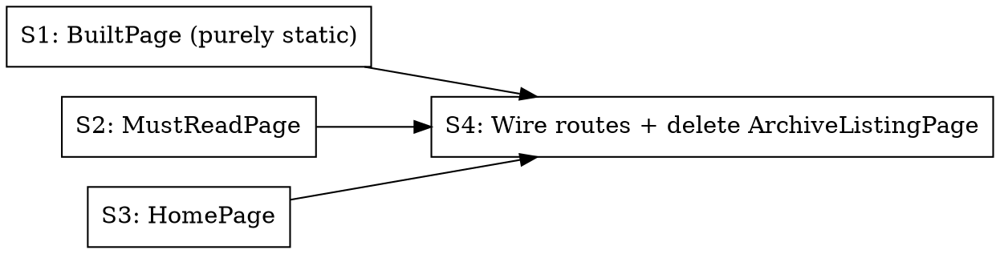

# Phase 6: Public pages — Home + MustRead + Built

> **Status:** pending

## Overview

Three new public pages, all wearing the shell from P5. Home is the composite front page; MustRead is the flat reverse-chron list; Built is the static manifesto + technical breakdown. Replaces `ArchiveListingPage` at `/`.

## Step Graph

S1, S2, S3 are independent (different files, no shared state). Execute sequentially in a single session to keep TDD focused; the steps exist so a future parallel session could fan them out.

## Step 1: BuiltPage

**Files:**
- Create: `packages/web/src/pages/BuiltPage.tsx`
  - Export top-level `const LAST_REVIEWED = "2026-05-23"` (REQ-019)
  - Render the locked copy from `/tmp/agentloop-previews/built.html`
- Create: `packages/web/src/components/built/PipelineDiagram.tsx` — the 7-stage horizontal flow
- Create: `packages/web/src/components/built/DefinitionTable.tsx` — generic mono-left / serif-right table
- Create: `packages/web/tests/unit/pages/BuiltPage.test.tsx`

**Tests:**
- REQ-017: page renders headline + sub-deck literal strings
- REQ-018: pipeline contains all 7 stage labels in order; skills table has 9 rows; agents table has 4 rows; artifacts table has 6 rows
- REQ-019: grep test — assert the source file matches `/^export const LAST_REVIEWED = "\d{4}-\d{2}-\d{2}";/m` (read file via Node fs in the test)

## Step 2: MustReadPage

**Files:**
- Create: `packages/web/src/pages/MustReadPage.tsx`
- Create: `packages/web/src/components/must-read/MustReadEntryView.tsx`
  - Per-entry render: mono `ADDED: <date>` eyebrow, serif title, mono `Author · Year` byline (omits `·` separator when both are null; omits just-`Year` or just-`Author` cleanly per EDGE-015), italic annotation, rust `→ source.host` link with `rel="noopener noreferrer" target="_blank"`
- Create: `packages/web/src/api/must-read.ts` — typed client for `GET /api/must-read`
- Create: `packages/web/tests/unit/pages/MustReadPage.test.tsx`
- Create: `packages/web/tests/unit/components/must-read/MustReadEntryView.test.tsx`

**Tests:**
- REQ-011: headline + sub-deck literals present; DirectoryNav rendered with all six items
- REQ-012: with 3 seeded entries, rendered order matches `addedAt DESC`; each entry's source link has both `rel="noopener noreferrer"` and `target="_blank"`
- REQ-013: exactly 2 nodes matching `[data-section="inline-subscribe"]` are rendered
- REQ-016: with empty list, meta line contains `0 entries`; both subscribe cards still present
- EDGE-015: `{author: null, year: null}` renders just the title row with no stray `·`
- EDGE-012: even if backend returned weird rel/target, the rendered output is always the canonical pair (component overrides)

## Step 3: HomePage

**Files:**
- Create: `packages/web/src/pages/HomePage.tsx`
- Create: `packages/web/src/components/home/TodaysIssueBlock.tsx`
- Create: `packages/web/src/components/home/FromTheCanonBlock.tsx`
- Create: `packages/web/src/components/home/ElsewhereStrip.tsx`
  - Three columns: MUST READ links to `/must-read`, SOURCES links to `/sources`, TOOLS is static muted `COMING SOON →` with NO `<a>` element (REQ-007)
- Create: `packages/web/src/api/home.ts` — typed client for `GET /api/home`
- Reuse: existing `ArchiveRow` from `packages/web/src/components/archive-listing/ArchiveRow.tsx` for the Recent Issues section
- Create: `packages/web/tests/unit/pages/HomePage.test.tsx`
- Create: `packages/web/tests/unit/components/home/ElsewhereStrip.test.tsx`

**Tests:**
- REQ-002: hero block renders all 7 literal strings
- REQ-003: when `todaysIssue` non-null, `[data-section="todays-issue"]` present with headline + link to `/archive/<runId>`
- REQ-004: when `featuredCanon` non-null, `[data-section="from-the-canon"]` present with title, annotation, link to entry URL
- REQ-006: `[data-section="recent-issues"]` contains ≤10 rows; if `todaysIssue` present, its `runId` does not appear
- REQ-007: `[data-section="elsewhere"]` has three columns; Tools column has zero `<a>` descendants
- REQ-009: no `[data-section="directory-nav"]` on `/` (verify DirectoryNav NOT rendered)
- EDGE-001: with `todaysIssue: null` payload, Today's Issue and Recent Issues both hidden; hero + subscribe + Elsewhere remain
- EDGE-002: with `featuredCanon: null`, From-the-canon section hidden
- NF-005: all `<a>` tags inside Today's Issue and recent-issues sections that point off-site use `rel="noopener noreferrer" target="_blank"`

## Step 4: Wire routes + delete `ArchiveListingPage`

**Files:**
- Modify: `packages/web/src/App.tsx` — replace `ArchiveListingPage` at `/` with `HomePage`; add `/must-read` → `MustReadPage`; add `/built` → `BuiltPage`
- Delete: `packages/web/src/pages/ArchiveListingPage.tsx`
- Delete or repurpose: any test files exclusive to `ArchiveListingPage`

**Verification:** `grep -r "ArchiveListingPage" packages/web/src` returns zero hits after this step.

## Pattern to follow

- `packages/web/src/pages/ArchivePage.tsx` — same Ledger aesthetic, same `useQuery` pattern
- Visual reference: `/tmp/agentloop-previews/home.html`, `must-read.html`, `built.html` — transcribe class names + inline styles literally

## Traces to

REQ-002, REQ-003, REQ-004, REQ-006, REQ-007, REQ-009, REQ-011, REQ-012, REQ-013, REQ-016, REQ-017, REQ-018, REQ-019, NF-005, EDGE-001, EDGE-002, EDGE-012, EDGE-015

## Commit

`feat(web): replace home with AgentLoop front page; add /must-read and /built`

## Done When

- [ ] All three pages render at their URLs in `pnpm dev`
- [ ] All listed REQs covered by passing unit tests
- [ ] `ArchiveListingPage` and its imports are gone
- [ ] `pnpm --filter @newsletter/web build` green
- [ ] `pnpm typecheck` and `pnpm lint` green
- [ ] Manual UI verification against the four HTML previews (deferred to Phase 8)
