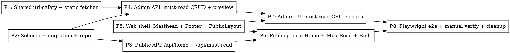

# Plan: AgentLoop Rebrand

> **Source:** [`SPEC.md`](./SPEC.md), [`../2026-05-23-agentloop-rebrand-design.md`](../2026-05-23-agentloop-rebrand-design.md)
> **Created:** 2026-05-23
> **Status:** planning

## Goal

Rebrand the public surface as **AgentLoop**, ship a `/must-read` annotated reading list (CRUD via admin), and ship a static `/built` page describing the harness practices behind the product.

## Acceptance Criteria

- [ ] `GET /` renders the new AgentLoop home page (masthead, hero, today's issue, from-the-canon, subscribe, recent issues, elsewhere strip, colophon, footer)
- [ ] `GET /api/home` returns a composite payload `{ todaysIssue, featuredCanon, recentIssues }` with the 48h freshness rule and uniform-random canon
- [ ] `/must-read` lists all entries reverse-chronological with two inline subscribe cards
- [ ] `/built` renders manifesto + pipeline + skills/agents/artifacts tables + `LAST_REVIEWED` constant
- [ ] Admin CRUD for must-read entries at `/admin/must-read` (paste-URL preview, save, edit, delete)
- [ ] Migration `0027_create_must_read_entries.sql` applied
- [ ] All 32 REQ-* and 8 NF-* acceptance criteria pass
- [ ] All 15 EDGE-* scenarios handled
- [ ] `pnpm build`, `pnpm typecheck`, `pnpm lint` all green
- [ ] Playwright e2e covers the admin add-entry flow
- [ ] Manual UI verification against the four HTML previews in `/tmp/agentloop-previews/`

## Codebase Context

### Existing Patterns to Follow

- **Hono route mounting:** `packages/api/src/app.ts` — `buildApp()` mounts public routers directly; admin routers go through `requireAdminFactory` gate; `/api/admin/<suffix>` uses `conditionalGate` that lets `/login` and `/logout` through.
- **Repository factory pattern:** `packages/api/src/repositories/run-archives.ts` — `createRunArchivesRepo(db)` returns an object with typed methods. Only files under `packages/api/src/repositories/**` are allowed to import `drizzle-orm` or `@newsletter/shared/db` (enforced by `newsletter/enforce-repository-access`).
- **Drizzle schema:** `packages/shared/src/db/schema.ts` — tables defined in order; `$inferInsert` and `$inferSelect` exported next to each table.
- **Drizzle migrations:** `pnpm --filter @newsletter/shared db:generate` from schema changes; apply with `pnpm --filter @newsletter/shared db:migrate`. Latest migration is `0026_chief_morlun.sql`; this plan adds `0027_*`.
- **Public layout:** `packages/web/src/layouts/PublicLayout.tsx` — currently has an inline Footer block; will be refactored to use the new shared Masthead + Footer components.
- **Admin form:** `packages/web/src/pages/SettingsPage.tsx` — `react-hook-form` + `zodResolver` + `@tanstack/react-query` `useMutation`. Mirror this pattern for the must-read admin form.
- **Typed API client:** `packages/web/src/api/client.ts` — `apiFetch` and `apiFetchAdmin` wrappers; `archives.ts` is the cleanest example to mirror.
- **Subscribe widget:** `packages/web/src/components/SubscribeWidget.tsx` — wraps `POST /api/subscribe`; reuse the underlying API call from new surfaces, do NOT duplicate.
- **React Router:** `packages/web/src/App.tsx` — `RouteObject[]` array; `PublicLayout` wraps public routes; `RequireAdmin` wraps admin routes inside `AdminLayout`.

### Test Infrastructure

- **API unit:** `packages/api/tests/unit/` — vitest, mocks the DB via repository injection.
- **API e2e:** `packages/api/tests/e2e/` — real Postgres + Redis via `pnpm infra:up`; `testTimeout: 30000`, `pool: "forks"`, `singleFork: true`.
- **Web unit:** `packages/web/tests/unit/` — vitest + jsdom for component rendering.
- **Web e2e (new):** Playwright will be added for the admin must-read flow only. No existing Playwright config — see Phase 7.
- **Test factories:** none today — tests construct fixtures inline. Continue this pattern; do not introduce a factory framework.

### Architecture Lint Rules to Respect

- `newsletter/enforce-repository-access` — blocks `drizzle-orm` / `@newsletter/shared/db` imports outside `repositories/**`.
- `newsletter/collector-return-shape` — N/A here (no new collectors).
- `web → shared` must use **subpath imports** (`@newsletter/shared/constants`, `@newsletter/shared/types`) — never root `@newsletter/shared` (see `.claude/rules/learnings/web-shared-subpath-imports.md`).
- Pipeline must not import from `@newsletter/api`. API must not import from pipeline (which is why we're moving the SSRF helper + static fetcher to shared).

### Key Findings from Exploration

- **`isPrivateOrLoopbackHost` ALREADY blocks `10.0.0.0/8` and `172.16.0.0/12`** (lines 63 and 65 of `packages/pipeline/src/services/link-enrichment/url-classifier.ts`). The design doc was wrong on this point. NF-007 is satisfied by the *move-to-shared* step alone; no rule expansion needed.
- **`enrichRawItems` is tightly coupled to `RawItemInsert`** and the pipeline's `EnrichmentContext`. It can't be called from the API as-is. The chosen approach (per Q&A): move `url-classifier` + a *static-only* fetcher into shared; API uses static path only; pipeline keeps Crawlee/Playwright for the browser path.
- **`packages/pipeline/src/services/web-fetch/fetch-static.ts`** is the static branch we'll move/extract.
- **Footer is inline in PublicLayout** today; new `Footer.tsx` component will replace it across all public pages.

### Open Knobs Locked During Planning

- Extraction architecture: **shared static fetcher only** (no browser in API).
- SSRF helper location: **`@newsletter/shared/services/url-safety.ts`**; pipeline's `url-classifier.ts` re-exports.
- Static extractor scope: **uses the existing fetch + Readability + Turndown path**, exposes `extractPageMetadata(html) → { title, author, year }` helper next to it; no third-party metascraper.
- Testing bar: **unit + API integration + Playwright for admin must-read flow + manual UI verification with Chrome MCP**.
- Merge strategy: **single PR** for the full feature.

## Phase Graph

Phases 1, 2, and 5 have no incoming edges → they could run in parallel if dispatched to separate sessions. I'll execute them sequentially in one session.

## Phase Summary

| Phase | Delivers | Touches |
|------|----------|---------|
| **P1** | `@newsletter/shared/services/url-safety` + `static-page-fetcher`; pipeline re-exports | shared, pipeline |
| **P2** | `must_read_entries` table, migration 0027, Drizzle types, repository factories | shared, api |
| **P3** | `GET /api/home`, `GET /api/must-read` public endpoints | api |
| **P4** | `POST /preview`, `POST /`, `GET /`, `PATCH /:id`, `DELETE /:id` admin endpoints | api |
| **P5** | `Masthead`, `Footer`, refactored `PublicLayout`, three-item top-right nav | web |
| **P6** | `HomePage`, `MustReadPage`, `BuiltPage` + the supporting block components | web |
| **P7** | `AdminMustReadListPage`, `AdminMustReadEditPage` + the two-step form | web |
| **P8** | Playwright config + one e2e spec + manual UI walkthrough + lint/typecheck/build green | repo-wide |

Each phase has its own `phase-N.md` file with REQ traceability, file paths, and TDD guidance.
