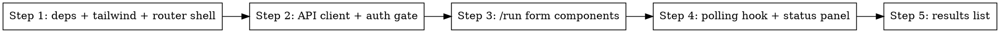

# Phase 7: Frontend scaffolding + /run page

> **Status:** pending
> **Depends on:** Phase 1 (types only — can run in parallel with backend phases 2-6)
> **Traces to:** REQ-100, REQ-102, REQ-103, REQ-104, REQ-105, REQ-106, REQ-107, REQ-110, REQ-111, REQ-112, REQ-113, REQ-114, REQ-120, REQ-121, REQ-122, EDGE-005, EDGE-015

## Overview

Turns the bare React+Vite shell into a working `/run` page. Adds Tailwind,
react-router-dom, @tanstack/react-query, and react-hook-form. Implements the
two-source form (HN + Reddit — Websites section deferred), submission to the
API, 2-second polling, status display, and ranked results rendering.

## Library research note

Use **context7** for current versions and patterns of:
- `@tanstack/react-query` v5 — `useQuery` with `refetchInterval`, auto-stop on
  terminal states
- `react-hook-form` — field arrays for subreddit list
- `tailwindcss@next` + `@tailwindcss/vite` plugin setup for Vite 8

## Step Graph



Steps are small and sequential within the phase — no benefit to parallelizing.

## Implementation

**Files to create:**
- `packages/web/tailwind.config.ts`
- `packages/web/postcss.config.mjs` (if tailwind v4 doesn't ship zero-config)
- `packages/web/src/index.css` — tailwind directives
- `packages/web/src/main.tsx` — wrap App in `<QueryClientProvider>` + `<BrowserRouter>`
- `packages/web/src/App.tsx` — routes
- `packages/web/src/api/client.ts` — typed fetch wrapper with auth header
- `packages/web/src/api/runs.ts` — `submitRun`, `getRun` functions
- `packages/web/src/auth/PasswordGate.tsx` — prompts for password if unset, stores in localStorage
- `packages/web/src/auth/useAuth.ts`
- `packages/web/src/pages/RunPage.tsx` — main page composition
- `packages/web/src/components/RunForm/index.tsx`
- `packages/web/src/components/RunForm/HnSection.tsx`
- `packages/web/src/components/RunForm/RedditSection.tsx`
- `packages/web/src/components/StatusPanel.tsx`
- `packages/web/src/components/ResultList.tsx`
- `packages/web/src/hooks/useRunPolling.ts`

**Files to modify:**
- `packages/web/package.json` — add deps
- `packages/web/vite.config.ts` — add `@tailwindcss/vite` plugin, configure
  `server.proxy` so `/api` → `http://localhost:3000` in dev

### Dependencies (pin exact versions)

```
tailwindcss, @tailwindcss/vite
react-router-dom
@tanstack/react-query
react-hook-form
```

Optionally `clsx` if more than a couple components need conditional classes.

### Step 1: deps + tailwind + router shell

- Install deps
- Add tailwind plugin to `vite.config.ts`
- Create `src/index.css` with `@import "tailwindcss";`
- Wrap `main.tsx`:
  ```tsx
  const qc = new QueryClient();
  createRoot(document.getElementById("root")!).render(
    <StrictMode>
      <QueryClientProvider client={qc}>
        <BrowserRouter>
          <App />
        </BrowserRouter>
      </QueryClientProvider>
    </StrictMode>,
  );
  ```
- `App.tsx` defines `<Routes>` with `/run` mapping to `<PasswordGate><RunPage/></PasswordGate>` and a `/` redirect to `/run`.

### Step 2: API client + auth gate

`src/api/client.ts`:
```typescript
export function getPassword(): string | null {
  return localStorage.getItem("newsletter_password");
}
export function setPassword(p: string): void {
  localStorage.setItem("newsletter_password", p);
}
export async function apiFetch(path: string, init?: RequestInit): Promise<Response> {
  const pw = getPassword();
  const headers = new Headers(init?.headers);
  if (pw) headers.set("Authorization", `Bearer ${pw}`);
  headers.set("Content-Type", "application/json");
  return fetch(path, { ...init, headers });
}
```

`src/api/runs.ts`:
```typescript
import type { RunState, RankedItem } from "@newsletter/shared";
import { apiFetch } from "./client";

export interface RunSubmitBody { topN: number; hn?: unknown; reddit?: unknown; }

export async function submitRun(body: RunSubmitBody): Promise<{ runId: string }> {
  const res = await apiFetch("/api/runs", { method: "POST", body: JSON.stringify(body) });
  if (!res.ok) throw new Error((await res.json()).error ?? "submit failed");
  return res.json();
}

export type RunStateResponse = RunState & { rankedItems: RankedItem[] | null };

export async function getRun(runId: string): Promise<RunStateResponse | null> {
  const res = await apiFetch(`/api/runs/${runId}`);
  if (res.status === 404) return null;
  if (!res.ok) throw new Error("fetch run failed");
  return res.json();
}
```

`PasswordGate.tsx`: shows an input if `getPassword()` is null. On submit, calls
`setPassword(value)` and triggers a re-render. The API 401 response is handled
by clearing the password and re-showing the gate.

### Step 3: RunForm

Uses react-hook-form with a zod-ish shape (or plain typed values). Structure:

```tsx
interface RunFormValues {
  topN: number;
  hnEnabled: boolean;
  hn: { keywords: string; pointsThreshold: number; sinceDays: number; };
  redditEnabled: boolean;
  reddit: { subreddits: string; sort: "hot"|"new"|"top"; limit: number; sinceDays: number; };
}
```

On submit:
1. Validate at least one of hn/reddit is enabled → else show error (REQ-106).
2. Build payload (parse comma-separated keywords / subreddits into arrays, trim).
3. Call `submitRun(payload)`.
4. On success, call parent `onSubmitted(runId)`.

HN section (REQ-103): toggle, keywords input, pointsThreshold, sinceDays.
Reddit section (REQ-102): subreddits (comma-separated or tag-style — simplest is a single comma-separated input), sort select, limit, sinceDays.
**No Websites section** (REQ-101 deferred).
Top-level: topN input (REQ-104, min 1 max 50, default 10).

### Step 4: Polling hook

`useRunPolling.ts`:
```typescript
import { useQuery } from "@tanstack/react-query";
import { getRun, type RunStateResponse } from "../api/runs";

const TERMINAL = new Set(["completed", "failed"]);

export function useRunPolling(runId: string | null) {
  return useQuery<RunStateResponse | null>({
    queryKey: ["run", runId],
    queryFn: () => getRun(runId!),
    enabled: runId !== null,
    refetchInterval: (q) => {
      const data = q.state.data;
      if (!data) return 2000;             // 404 or initial load — let queryFn handle 404 below
      if (TERMINAL.has(data.status)) return false;
      return 2000;
    },
    retry: false,
  });
}
```

- When `data === null` (404), polling stops (explicit REQ-114 — return false in refetchInterval after first null).
- StatusPanel reads `data?.sources` and renders per-source badges (REQ-111).

### Step 5: ResultList

Renders ranked items in score order (already ordered by the API). Each row:
- Rank number
- Source type badge
- Title as external link to `url`
- Published date formatted
- Engagement (`points + commentCount`)
- LLM rationale

Empty state (`rankedItems: []`): "No items matched your criteria." (REQ-121).

### Auth flow on 401

If `getRun`/`submitRun` rejects with a 401 response, the API client throws a
tagged error; `PasswordGate` watches for this via an auth-error event or
simpler: `PasswordGate` is always rendered — inner components call a hook that,
on 401, clears localStorage and forces a re-render. Keep it simple: on any fetch
failure, `RunPage` shows the error; user refreshes and re-enters password.

## What to test

Frontend tests are Playwright-based per verification matrix. For this phase,
add minimal smoke testing:

- **Unit:** `useRunPolling` with a mocked `getRun` — covers REQ-114 (404 → stop
  polling) and terminal-state stopping. Use `@testing-library/react` + `vitest`.
- **Playwright E2E:** deferred to Phase 8 — they exercise the full stack.
- **Visual smoke:** ensure the page renders and submit button is present.

For this phase, set up vitest + @testing-library/react in the web package and
write at least:
1. RunForm shows an error when submitted with no sources enabled (REQ-106).
2. useRunPolling stops polling when `data.status === "completed"`.
3. useRunPolling stops polling when `getRun` returns `null` (REQ-114).

**Commit:** `feat(VER-run-ui): add /run page with form, polling, and results`

## Done When

- [ ] Tailwind working (`pnpm --filter @newsletter/web build` includes styles)
- [ ] `/run` route renders the form behind a password gate
- [ ] Form submits to `POST /api/runs` and begins polling on success
- [ ] Status panel shows per-source status with item counts
- [ ] Terminal states stop polling and render results or error
- [ ] Unit tests for form validation + polling hook pass
- [ ] `pnpm typecheck`, `pnpm lint`, `pnpm build` pass for web package
