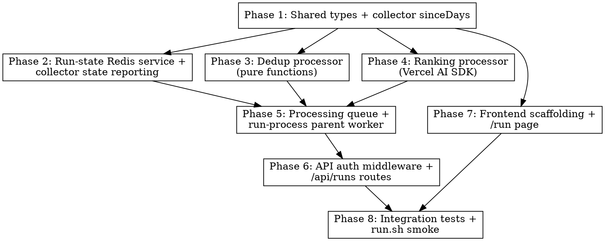

# Plan: Run UI — Collect → Dedup → Rank → Show

> **Source:** `docs/plans/run-ui/SPEC.md` + `docs/plans/2026-04-07-run-ui-feature-design.md`
> **Created:** 2026-04-07
> **Status:** planning

## Goal

Ship the first end-to-end product slice: a `/run` page where an authenticated user
configures HN + Reddit sources, submits, and gets back an LLM-ranked list of AI news
items. Deduplication and ranking are introduced as new pipeline stages; the API and
frontend get their first real routes/pages.

## Scoping Decisions (from planning Q&A)

1. **Web blog collector is deferred from this PR.** Only HN + Reddit source groups
   are wired end-to-end. The API rejects any payload containing a `web` group with
   HTTP 400 and the frontend omits the Websites section. Web collector will be a
   follow-up PR that re-enables the third source group. SPEC requirements tied to
   web (REQ-043, EDGE-006, EDGE-007, REQ-101) are consciously deferred.
2. **Frontend stack:** Tailwind CSS + react-router-dom + @tanstack/react-query +
   react-hook-form. Vite keeps its current shape.
3. **Ranking:** Vercel AI SDK (`ai`) + `@ai-sdk/google`, default model
   `google/gemini-2.5-flash`, configurable via `RANKING_MODEL`. `GEMINI_API_KEY`
   becomes a required pipeline-worker env var (validated at worker startup, not
   per-submit, because ranking always needs it).
4. **API enqueue:** `bullmq` becomes a direct dependency of `@newsletter/api`. The
   API constructs a `FlowProducer` itself, sharing Redis via
   `createRedisConnection()` from `@newsletter/shared`.

## Acceptance Criteria

- [ ] `POST /api/runs` accepts HN+Reddit config, returns `{ runId }` in <500ms,
      enqueues a BullMQ flow (REQ-001, REQ-004, REQ-005).
- [ ] `POST /api/runs` with any `web:` payload returns HTTP 400 with a
      "web sources not yet supported" message (scoping override of REQ-003).
- [ ] `GET /api/runs/:runId` returns full run state and, on `completed`, hydrated
      `rankedItems[]` (REQ-010, REQ-012, REQ-013).
- [ ] HN + Reddit collectors honor `sinceDays` (REQ-020–023) and report state to
      Redis on start/complete/fail (REQ-030–032).
- [ ] `run-process` parent job executes after all children finish, dedups, ranks
      via Vercel AI SDK (single `generateObject` call), writes `rankedItems` to
      Redis, and updates status (REQ-040–044, 050–066, 070–071).
- [ ] Structured logs emitted at all stage boundaries (REQ-080–085).
- [ ] `/run` page: form with HN + Reddit sections, topN input, submit, 2s polling,
      per-source status, final ranked list with rationale (REQ-100, 103, 104,
      105, 107, 110–114, 120–122). Websites section (REQ-101) deferred.
- [ ] MVP password middleware guards `POST /api/runs`, `GET /api/runs/:runId`, and
      `/run` page (REQ-006, REQ-107).
- [ ] All existing tests pass; new unit + integration tests added per verification
      matrix.
- [ ] `pnpm typecheck`, `pnpm lint`, `pnpm test:unit`, `pnpm build` all green.

## Codebase Context

### Existing patterns to follow
- **Collectors:** `packages/pipeline/src/collectors/hn.ts`, `reddit.ts` — export a
  function `(deps, config) => Promise<CollectorResult>`, use `createLogger("collector:*")`,
  call `deps.repo.upsertItems(items)`, return metrics. Tests at
  `packages/pipeline/tests/unit/collectors/*.test.ts` use `vi.fn()` mocks for the
  repo and JSON fixtures under `tests/unit/fixtures/`.
- **BullMQ queue/worker:** `packages/pipeline/src/queues/collection.ts` +
  `workers/collection.ts` use `new Queue(...)` / `new Worker(...)` with
  `createRedisConnection()` from shared. Job name switch dispatches to collectors.
- **Drizzle schema:** `packages/shared/src/db/schema.ts` owns `raw_items`. The DB
  client is a singleton `getDb()` in `packages/shared/src/db/client.ts`.
- **Repo:** `packages/pipeline/src/repositories/raw-items.ts` exposes
  `createRawItemsRepo(db)` with an `upsertItems(items)` method. The API will add a
  query helper to load items by id list (no repo split needed).
- **Logger:** `createLogger(name)` from `@newsletter/shared` wraps pino; use names
  like `api:runs`, `pipeline:run-process`, `processor:dedup`, `processor:rank`.
- **Shared types:** `packages/shared/src/types/index.ts` — add `RunStatus`, `RunStage`,
  `SourceRunState`, `RunState`, `RankedItem`, `RunSubmitPayload` here so both api
  and pipeline can import them. Keep collector configs in pipeline/types.ts.

### Test infrastructure
- **Runner:** Vitest 3.2.1 with two projects per package: `unit` and `e2e`.
- **Unit tests:** `tests/unit/**/*.test.ts`; mocks via `vi.fn()` and JSON fixtures.
- **Integration/E2E tests:** `tests/e2e/**/*.e2e.test.ts` in pipeline, use real
  Postgres + Redis via `pnpm infra:up`. New integration tests for run-process and
  API go in each package's `tests/e2e/` directory.
- **Commands:** `pnpm typecheck`, `pnpm lint`, `pnpm test:unit`, `pnpm build` at
  monorepo root via Turborepo.

### New dependencies

| Package | Added to | Why |
|---|---|---|
| `ai` | `@newsletter/pipeline` | Vercel AI SDK core for `generateObject` |
| `@ai-sdk/google` | `@newsletter/pipeline` | Gemini provider |
| `zod` | `@newsletter/pipeline`, `@newsletter/api` | Structured-output schema + request validation |
| `bullmq` | `@newsletter/api` | `FlowProducer` to enqueue the fan-out flow |
| `ioredis` | `@newsletter/api` (peer of bullmq, already in shared) | Reuse `createRedisConnection()` |
| `tailwindcss` + `@tailwindcss/vite` | `@newsletter/web` | Styling |
| `react-router-dom` | `@newsletter/web` | Routing |
| `@tanstack/react-query` | `@newsletter/web` | Polling + cache |
| `react-hook-form` | `@newsletter/web` | Form state |

Pin exact versions (no `^`/`~`) per `.claude/rules/tooling.md`.

## Phase Graph

**Parallelism:** After phase 1, phases 2, 3, 4, and 7 are independent and can run
in parallel. Phase 5 fans them back in. Phase 6 follows phase 5. Phase 7 (frontend)
can run in parallel with the entire backend chain since it only depends on shared
types from phase 1. Phase 8 is the final integration gate.

## Requirements → Phases

| REQ range | Phase(s) |
|---|---|
| REQ-001–006 (API run creation) | P6 |
| REQ-010–013 (API run status) | P6 |
| REQ-020–023 (sinceDays) | P1 |
| REQ-030–032 (collector state reporting) | P2 |
| REQ-040–044 (orchestration) | P5 |
| REQ-050–052 (dedup) | P3 |
| REQ-060–066 (ranking) | P4 |
| REQ-070–071 (completion) | P5 |
| REQ-080–085 (observability) | P2, P4, P5, P6 |
| REQ-100, 103–107 (form) | P7 |
| REQ-101 (websites section) | **deferred** |
| REQ-102 (subreddits) | P7 |
| REQ-110–114 (polling) | P7 |
| REQ-120–122 (results) | P7 |

## Risks & Mitigations

| Risk | Mitigation |
|---|---|
| Vercel AI SDK `generateObject` API signature unknown / drifts | Use context7 before writing rank.ts; cover with a mocked unit test (REQ-061 acceptance criterion) |
| BullMQ FlowProducer barrier semantics (child failure behavior) | Integration test REQ-040 asserts parent runs after children regardless of success/fail; consult context7 for bullmq flows |
| Redis TTL expires between collector start and parent load (`run.startedAt`) | Implement EDGE-013 fallback: parent uses `now - 10 min` window if run-state is gone |
| Frontend polling leaks timers on unmount / 404 | TanStack Query's `refetchInterval` auto-pauses on terminal states; test REQ-114 with mocked 404 |
| Shared types drift between api and pipeline | Single export location in `@newsletter/shared/types`; both packages import from there |
