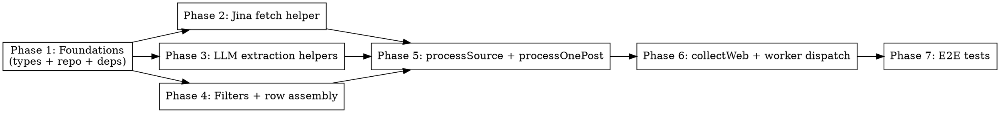

# Plan: Web Blog Collector

> **Source:** docs/spec/web-blog-collector/design.md + docs/spec/web-blog-collector/spec.md
> **Created:** 2026-04-07
> **Linear:** [VER-47](https://linear.app/vertexcover/issue/VER-47/web-blog-collector-jina-vercel-ai-sdk-gemini)
> **Branch:** feat/web-blog-collector
> **Status:** planning

## Goal

Deliver a third BullMQ collector (`collectWeb`) that ingests posts from arbitrary
blog listing URLs via Jina Reader + Vercel AI SDK + Gemini 2.5 Flash, emits
`RawItemInsert` rows matching the `hn.ts`/`reddit.ts` shape, and surfaces every
failure through a minimal `CollectorFailure` type — with no per-source CSS
selectors or manual config beyond the listing URL.

## Acceptance Criteria

- [ ] All 40 requirements in `spec.md` pass their unit tests
- [ ] 5 e2e tests in `tests/e2e/collectors/web.e2e.test.ts` pass against live
      Jina + Gemini (gated on `GEMINI_API_KEY`)
- [ ] `pnpm build`, `pnpm typecheck`, `pnpm lint`, `pnpm test:unit` all clean
- [ ] BullMQ `"web-collect"` jobs are routed to `collectWeb` via
      `workers/collection.ts`
- [ ] No changes to `@newsletter/shared` (`CollectorResult` stays as-is)
- [ ] New deps (`ai`, `@ai-sdk/google`, `zod`, `p-limit`) pinned to exact versions

## Codebase Context

### Existing patterns to follow

- **Collector function shape:** `packages/pipeline/src/collectors/hn.ts:176-241` —
  `collectXxx(deps, config) -> CollectorResult` where `deps` is
  `{ rawItemsRepo, fetchFn? }`. Inject all I/O through deps for testability.
- **Fetch with retry:** `packages/pipeline/src/collectors/hn.ts:83-115` —
  `fetchWithRetry` with exponential backoff, non-retryable 4xx short-circuit
  (not 429), 3-retry max. Our `fetchMarkdown` helper should follow this shape.
- **Repo boundary:** `packages/pipeline/src/repositories/raw-items.ts:12-22` —
  `createRawItemsRepo(db).upsertItems(items)` is the only DB write. Extend
  with `findExistingExternalIds` in Phase 1.
- **Worker dispatch:** `packages/pipeline/src/workers/collection.ts:14-29` —
  switch on `job.name`, construct deps per case. Add a `"web-collect"` case
  in Phase 6.
- **Logger:** `createLogger("collector:web")` (mirrors `collector:hn`,
  `collector:reddit`).
- **Path aliases:** `@pipeline/*` (src), `@pipeline-tests/*` (tests). Never
  relative imports across `src`/`tests`.
- **Collector files are self-contained:** private types, constants, and
  helpers all live in one `collectors/<name>.ts` file (~250-310 lines in
  hn/reddit). Single file for web too.

### Test infrastructure

- **Vitest projects:** `unit` + `e2e` in `packages/pipeline/vitest.config.ts`.
  E2E uses `singleFork: true`, `fileParallelism: false`,
  `testTimeout: 30000` (web e2e will override to `60000` via describe option).
- **Unit test pattern:** `tests/unit/collectors/hn.test.ts` — dynamic
  `await import("@pipeline/collectors/...")` inside `beforeEach`, `createMockFetch`,
  `createMockRepo`, **JSON fixtures** from `@pipeline-tests/unit/fixtures/*.json`.
  (Spec originally said "inline template strings"; corrected during planning.)
- **E2E test pattern:** `tests/e2e/collectors/hn.e2e.test.ts:11` — loads
  `.env.test` via `config({ path: resolve(...) })`, uses `getTestDb()` +
  `truncateAll()` between tests. **Web e2e follows the same pattern** —
  dotenv-loaded `.env.test` for test-only secrets. (Spec originally said
  "no dotenv in setup"; corrected during planning — the rule applies to the
  runtime `.env`, not test-only `.env.test`.)
- **Run commands:** `pnpm test:unit` (fast, mocked), `pnpm test:e2e`
  (live, needs `.env.test` with `DATABASE_URL`, `GEMINI_API_KEY`, optionally
  `JINA_API_KEY`).

### Dependencies to add (pinned exact versions)

- `ai` — Vercel AI SDK core, provides `generateObject`
- `@ai-sdk/google` — Gemini provider (`google('gemini-2.5-flash')`)
- `zod` — schema definitions for `generateObject`
- `p-limit` — concurrency limiter for per-source post-detail fan-out

Exact versions resolved via context7 + `pnpm view` lookup during Phase 1.

## Phase Graph

**Parallelism:** After Phase 1 lands, phases 2, 3, and 4 are independent and
can be dispatched as a single wave of three parallel sub-agents. Phase 5
depends on all three and kicks off once that wave completes. Phases 6 and 7
are sequential tail.

## Phase Summary

| # | Phase | REQs covered | Commit |
|---|---|---|---|
| 1 | Foundations — types, repo addition, new deps installed and pinned | REQ-001 (types), 002, 003, 030, 070, 071, 082 | `feat(VER-47): add web collector types and findExistingExternalIds` |
| 2 | Jina fetch helper — `fetchMarkdown` with envelope stripping, retry-with-backoff, non-retryable 4xx handling | REQ-010, 040, 100, 101 | `feat(VER-47): add Jina fetch helper with retry` |
| 3 | LLM extraction helpers — Zod schemas, `discoverPostUrls`, `extractPostFields`, URL substring validation | REQ-011, 012, 041, 042 | `feat(VER-47): add Gemini discovery and detail extractors` |
| 4 | Filters and row assembly — `applySinceDays`, `buildRawItem`, `parseDateOrNull` | REQ-020, 021, 022, 023, 050, 051 | `feat(VER-47): add sinceDays filter and row assembly helpers` |
| 5 | `processSource` + `processOnePost` — orchestration with dedup pre-check, `p-limit`, per-stage failure recording | REQ-012 (validation), 031, 060, 061, 062, 072-078, 081 | `feat(VER-47): add per-source processing with p-limit and failure tracking` |
| 6 | `collectWeb` + worker dispatch — top-level `Promise.all`, all-failed-throws rule, upsert, summary logging, `"web-collect"` case in worker | REQ-001 (dispatch), 002 (dispatch), 032, 052, 079, 080, 090, 091, 092 | `feat(VER-47): add collectWeb top-level and worker dispatch` |
| 7 | E2E tests — 5 live-integration tests against anthropic-research, openai-news, huggingface-blog | E2E verification of REQs 010-082 via real run | `test(VER-47): add e2e tests against live Jina and Gemini` |
