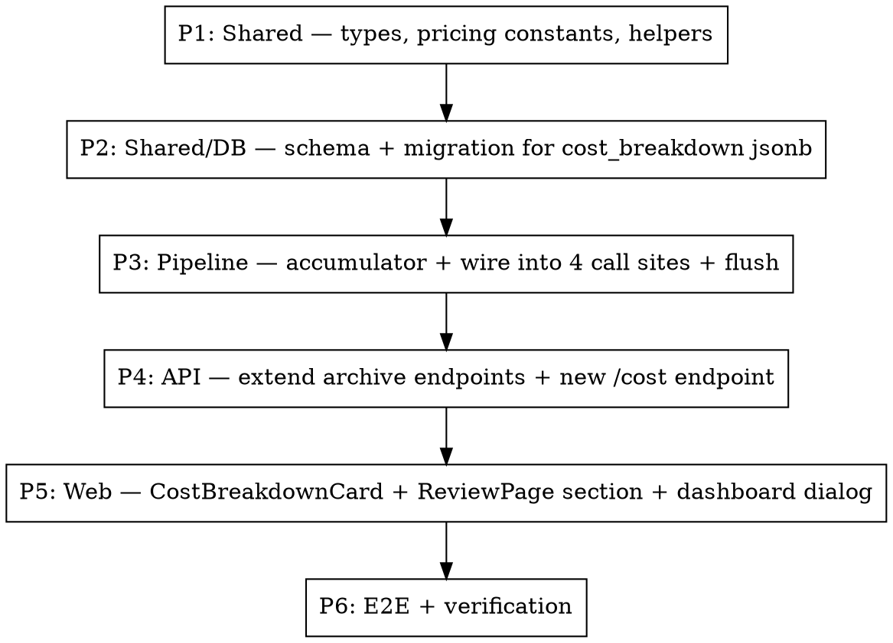

# Plan — Admin Pipeline Cost Analysis

**Date:** 2026-05-18
**Spec:** `docs/spec/admin-pipeline-cost-analysis/spec.md`
**Design:** `docs/plans/2026-05-18-admin-pipeline-cost-analysis-design.md`

## Phase graph



Linear, serial execution. Each phase builds on the previous; no cross-phase parallelism since they share types.

---

## Phase 1: Shared — types, pricing constants, computation helpers

**Files:**
- `packages/shared/src/types/cost.ts` (new) — `LlmStage`, `StageCost`, `RunCostBreakdown`, `ClaudePricing`
- `packages/shared/src/pricing/claude.ts` (new) — `CLAUDE_PRICING` constant map + `computeUsdCost(modelId, inputTokens, outputTokens)` helper
- `packages/shared/src/index.ts` — re-export new types
- `packages/shared/src/pricing/claude.test.ts` (new) — unit tests for `computeUsdCost` (VS-0a, VS-0b)

**Constant values (from library-probe.md, verified 2026-05-18):**
```ts
CLAUDE_PRICING = {
  "claude-haiku-4-5-20251001": { inputPerMTok: 1, outputPerMTok: 5, lastVerified: "2026-05-18", source: "https://platform.claude.com/docs/en/about-claude/pricing" },
  "claude-sonnet-4-6":         { inputPerMTok: 3, outputPerMTok: 15, lastVerified: "2026-05-18", source: "https://platform.claude.com/docs/en/about-claude/pricing" },
  "claude-opus-4-7":           { inputPerMTok: 5, outputPerMTok: 25, lastVerified: "2026-05-18", source: "https://platform.claude.com/docs/en/about-claude/pricing" },
};
```

**Exit criteria:** `pnpm --filter @newsletter/shared test` passes new unit tests; `pnpm typecheck` clean.

---

## Phase 2: DB schema — add `cost_breakdown` jsonb to run_archives

**Files:**
- `packages/shared/src/db/schema.ts` — add `costBreakdown: jsonb("cost_breakdown").$type<RunCostBreakdown | null>()`. Nullable, no default (null for historical rows).
- New Drizzle migration generated via `pnpm --filter @newsletter/shared db:generate`

**Exit criteria:** Migration file exists in `packages/shared/src/db/migrations/`. `pnpm --filter @newsletter/shared db:migrate` applies cleanly against local Postgres. Verified by reading column with PostgreSQL MCP.

---

## Phase 3: Pipeline — accumulator + capture + flush

**Files:**
- `packages/pipeline/src/services/cost-accumulator.ts` (new) — `RunCostAccumulator` class with `record()` and `snapshot()`
- `packages/pipeline/src/services/cost-accumulator.test.ts` (new) — VS-1, VS-2
- `packages/pipeline/src/collectors/web.ts` — add `costAccumulator?: RunCostAccumulator` to options; after each `generateObject` call, `costAccumulator?.record("webListing"|"webExtraction", result, modelId)`
- `packages/pipeline/src/processors/rank.ts` — same, stage `"rank"`
- `packages/pipeline/src/processors/recap.ts` — same, stage `"recap"`
- `packages/pipeline/src/workers/processing.ts` (`handleRunProcessJob` or wherever the orchestrator lives) — construct one accumulator per run, pass to each stage, flush snapshot to `runArchivesRepo.write({ ..., costBreakdown })` in `finally`-equivalent path covering completion, failure, AND cancellation.

**Wiring constraint:** The accumulator must be the same instance across all four call sites within a run. Pass via existing options objects — do not introduce a global or run-state mutation through Redis.

**Exit criteria:** Unit tests pass. Manual integration test via `/test-api` skill or `pnpm --filter @newsletter/pipeline test:integration` shows a run completing with `cost_breakdown` populated in `run_archives`.

---

## Phase 4: API — expose costBreakdown

**Files:**
- `packages/api/src/routes/archives.ts` — `GET /api/archives/:runId` already returns the archive row; ensure `costBreakdown` is in the response shape (Drizzle returns it automatically once schema is updated; just confirm response typing reflects it).
- `packages/api/src/routes/admin-archives.ts` (or wherever admin archive routes live) — new `GET /api/admin/archives/:runId/cost` returning `{ runId, costBreakdown }`. Gated by existing `requireAdmin` middleware.
- API integration test (Vitest) covering both routes against a seeded archive row.

**Exit criteria:** Both endpoints return correct shape. Admin endpoint returns 401 without session cookie. Test passes.

---

## Phase 5: Web UI

**Files:**
- `packages/web/src/components/admin/CostBreakdownCard.tsx` (new) — receives `costBreakdown: RunCostBreakdown | null` and renders. Pure presentational. Handles null state and warning badges.
- `packages/web/src/components/admin/CostBreakdownCard.test.tsx` (new) — rtl tests for empty state, normal render, warning badges
- `packages/web/src/pages/ReviewPage.tsx` — import card, place below the existing review controls. Data comes from the already-fetched archive query.
- `packages/web/src/pages/DashboardPage.tsx` — for each row in recent-runs, add a small `$` icon button (shadcn `Button variant="ghost" size="sm"`). Clicking opens a `Dialog` containing `<CostBreakdownCard costBreakdown={data?.costBreakdown ?? null} />`. Use react-query keyed by `["archive-cost", runId]` and `enabled: dialogOpen`.
- `packages/web/src/lib/api.ts` (or equivalent client file) — add `fetchArchiveCost(runId)`.

**Exit criteria:** Components render correctly with all three states (data present, null, with warnings). Playwright smoke verifies button → dialog flow.

---

## Phase 6: E2E + verification

- Run quality gate (typecheck, lint, test, coverage) — must be ≥ baseline.
- Functional verification via Playwright per VS-3, VS-4, VS-5, VS-6.
- Smoke a real run end-to-end against local Podman infrastructure (`pnpm infra:up`, trigger run, inspect resulting `run_archives.cost_breakdown` via PostgreSQL MCP).
