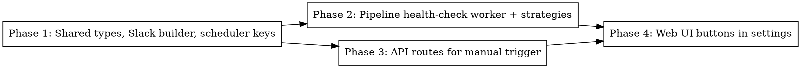

# Plan: Collector Health Check

> **Source:** docs/spec/collector-health-check/spec.md
> **Created:** 2026-06-02
> **Status:** planning

## Goal

Add proactive health checks for all 5 collector types (HN, Reddit, Twitter/X, Blog/Web, Web Search) that can be triggered manually from the admin settings page or automatically 15 minutes before each scheduled pipeline run, with Slack notifications for failures.

## Acceptance Criteria

- [ ] "Check Health" buttons on each source section in `/admin/settings` that trigger single-collector health checks
- [ ] "Check All Collectors" button that triggers all 5 checks at once
- [ ] Health checks are non-blocking BullMQ jobs on the existing processing queue
- [ ] Automatic health check fires 15 minutes before pipelineTime, reconciled on every settings save
- [ ] Each collector type has an end-to-end health check that validates: connectivity, auth, response parsing
- [ ] Failed collectors produce a Slack notification with 🩺 header, per-failure actionable error messages, and healthy-collector summary
- [ ] Skipped collectors (no config, missing API key) are not treated as failures
- [ ] Slack notifications are Redis-debounced to prevent spam (same failures within 1 hour)

## Codebase Context

### Context Map (Step 2.0)
- **Context map read:** 4 PACKAGE.md, 4 standards files
- **Decisions honored:**
  - `D-051` — Build health-check deps per-job (not at worker startup) so credential changes take effect without restart; health check strategies read creds via `resolveTwitterCollectorCookie` (DB-first, env-fallback)
  - `D-022/D-023` — Digest meta patterns are unrelated to this feature; no changes to review page
- **Standards honored:**
  - `S-global-01` — TypeScript strict, no `any`
  - `S-global-02` — Exact dependency versions
  - `S-global-03` — No premature abstractions; each strategy is a standalone function
  - `S-global-04` — Log at service boundaries only (job start/complete/fail, API request, external API call)
- **Gotchas carried forward:**
  - `packages/pipeline/workers/PACKAGE.md` — publishDeps per-job pattern (D-051); follow same pattern for health-check deps
  - `packages/web/pages/PACKAGE.md` — SettingsPage form uses `e.preventDefault()` before `handleSubmit` to prevent native form POST; health check buttons must be `type="button"` to avoid triggering form submission

### Existing Patterns to Follow
- **Worker pattern:** `social-health.ts` — fire-and-forget handler with deps injection, Slack alert on failure, no-op when unconfigured
- **Route pattern:** `runs.ts` — factory function `createHealthCheckRouter(deps): Hono`, zod validation, admin-gated
- **Scheduler pattern:** `reconcilePipelineSchedule` — `upsertJobScheduler` with cron + tz, removed when disabled
- **Slack builder pattern:** `packages/shared/src/slack/builders/source-distribution.ts` — Block Kit builder function

### Test Infrastructure
- Vitest 3 (unit + e2e per package)
- `packages/pipeline/src/__tests__/` — pipeline unit tests
- `packages/api/src/__tests__/` — API integration tests
- `packages/web/tests/unit/` — frontend component tests

## Phase Graph

## Phase Summaries

| Phase | Package(s) | What it delivers |
|-------|-----------|-----------------|
| 1 | shared | `HealthCheckResult` type, `HEALTH_CHECK_SCHEDULER_KEY` constant, `healthCheckFailed` notification key, Slack message builder |
| 2 | pipeline | `handleHealthCheckJob` worker, 5 per-collector strategy functions, processing.ts dispatch, Slack notification integration |
| 3 | api | `POST /api/admin/health-check` and `/:collectorType` routes, scheduler integration in `reconcilePipelineSchedule` |
| 4 | web | "Check Health" button per source section, "Check All Collectors" button in SaveBar, inline result display |
