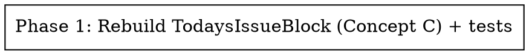

# Plan — Redesign `TodaysIssueBlock`

Single-phase, single-component frontend refactor. No API/schema/type/wiring changes.

## Phase graph

## Phase 1 — Rebuild `TodaysIssueBlock` as clean Concept C (+ unit test)

**Visual reference (match exactly):** `docs/mocks/redesign-todaysissueblock.html` — the
user-approved clean Concept C mock. Reproduce its layout, spacing, typography, and styling in
Tailwind.

**Files**
- `packages/web/src/components/home/TodaysIssueBlock.tsx` (rewrite)
- `packages/web/tests/unit/components/home/TodaysIssueBlock.test.tsx` (new)

**TDD**
1. Write the failing unit test first (render with `MemoryRouter`, assert via `data-*`/href/text):
   - VS-1: no `role="img"` cover plate; no `§` glyph.
   - VS-2: a single anchor with `href="/archive/<runId>"` wraps the content (headline + a story
     title are inside it).
   - VS-3: each `topItems` entry renders its title + mapped source label (`hn`→"Hacker News",
     `twitter`→"X").
   - VS-4: `storyCount > topItems.length` → "+N more inside"; else "Read today's issue".
   - VS-5: empty `topItems` → no running-order list; null `digestSummary` → no dek; null
     `digestHeadline` → falls back to `topItems[0].title`.
2. Implement the component to pass:
   - Single `<Link to={`/archive/${issue.runId}`}>` wrapper; keep `data-section="todays-issue"`.
   - Eyebrow `TODAY'S ISSUE · <Weekday>, <Month Day>` (reuse `Intl.DateTimeFormat` + local-date parse).
   - Headline (`clamp`), optional italic dek.
   - Running-order `<ol>` (responsive grid: `sm` 3-track `index|title|source`; `<sm` source
     stacks under title) guarded by `topItems.length > 0`.
   - Source-label map for `SourceType`; unknown → uppercased raw.
   - Read line: `+N more inside →` / `Read today's issue →`.
   - Theme tokens unchanged; `@newsletter/shared/types` subpath import only; explicit
     `ReactElement` return type; no `any`.
3. Run `pnpm --filter @newsletter/web test:unit`, `typecheck`, `lint`. Build `@newsletter/shared`
   first if typecheck can't resolve it.

**Claims** — write `.harness/redesign-todaysissueblock/phase-1-claims.json` with the unit-test
run (executed>0, failed=0) and a `type: "ui"` claim for the rendered block (proven later by
Playwright in verify).

**Done when** test passes, typecheck/lint clean, component matches the approved mock
(the approved mock `docs/spec/redesign-todaysissueblock/mock.html`).
