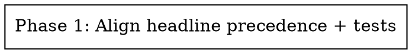

# Plan: Fix headline mismatch in `TodaysIssueBlock`

Single-phase fix. Root cause already identified (see `design.md`): `TodaysIssueBlock`
and `ArchivePageHeader` derive an issue headline with reversed fallback precedence.

## Phase graph

Single phase, no parallelism.

## Phase 1 — Align `TodaysIssueBlock` headline to `pickHeadline`

**Files**
- `packages/web/src/components/home/TodaysIssueBlock.tsx` — replace the inline
  `digestHeadline ?? topItems[0]?.title ?? "Today's issue"` derivation with a call to
  the shared `pickHeadline(topStoryTitle, digestHeadline)` imported from
  `../ArchivePageHeader`.
- `packages/web/tests/unit/components/TodaysIssueBlock.test.tsx` (new) — component
  unit tests covering REQ-001..REQ-004 (the five edge cases) and the cross-surface
  invariant against `pickHeadline`. Render inside `MemoryRouter` (component uses `Link`).
- E2E UI proof (Playwright MCP, during verification) — load `/` and `/archive/:runId`
  with a seeded/mocked issue whose `digestHeadline` differs from the top-story title;
  assert the Today's Issue `<h2>` equals the archive `<h1>`.

**Acceptance:** REQ-001..REQ-005 from `spec.md`. `pnpm --filter @newsletter/web test:unit`
passes; `pnpm typecheck`, `pnpm build`, `pnpm lint` stay green.

**Approach (TDD):**
1. Write `TodaysIssueBlock.test.tsx` first with the five edge-case assertions and the
   `pickHeadline` cross-surface invariant — they fail against the current reversed logic
   (specifically the "both present, differ" case expects the top-story title but the
   current code returns the digest headline).
2. Change `TodaysIssueBlock.tsx` to call `pickHeadline`.
3. Re-run unit tests → green.
